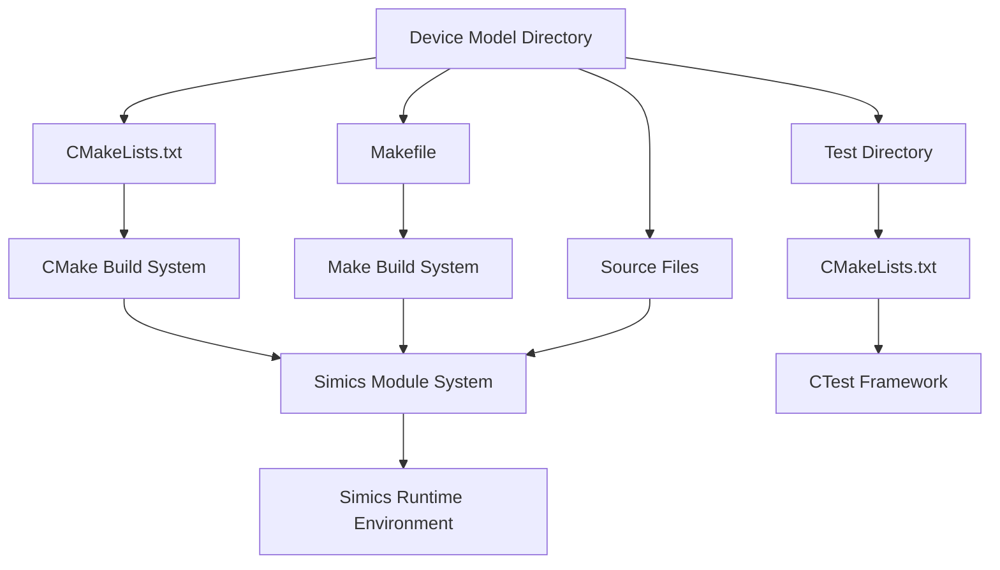
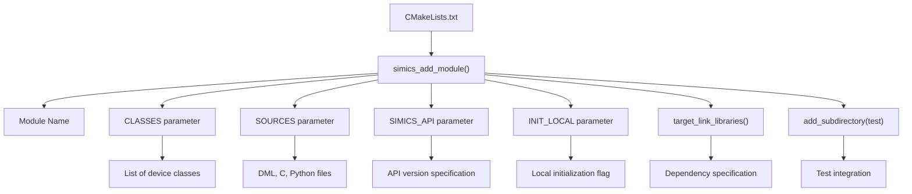
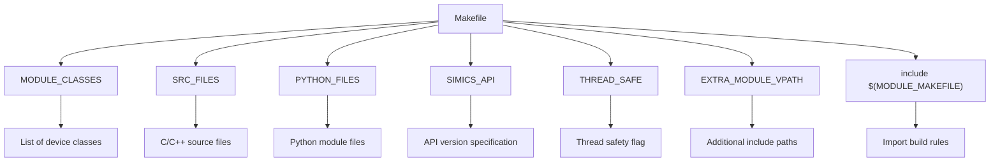
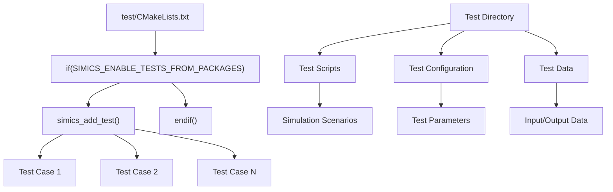
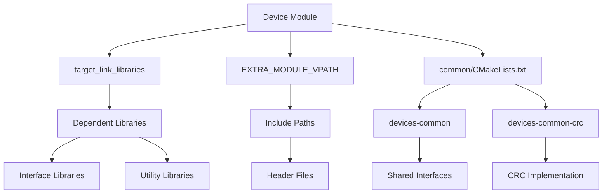
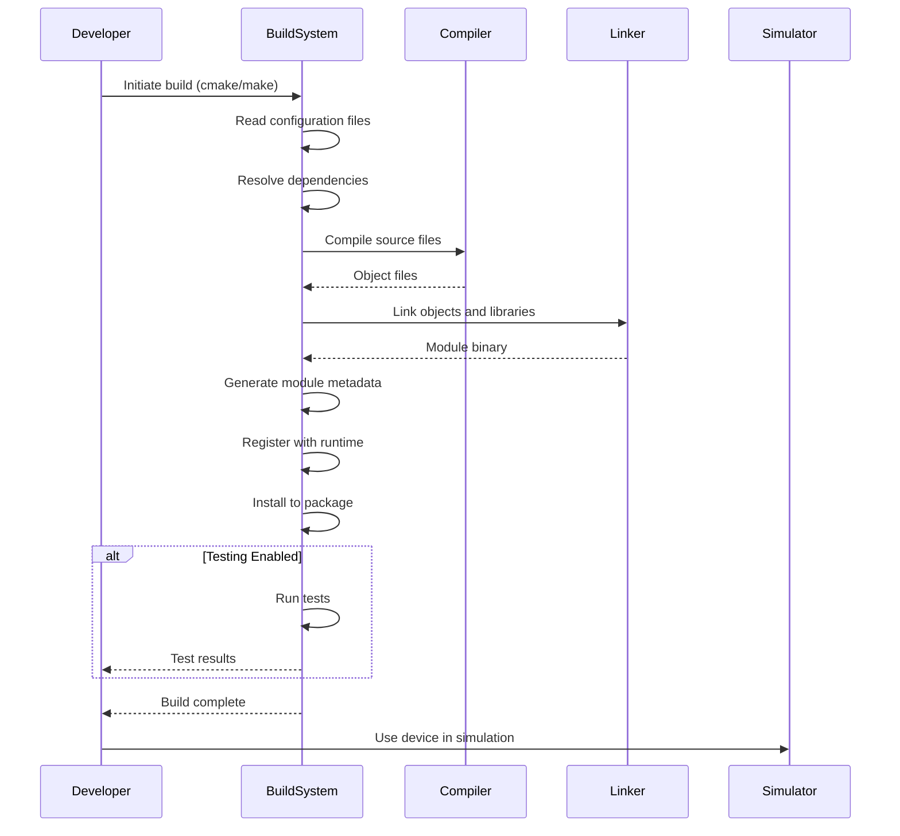

# Build Configuration

<cite>
**Referenced Files in This Document**   
- [AM79C960/CMakeLists.txt](file://simics-7.57.0/src/devices/AM79C960/CMakeLists.txt)
- [AM79C960/Makefile](file://simics-7.57.0/src/devices/AM79C960/Makefile)
- [common/CMakeLists.txt](file://simics-7.57.0/src/devices/common/CMakeLists.txt)
- [sample-device-c/CMakeLists.txt](file://simics-7.57.0/src/devices/sample-device-c/CMakeLists.txt)
- [sample-device-c/Makefile](file://simics-7.57.0/src/devices/sample-device-c/Makefile)
- [generic-flash-memory/CMakeLists.txt](file://simics-7.57.0/src/devices/generic-flash-memory/CMakeLists.txt)
- [generic-flash-memory/Makefile](file://simics-7.57.0/src/devices/generic-flash-memory/Makefile)
- [empty-device-c/CMakeLists.txt](file://simics-7.57.0/src/devices/empty-device-c/CMakeLists.txt)
- [empty-device-c/Makefile](file://simics-7.57.0/src/devices/empty-device-c/Makefile)
- [sample-device-c/test/CMakeLists.txt](file://simics-7.57.0/src/devices/sample-device-c/test/CMakeLists.txt)
- [generic-flash-memory/test/CMakeLists.txt](file://simics-7.57.0/src/devices/generic-flash-memory/test/CMakeLists.txt)
- [eth-links/test/CMakeLists.txt](file://simics-7.57.0/src/devices/eth-links/test/CMakeLists.txt)
- [sample-device-c/module_load.py](file://simics-7.57.0/src/devices/sample-device-c/module_load.py)
</cite>

## Table of Contents
1. [Introduction](#introduction)
2. [Build System Architecture](#build-system-architecture)
3. [Core Build Configuration Files](#core-build-configuration-files)
4. [CMake Configuration Patterns](#cmake-configuration-patterns)
5. [Makefile Configuration Patterns](#makefile-configuration-patterns)
6. [Testing Configuration](#testing-configuration)
7. [Dependency Management](#dependency-management)
8. [Build Process Flow](#build-process-flow)
9. [Practical Examples](#practical-examples)
10. [Best Practices](#best-practices)

## Introduction

The Simics device modeling framework employs a dual build system architecture that supports both CMake and Make to provide flexibility for developers across different environments. This build configuration system manages the compilation and integration of device models into the Simics platform, enabling seamless development, testing, and deployment of virtual hardware components. The system is designed to handle various device types implemented in C, DML (Device Modeling Language), and Python, with consistent configuration patterns across all device models.

The build configuration serves as the bridge between source code organization and the Simics runtime environment, defining how device models are compiled, linked, and loaded. It supports multiple Simics API versions and provides mechanisms for dependency resolution, test integration, and cross-platform compatibility.

**Section sources**
- [AM79C960/CMakeLists.txt](file://simics-7.57.0/src/devices/AM79C960/CMakeLists.txt)
- [AM79C960/Makefile](file://simics-7.57.0/src/devices/AM79C960/Makefile)

## Build System Architecture

The Simics build system architecture is designed to support multiple build systems (CMake and Make) while maintaining consistency in device model integration. This dual-system approach allows developers to choose their preferred build tool based on project requirements and development environment preferences.

The architecture follows a hierarchical structure where each device model directory contains its own build configuration files, enabling modular development and independent compilation of device components. The build system integrates with the Simics module loading mechanism, ensuring that compiled device models are properly registered and available within the simulation environment.

Key architectural components include:
- Device-specific build configuration files (CMakeLists.txt and Makefile)
- Centralized module definition macros and rules
- Test integration framework
- Dependency management system
- API version compatibility layer

This architecture enables developers to create, modify, and extend device models with minimal configuration overhead while maintaining compatibility with the broader Simics ecosystem.

**Diagram sources**
- [AM79C960/CMakeLists.txt](file://simics-7.57.0/src/devices/AM79C960/CMakeLists.txt)
- [AM79C960/Makefile](file://simics-7.57.0/src/devices/AM79C960/Makefile)
- [sample-device-c/test/CMakeLists.txt](file://simics-7.57.0/src/devices/sample-device-c/test/CMakeLists.txt)

## Core Build Configuration Files

The Simics device modeling framework utilizes two primary build configuration files: CMakeLists.txt for CMake-based builds and Makefile for traditional Make-based builds. These files coexist in each device model directory, providing developers with the choice of build system while ensuring consistent configuration across the framework.

The CMakeLists.txt file serves as the primary configuration for CMake-based builds, defining the device module properties, source files, dependencies, and build options. It uses the simics_add_module() macro to declare the device module, specifying essential parameters such as module name, implemented classes, source files, and API version requirements.

The Makefile provides equivalent configuration for Make-based builds, using Make variables to define the same properties. It includes the MODULE_MAKEFILE variable which points to the central Simics makefile that contains the build rules and integration logic.

Both configuration files follow a consistent pattern across device models, making it easy for developers to understand and modify build configurations. The presence of both files in each device directory ensures that developers can use their preferred build system without requiring additional setup or conversion.

**Section sources**
- [AM79C960/CMakeLists.txt](file://simics-7.57.0/src/devices/AM79C960/CMakeLists.txt)
- [AM79C960/Makefile](file://simics-7.57.0/src/devices/AM79C960/Makefile)
- [sample-device-c/CMakeLists.txt](file://simics-7.57.0/src/devices/sample-device-c/CMakeLists.txt)
- [sample-device-c/Makefile](file://simics-7.57.0/src/devices/sample-device-c/Makefile)

## CMake Configuration Patterns

The CMake configuration in the Simics device modeling framework follows consistent patterns across device implementations. The primary configuration element is the simics_add_module() macro, which defines a device module with its properties and dependencies.

Key configuration patterns include:

- **Module Declaration**: The simics_add_module() macro takes the module name as its first parameter, followed by named parameters for CLASSES, SOURCES, SIMICS_API, and INIT_LOCAL.
- **Class Specification**: The CLASSES parameter lists the device classes implemented in the module, which are used by the Simics runtime to identify and instantiate the device.
- **Source File Management**: The SOURCES parameter specifies all source files required for the module, including DML files, C/C++ source files, and Python module files.
- **API Version Control**: The SIMICS_API parameter specifies the minimum Simics API version required by the module, ensuring compatibility with the target Simics release.
- **Initialization Configuration**: The INIT_LOCAL parameter indicates whether the module requires local initialization code.

Additional patterns include the use of target_link_libraries() for specifying dependencies on other modules or libraries, and add_subdirectory(test) for integrating test configurations.

**Diagram sources**
- [AM79C960/CMakeLists.txt](file://simics-7.57.0/src/devices/AM79C960/CMakeLists.txt)
- [sample-device-c/CMakeLists.txt](file://simics-7.57.0/src/devices/sample-device-c/CMakeLists.txt)
- [generic-flash-memory/CMakeLists.txt](file://simics-7.57.0/src/devices/generic-flash-memory/CMakeLists.txt)

## Makefile Configuration Patterns

The Makefile configuration in the Simics device modeling framework follows established patterns that mirror the CMake configuration but use Make syntax and conventions. These patterns ensure consistency across device models while leveraging the capabilities of the Make build system.

Key configuration patterns include:

- **Class Definition**: The MODULE_CLASSES variable specifies the device classes implemented in the module, equivalent to the CLASSES parameter in CMake.
- **Source File Specification**: The SRC_FILES variable lists the C/C++ source files, while PYTHON_FILES lists Python module files.
- **API Version Specification**: The SIMICS_API variable defines the required Simics API version, typically set to "latest" or a specific version number.
- **Thread Safety**: The THREAD_SAFE variable indicates whether the module is thread-safe, with "yes" being the common value.
- **Include Mechanism**: The include $(MODULE_MAKEFILE) statement imports the central Simics makefile that contains the build rules and integration logic.

Additional patterns include the use of EXTRA_MODULE_VPATH to specify additional include paths for header files, and conditional logic to handle different build scenarios.

The Makefile structure is designed to be simple and straightforward, with clear separation between user-configurable variables and the imported build rules. This approach minimizes the complexity of device-specific Makefiles while ensuring consistent integration with the Simics build system.

**Diagram sources**
- [AM79C960/Makefile](file://simics-7.57.0/src/devices/AM79C960/Makefile)
- [sample-device-c/Makefile](file://simics-7.57.0/src/devices/sample-device-c/Makefile)
- [generic-flash-memory/Makefile](file://simics-7.57.0/src/devices/generic-flash-memory/Makefile)

## Testing Configuration

The Simics build configuration system includes integrated support for testing device models through both CMake and Make systems. Testing is organized in dedicated test subdirectories within each device model directory, with configuration files that define the test cases and execution conditions.

The testing configuration follows a conditional pattern using the SIMICS_ENABLE_TESTS_FROM_PACKAGES variable, which controls whether package tests are enabled. This allows developers to selectively enable tests from Simics packages in their projects.

Key testing patterns include:
- **Conditional Test Inclusion**: Tests are wrapped in if(SIMICS_ENABLE_TESTS_FROM_PACKAGES) blocks to allow selective enabling.
- **Test Definition**: The simics_add_test() macro defines individual test cases, with each test typically corresponding to a specific device functionality or scenario.
- **Hierarchical Organization**: Tests are organized in the test subdirectory, maintaining separation from the main device implementation.
- **Integration with CTest**: The CMake configuration integrates with CTest for comprehensive test management and reporting.

The testing framework supports a wide range of test cases, from basic functionality verification to complex scenario testing, ensuring the reliability and correctness of device models. The configuration allows for easy addition of new tests and modification of existing ones, supporting the iterative development process.

**Diagram sources**
- [sample-device-c/test/CMakeLists.txt](file://simics-7.57.0/src/devices/sample-device-c/test/CMakeLists.txt)
- [generic-flash-memory/test/CMakeLists.txt](file://simics-7.57.0/src/devices/generic-flash-memory/test/CMakeLists.txt)
- [eth-links/test/CMakeLists.txt](file://simics-7.57.0/src/devices/eth-links/test/CMakeLists.txt)

## Dependency Management

The Simics build configuration system provides robust dependency management capabilities that support both internal and external dependencies for device models. This system ensures that all required components are properly resolved and linked during the build process.

For CMake-based builds, dependency management is handled through CMake's target_link_libraries() command, which specifies the libraries and modules that a device depends on. This approach enables fine-grained control over dependency visibility (PRIVATE, PUBLIC, INTERFACE) and supports transitive dependencies.

For Make-based builds, dependency management is achieved through the EXTRA_MODULE_VPATH variable, which specifies additional include paths for header files from other modules. This mechanism allows devices to access interfaces and data structures from dependent modules.

The dependency management system also includes support for common libraries and utilities, such as the devices-common library defined in the common/CMakeLists.txt file. This library provides shared functionality across multiple device models, promoting code reuse and consistency.

Key dependency patterns include:
- **Interface Dependencies**: Devices depend on interface definitions from other modules.
- **Utility Libraries**: Shared libraries provide common functionality.
- **Version Compatibility**: Dependencies are managed with API version considerations.
- **Conditional Dependencies**: Some dependencies are optional or conditional based on configuration.

**Diagram sources**
- [common/CMakeLists.txt](file://simics-7.57.0/src/devices/common/CMakeLists.txt)
- [sample-device-c/CMakeLists.txt](file://simics-7.57.0/src/devices/sample-device-c/CMakeLists.txt)
- [sample-device-c/Makefile](file://simics-7.57.0/src/devices/sample-device-c/Makefile)

## Build Process Flow

The build process in the Simics device modeling framework follows a structured flow that transforms source code into executable device modules. This process is consistent across both CMake and Make build systems, with each system providing its own implementation of the build steps.

The build process flow begins with configuration, where the build system reads the CMakeLists.txt or Makefile to determine the build parameters and dependencies. This is followed by compilation, where source files are compiled into object files using the appropriate compilers for C, DML, and Python code.

Next, the linking phase combines the object files and dependencies into a single module binary. The build system then performs integration steps, such as generating module metadata and registering the module with the Simics runtime system.

Finally, the installation phase places the compiled module in the appropriate location within the Simics package structure, making it available for use in simulations. Throughout this process, the build system handles dependency resolution, ensuring that all required components are built and available.

The build process also includes optional testing phases, which can be enabled through configuration variables. These tests validate the functionality of the device model before deployment.

**Diagram sources**
- [AM79C960/CMakeLists.txt](file://simics-7.57.0/src/devices/AM79C960/CMakeLists.txt)
- [AM79C960/Makefile](file://simics-7.57.0/src/devices/AM79C960/Makefile)
- [sample-device-c/CMakeLists.txt](file://simics-7.57.0/src/devices/sample-device-c/CMakeLists.txt)

## Practical Examples

The Simics build configuration system provides several practical examples that demonstrate common use cases and patterns for device model development. These examples serve as templates for creating new device models and adapting existing ones to specific requirements.

One common example is the creation of a new C-based device model, which involves creating a CMakeLists.txt file with the simics_add_module() macro, specifying the device class, source files, and API version. The equivalent Makefile would define the MODULE_CLASSES, SRC_FILES, and other required variables.

Another example is modifying an existing device to support a new API version, which requires updating the SIMICS_API parameter in both the CMakeLists.txt and Makefile. This change ensures compatibility with the target Simics release while maintaining the existing functionality.

A third example is adding dependencies to a device model, which can be accomplished through the target_link_libraries() command in CMake or the EXTRA_MODULE_VPATH variable in Make. This allows the device to use interfaces and functionality from other modules.

These practical examples illustrate the flexibility and consistency of the Simics build configuration system, enabling developers to efficiently create and modify device models for various simulation scenarios.

**Section sources**
- [empty-device-c/CMakeLists.txt](file://simics-7.57.0/src/devices/empty-device-c/CMakeLists.txt)
- [empty-device-c/Makefile](file://simics-7.57.0/src/devices/empty-device-c/Makefile)
- [sample-device-c/CMakeLists.txt](file://simics-7.57.0/src/devices/sample-device-c/CMakeLists.txt)
- [sample-device-c/Makefile](file://simics-7.57.0/src/devices/sample-device-c/Makefile)

## Best Practices

When working with the Simics device modeling framework's build configuration system, several best practices should be followed to ensure maintainable, compatible, and efficient device models.

First, maintain consistency between CMake and Make configurations by ensuring that both files specify the same module properties, source files, and dependencies. This prevents build discrepancies and simplifies maintenance.

Second, use descriptive and consistent naming conventions for modules, classes, and files. This improves code readability and makes it easier to understand the purpose and functionality of each component.

Third, properly specify API version requirements to ensure compatibility with the target Simics release. Avoid using "latest" in production code, as it can lead to compatibility issues when upgrading Simics versions.

Fourth, organize source files logically within the directory structure, grouping related files together and using subdirectories for larger components. This improves code organization and makes it easier to navigate the codebase.

Fifth, leverage common libraries and utilities when available, rather than duplicating functionality. This promotes code reuse and reduces maintenance overhead.

Finally, document configuration choices and dependencies clearly in comments within the build files. This helps other developers understand the rationale behind specific configuration decisions and facilitates collaboration.

Following these best practices ensures that device models are well-structured, maintainable, and compatible with the Simics ecosystem.

**Section sources**
- [AM79C960/CMakeLists.txt](file://simics-7.57.0/src/devices/AM79C960/CMakeLists.txt)
- [AM79C960/Makefile](file://simics-7.57.0/src/devices/AM79C960/Makefile)
- [common/CMakeLists.txt](file://simics-7.57.0/src/devices/common/CMakeLists.txt)
- [sample-device-c/module_load.py](file://simics-7.57.0/src/devices/sample-device-c/module_load.py)