# CMake Configuration

<cite>
**Referenced Files in This Document**   
- [empty-device-c/CMakeLists.txt](file://simics-7.57.0/src/devices/empty-device-c/CMakeLists.txt)
- [sample-device-c/CMakeLists.txt](file://simics-7.57.0/src/devices/sample-device-c/CMakeLists.txt)
- [generic-flash-memory/CMakeLists.txt](file://simics-7.57.0/src/devices/generic-flash-memory/CMakeLists.txt)
- [AT24Cxx/CMakeLists.txt](file://simics-7.57.0/src/devices/AT24Cxx/CMakeLists.txt)
- [NS16x50/CMakeLists.txt](file://simics-7.57.0/src/devices/NS16x50/CMakeLists.txt)
- [virtio/CMakeLists.txt](file://simics-7.57.0/src/devices/virtio/CMakeLists.txt)
- [can-link/CMakeLists.txt](file://simics-7.57.0/src/devices/can-link/CMakeLists.txt)
- [i2c-link-v2/CMakeLists.txt](file://simics-7.57.0/src/devices/i2c-link-v2/CMakeLists.txt)
- [eth-links/CMakeLists.txt](file://simics-7.57.0/src/devices/eth-links/CMakeLists.txt)
- [simics-nvme-controller/CMakeLists.txt](file://simics-7.57.0/src/devices/simics-nvme-controller/CMakeLists.txt)
- [common/CMakeLists.txt](file://simics-7.57.0/src/devices/common/CMakeLists.txt)
- [dml-lib/CMakeLists.txt](file://simics-7.57.0/src/devices/dml-lib/CMakeLists.txt)
- [nvme-common/CMakeLists.txt](file://simics-7.57.0/src/devices/nvme-common/CMakeLists.txt)
- [empty-device-dml/CMakeLists.txt](file://simics-7.57.0/src/devices/empty-device-dml/CMakeLists.txt)
- [empty-device-python/CMakeLists.txt](file://simics-7.57.0/src/devices/empty-device-python/CMakeLists.txt)
</cite>

## Table of Contents
1. [Introduction](#introduction)
2. [CMake Architecture in Simics](#cmake-architecture-in-simics)
3. [Core CMake Components](#core-cmake-components)
4. [Device-Specific Configuration Patterns](#device-specific-configuration-patterns)
5. [Dependency Management](#dependency-management)
6. [Integration with DML and Python](#integration-with-dml-and-python)
7. [Advanced Configuration Options](#advanced-configuration-options)
8. [Common Variables and Macros](#common-variables-and-macros)
9. [Best Practices and Troubleshooting](#best-practices-and-troubleshooting)
10. [Conclusion](#conclusion)

## Introduction

CMake serves as the primary build system for modern Simics device development, providing a standardized and flexible approach to compiling device models across different platforms. This documentation provides comprehensive guidance on CMake configuration within the Simics device modeling framework, covering both fundamental concepts for beginners and advanced techniques for experienced developers. The CMake build system enables consistent compilation of device models written in C, DML (Device Modeling Language), and Python, while managing complex dependencies and platform-specific requirements.

## CMake Architecture in Simics

The CMake architecture in Simics follows a hierarchical structure where each device directory contains its own CMakeLists.txt file that defines the build configuration for that specific device. The architecture is designed to support modular development, allowing device models to be developed and compiled independently while maintaining integration with the broader Simics platform.

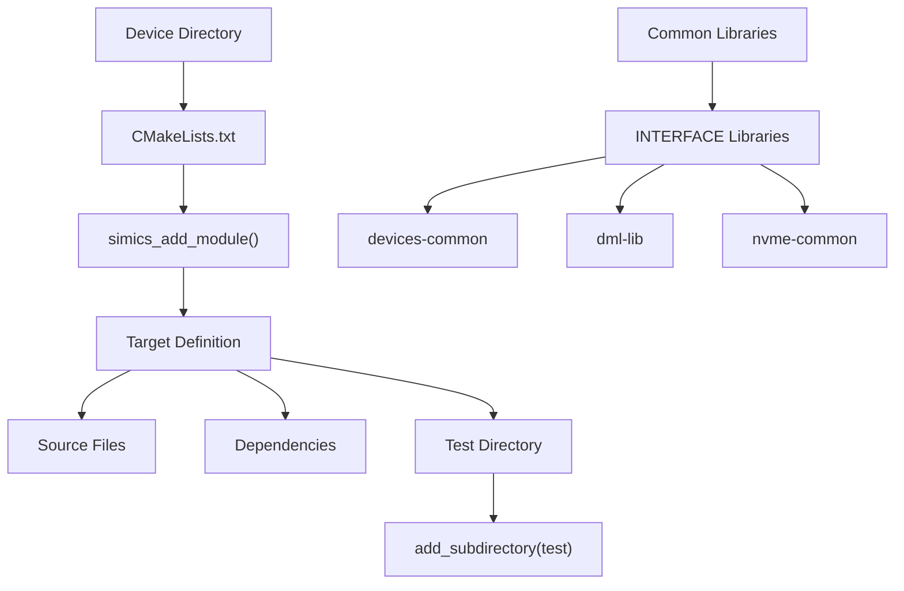

**Diagram sources**
- [common/CMakeLists.txt](file://simics-7.57.0/src/devices/common/CMakeLists.txt)
- [dml-lib/CMakeLists.txt](file://simics-7.57.0/src/devices/dml-lib/CMakeLists.txt)
- [nvme-common/CMakeLists.txt](file://simics-7.57.0/src/devices/nvme-common/CMakeLists.txt)

**Section sources**
- [common/CMakeLists.txt](file://simics-7.57.0/src/devices/common/CMakeLists.txt)
- [dml-lib/CMakeLists.txt](file://simics-7.57.0/src/devices/dml-lib/CMakeLists.txt)

## Core CMake Components

The core components of Simics CMake configuration revolve around the `simics_add_module()` function, which is the primary macro for defining device targets. This function encapsulates the necessary parameters for building a Simics device module, including class definitions, source files, and API version requirements.

### simics_add_module Parameters

The `simics_add_module()` function accepts several key parameters that define the device module:

- **Module Name**: The name of the target being created, typically matching the directory name
- **CLASSES**: Specifies the Simics class names implemented by the device
- **SOURCES**: Lists all source files required for the module, including C, DML, and Python files
- **SIMICS_API**: Defines the Simics API version compatibility
- **INIT_LOCAL**: Indicates whether the module requires local initialization
- **COMPONENTS**: Optional parameter for defining component names

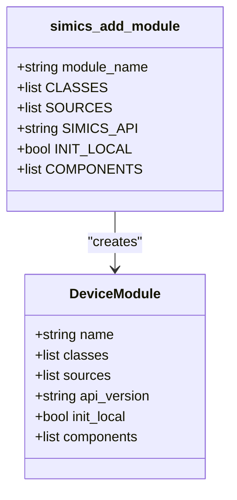

**Diagram sources**
- [empty-device-c/CMakeLists.txt](file://simics-7.57.0/src/devices/empty-device-c/CMakeLists.txt)
- [sample-device-c/CMakeLists.txt](file://simics-7.57.0/src/devices/sample-device-c/CMakeLists.txt)

**Section sources**
- [empty-device-c/CMakeLists.txt](file://simics-7.57.0/src/devices/empty-device-c/CMakeLists.txt)
- [sample-device-c/CMakeLists.txt](file://simics-7.57.0/src/devices/sample-device-c/CMakeLists.txt)

## Device-Specific Configuration Patterns

Different types of Simics devices follow specific CMake configuration patterns based on their implementation language and functionality. These patterns ensure consistency across the codebase while accommodating the unique requirements of each device type.

### C-Based Devices

C-based devices typically include C source files and may require linking to common libraries. The configuration pattern includes specifying the source files and any necessary dependencies.

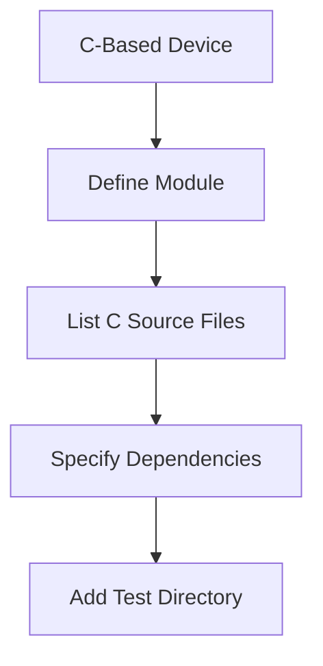

**Diagram sources**
- [empty-device-c/CMakeLists.txt](file://simics-7.57.0/src/devices/empty-device-c/CMakeLists.txt)
- [sample-device-c/CMakeLists.txt](file://simics-7.57.0/src/devices/sample-device-c/CMakeLists.txt)

### DML-Based Devices

DML-based devices use Device Modeling Language files as their primary source code. The CMake configuration focuses on the DML files and their integration with the Simics framework.

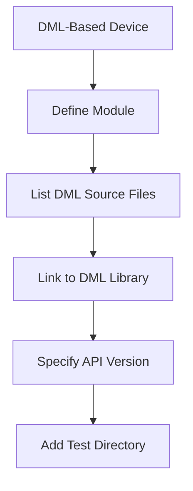

**Diagram sources**
- [empty-device-dml/CMakeLists.txt](file://simics-7.57.0/src/devices/empty-device-dml/CMakeLists.txt)
- [NS16x50/CMakeLists.txt](file://simics-7.57.0/src/devices/NS16x50/CMakeLists.txt)

### Python-Based Devices

Python-based devices integrate Python scripts into the Simics framework. The CMake configuration includes Python files and may require specific initialization settings.

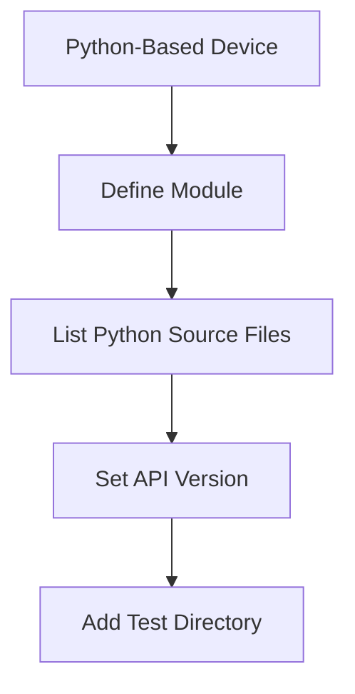

**Diagram sources**
- [empty-device-python/CMakeLists.txt](file://simics-7.57.0/src/devices/empty-device-python/CMakeLists.txt)
- [AT24Cxx/CMakeLists.txt](file://simics-7.57.0/src/devices/AT24Cxx/CMakeLists.txt)

**Section sources**
- [empty-device-c/CMakeLists.txt](file://simics-7.57.0/src/devices/empty-device-c/CMakeLists.txt)
- [empty-device-dml/CMakeLists.txt](file://simics-7.57.0/src/devices/empty-device-dml/CMakeLists.txt)
- [empty-device-python/CMakeLists.txt](file://simics-7.57.0/src/devices/empty-device-python/CMakeLists.txt)

## Dependency Management

Effective dependency management is crucial in the Simics CMake system, ensuring that device modules can access required libraries and interfaces. The system uses INTERFACE libraries and target_link_libraries to manage dependencies between components.

### Interface Libraries

Interface libraries are used to provide include directories and other compile-time requirements without creating linkable binaries. These libraries are defined using add_library with the INTERFACE keyword.

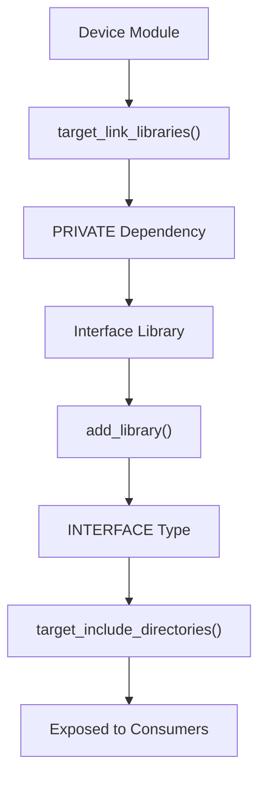

**Diagram sources**
- [common/CMakeLists.txt](file://simics-7.57.0/src/devices/common/CMakeLists.txt)
- [dml-lib/CMakeLists.txt](file://simics-7.57.0/src/devices/dml-lib/CMakeLists.txt)

### Dependency Resolution Patterns

The CMake system follows specific patterns for resolving dependencies between device modules:

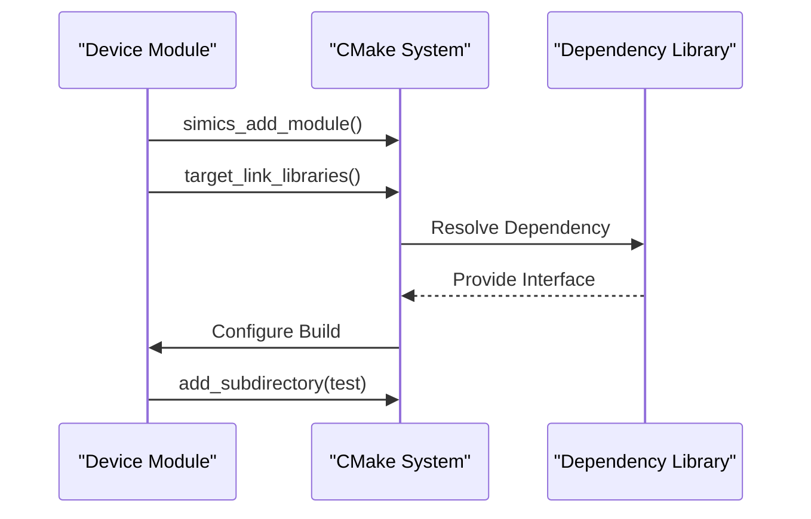

**Diagram sources**
- [can-link/CMakeLists.txt](file://simics-7.57.0/src/devices/can-link/CMakeLists.txt)
- [eth-links/CMakeLists.txt](file://simics-7.57.0/src/devices/eth-links/CMakeLists.txt)

**Section sources**
- [common/CMakeLists.txt](file://simics-7.57.0/src/devices/common/CMakeLists.txt)
- [dml-lib/CMakeLists.txt](file://simics-7.57.0/src/devices/dml-lib/CMakeLists.txt)
- [can-link/CMakeLists.txt](file://simics-7.57.0/src/devices/can-link/CMakeLists.txt)

## Integration with DML and Python

The CMake system seamlessly integrates DML and Python components into the Simics device modeling framework, allowing mixed-language development and configuration.

### DML Integration

DML files are treated as source files within the CMake configuration and are processed as part of the build system. The integration pattern includes:

- Listing DML files in the SOURCES parameter
- Linking to the dml-lib interface library
- Specifying the appropriate SIMICS_API version

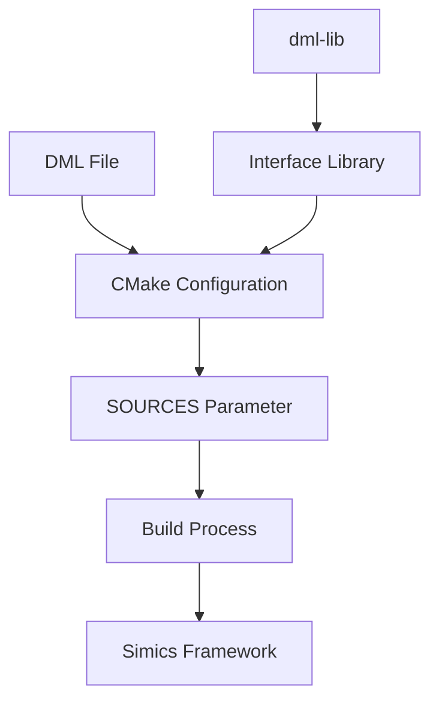

**Diagram sources**
- [NS16x50/CMakeLists.txt](file://simics-7.57.0/src/devices/NS16x50/CMakeLists.txt)
- [virtio/CMakeLists.txt](file://simics-7.57.0/src/devices/virtio/CMakeLists.txt)

### Python Integration

Python scripts are integrated into device models through the CMake system, enabling Python-based device functionality:

- Python files are included in the SOURCES parameter
- The SIMICS_API parameter ensures compatibility
- Python modules can be imported and used within the Simics environment

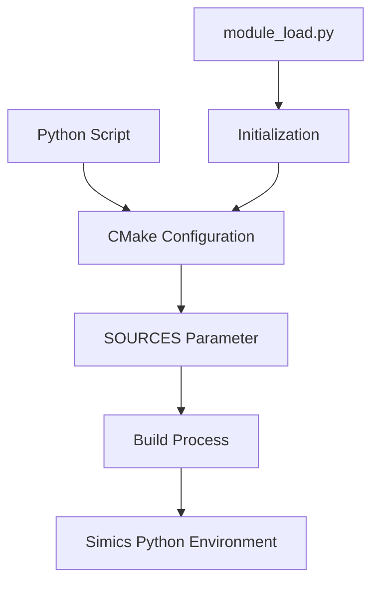

**Diagram sources**
- [AT24Cxx/CMakeLists.txt](file://simics-7.57.0/src/devices/AT24Cxx/CMakeLists.txt)
- [i2c-link-v2/CMakeLists.txt](file://simics-7.57.0/src/devices/i2c-link-v2/CMakeLists.txt)

**Section sources**
- [NS16x50/CMakeLists.txt](file://simics-7.57.0/src/devices/NS16x50/CMakeLists.txt)
- [AT24Cxx/CMakeLists.txt](file://simics-7.57.0/src/devices/AT24Cxx/CMakeLists.txt)
- [virtio/CMakeLists.txt](file://simics-7.57.0/src/devices/virtio/CMakeLists.txt)

## Advanced Configuration Options

The Simics CMake system supports advanced configuration options for specialized build requirements and optimization.

### Conditional Compilation

Conditional compilation allows for platform-specific code and feature toggles:

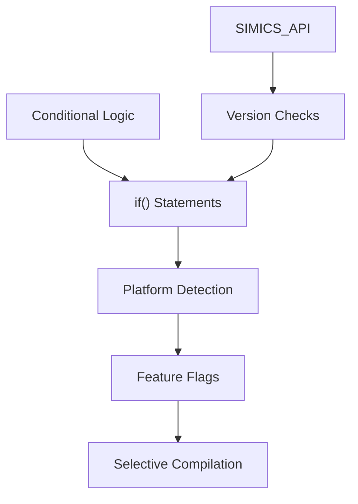

**Diagram sources**
- [i2c-link-v2/CMakeLists.txt](file://simics-7.57.0/src/devices/i2c-link-v2/CMakeLists.txt)
- [eth-links/CMakeLists.txt](file://simics-7.57.0/src/devices/eth-links/CMakeLists.txt)

### Sanitizer Support

The system includes support for code sanitizers to detect runtime errors:

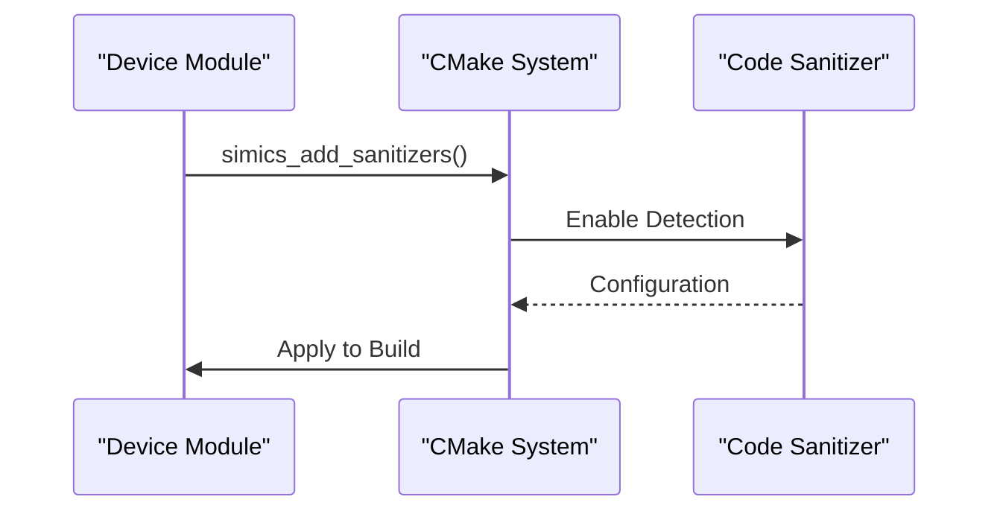

**Diagram sources**
- [virtio/CMakeLists.txt](file://simics-7.57.0/src/devices/virtio/CMakeLists.txt)
- [simics-nvme-controller/CMakeLists.txt](file://simics-7.57.0/src/devices/simics-nvme-controller/CMakeLists.txt)

**Section sources**
- [virtio/CMakeLists.txt](file://simics-7.57.0/src/devices/virtio/CMakeLists.txt)
- [simics-nvme-controller/CMakeLists.txt](file://simics-7.57.0/src/devices/simics-nvme-controller/CMakeLists.txt)

## Common Variables and Macros

The Simics CMake system defines several common variables and macros that are used across device configurations.

### Standard Variables

- **CMAKE_CURRENT_SOURCE_DIR**: Current source directory path
- **SIMICS_API**: Simics API version for compatibility
- **PRIVATE**: Scope specifier for target_link_libraries

### Key Macros

- **simics_add_module()**: Primary macro for defining device modules
- **target_link_libraries()**: Links dependencies to targets
- **add_subdirectory()**: Includes subdirectories in the build
- **simics_add_sanitizers()**: Adds code sanitizers to the build

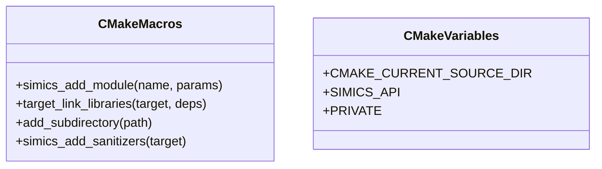

**Diagram sources**
- [empty-device-c/CMakeLists.txt](file://simics-7.57.0/src/devices/empty-device-c/CMakeLists.txt)
- [sample-device-c/CMakeLists.txt](file://simics-7.57.0/src/devices/sample-device-c/CMakeLists.txt)

**Section sources**
- [empty-device-c/CMakeLists.txt](file://simics-7.57.0/src/devices/empty-device-c/CMakeLists.txt)
- [sample-device-c/CMakeLists.txt](file://simics-7.57.0/src/devices/sample-device-c/CMakeLists.txt)

## Best Practices and Troubleshooting

### Best Practices

1. **Consistent Naming**: Use consistent naming conventions for modules and targets
2. **Modular Design**: Keep device modules focused and independent
3. **Dependency Management**: Explicitly declare all dependencies
4. **Version Compatibility**: Specify appropriate SIMICS_API versions
5. **Test Integration**: Always include test directories with add_subdirectory()

### Common Issues and Solutions

- **Missing Dependencies**: Ensure all required libraries are linked with target_link_libraries
- **API Version Mismatches**: Verify SIMICS_API compatibility with the target platform
- **Source File Not Found**: Check file paths and ensure SOURCES are correctly specified
- **Circular Dependencies**: Restructure code to eliminate circular references
- **Platform-Specific Issues**: Use conditional compilation for platform differences

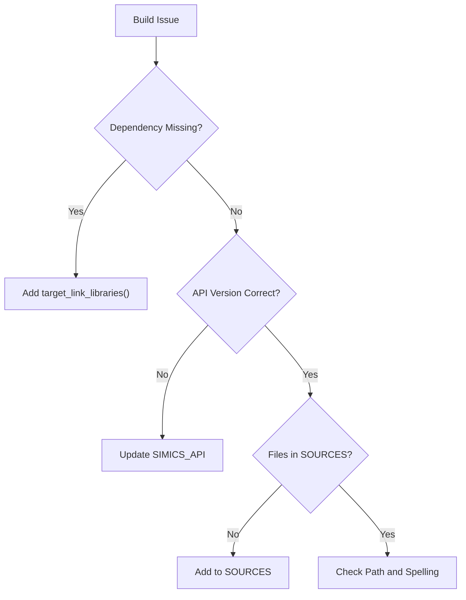

**Section sources**
- [generic-flash-memory/CMakeLists.txt](file://simics-7.57.0/src/devices/generic-flash-memory/CMakeLists.txt)
- [can-link/CMakeLists.txt](file://simics-7.57.0/src/devices/can-link/CMakeLists.txt)

## Conclusion

The CMake build configuration system in Simics provides a robust and flexible framework for developing device models. By following the standardized patterns and best practices outlined in this documentation, developers can create well-structured, maintainable device modules that integrate seamlessly with the Simics platform. The system's support for multiple languages, dependency management, and advanced configuration options makes it a powerful tool for modern device modeling. Understanding the core components and patterns enables developers to effectively leverage CMake for both simple and complex device implementations.