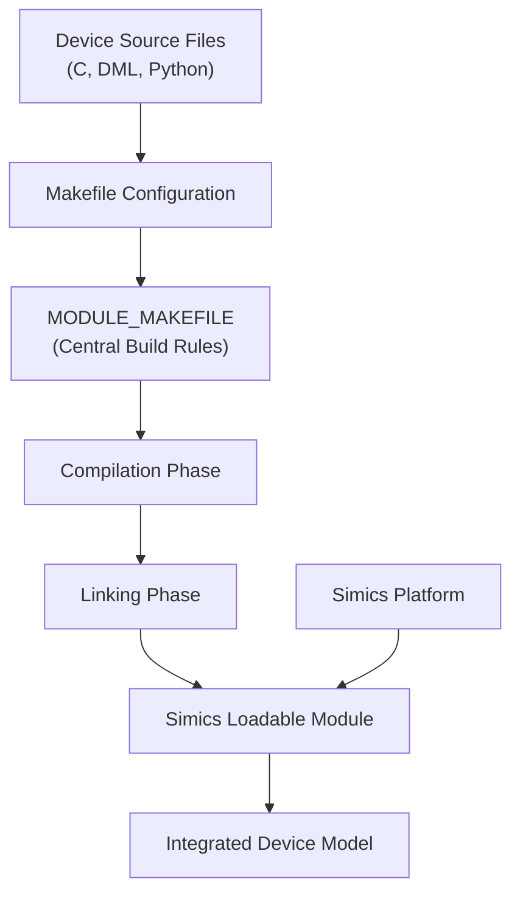
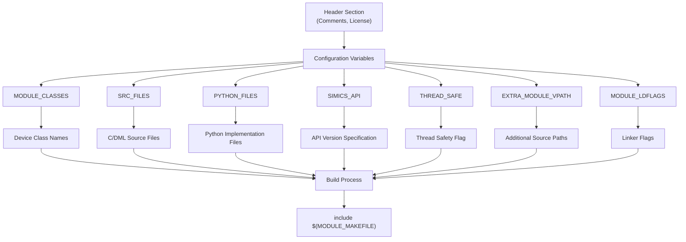
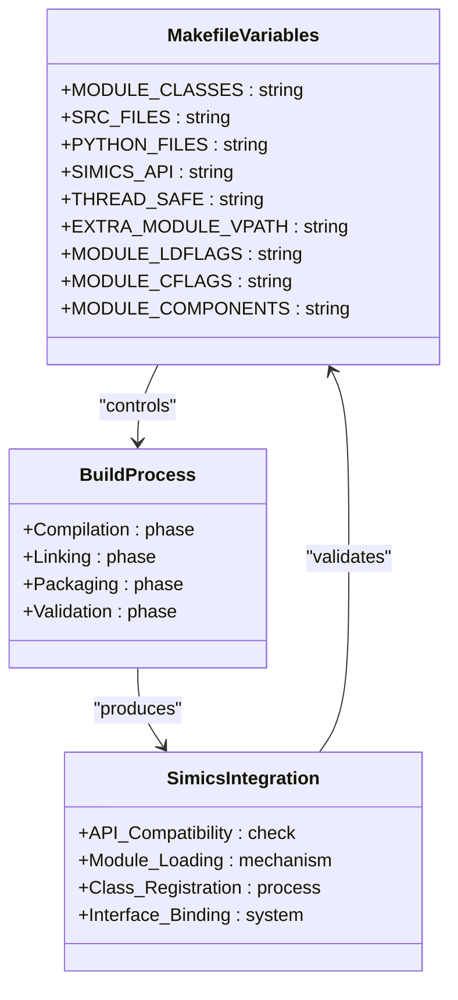
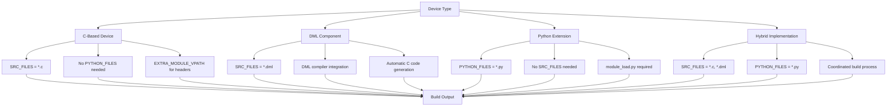
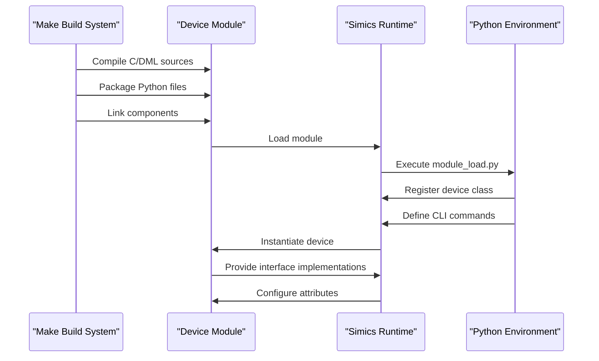
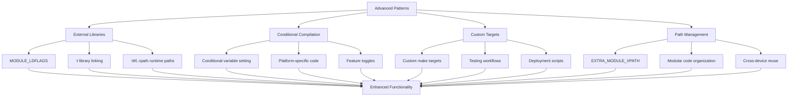
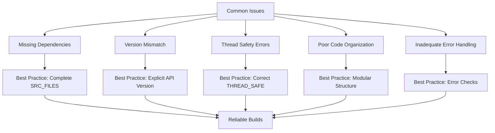

# Make Configuration

<cite>
**Referenced Files in This Document**   
- [AM79C960/Makefile](file://simics-7.57.0/src/devices/AM79C960/Makefile)
- [AT24Cxx/Makefile](file://simics-7.57.0/src/devices/AT24Cxx/Makefile)
- [NS16x50/Makefile](file://simics-7.57.0/src/devices/NS16x50/Makefile)
- [generic-flash-memory/Makefile](file://simics-7.57.0/src/devices/generic-flash-memory/Makefile)
- [sample-device-c/Makefile](file://simics-7.57.0/src/devices/sample-device-c/Makefile)
- [empty-device-c/Makefile](file://simics-7.57.0/src/devices/empty-device-c/Makefile)
- [empty-device-python/Makefile](file://simics-7.57.0/src/devices/empty-device-python/Makefile)
- [empty-device-dml/Makefile](file://simics-7.57.0/src/devices/empty-device-dml/Makefile)
- [can-link/Makefile](file://simics-7.57.0/src/devices/can-link/Makefile)
- [i2c-link-v2/Makefile](file://simics-7.57.0/src/devices/i2c-link-v2/Makefile)
- [AM79C960/module_load.py](file://simics-7.57.0/src/devices/AM79C960/module_load.py)
- [AT24Cxx/module_load.py](file://simics-7.57.0/src/devices/AT24Cxx/module_load.py)
- [empty-device-c/module_load.py](file://simics-7.57.0/src/devices/empty-device-c/module_load.py)
- [AT24Cxx/AT24Cxx.c](file://simics-7.57.0/src/devices/AT24Cxx/AT24Cxx.c)
- [empty-device-c/empty-device-c.c](file://simics-7.57.0/src/devices/empty-device-c/empty-device-c.c)
- [empty-device-dml/empty-device-dml.dml](file://simics-7.57.0/src/devices/empty-device-dml/empty-device-dml.dml)
- [empty-device-python/empty_device_python.py](file://simics-7.57.0/src/devices/empty-device-python/empty_device_python.py)
</cite>

## Table of Contents
1. [Introduction](#introduction)
2. [Make Build System Overview](#make-build-system-overview)
3. [Core Makefile Structure](#core-makefile-structure)
4. [Key Variables and Their Functions](#key-variables-and-their-functions)
5. [Device Type Specific Configurations](#device-type-specific-configurations)
6. [Integration with Simics Components](#integration-with-simics-components)
7. [Advanced Configuration Patterns](#advanced-configuration-patterns)
8. [Common Issues and Best Practices](#common-issues-and-best-practices)
9. [Conclusion](#conclusion)

## Introduction
The Make build system serves as the traditional foundation for Simics device model development, particularly for legacy components and established device families. This documentation provides comprehensive guidance on configuring Make for Simics device modeling, covering both fundamental concepts for beginners and advanced techniques for experienced developers. The analysis is based on real device implementations across the Simics framework, revealing consistent patterns and best practices that ensure reliable builds and proper integration with the Simics platform.

**Section sources**
- [AM79C960/Makefile](file://simics-7.57.0/src/devices/AM79C960/Makefile#L1-L24)
- [AT24Cxx/Makefile](file://simics-7.57.0/src/devices/AT24Cxx/Makefile#L1-L26)

## Make Build System Overview
The Make build system in Simics provides a standardized approach to compiling and linking device models, serving as the backbone for legacy device development. Unlike modern CMake-based configurations, Makefiles offer a direct and transparent method for defining build rules, making them particularly valuable for understanding the underlying compilation process. The system is designed to handle various device types including C-based implementations, DML (Device Modeling Language) components, and Python extensions, with consistent patterns across different device categories.

The architecture centers around a modular approach where each device directory contains its own Makefile that inherits common rules from a central MODULE_MAKEFILE. This design enables consistent build behavior while allowing device-specific customizations. The system supports incremental builds with proper dependency tracking, ensuring that only modified components are recompiled, which significantly improves development efficiency for large-scale simulations.

**Diagram sources**
- [AM79C960/Makefile](file://simics-7.57.0/src/devices/AM79C960/Makefile#L1-L24)
- [AT24Cxx/Makefile](file://simics-7.57.0/src/devices/AT24Cxx/Makefile#L1-L26)

**Section sources**
- [AM79C960/Makefile](file://simics-7.57.0/src/devices/AM79C960/Makefile#L1-L24)
- [AT24Cxx/Makefile](file://simics-7.57.0/src/devices/AT24Cxx/Makefile#L1-L26)

## Core Makefile Structure
The structure of Simics Makefiles follows a consistent pattern across device implementations, beginning with copyright and license information followed by essential build configuration variables. Each Makefile typically starts with metadata comments and then defines key variables that control the build process. The most critical structural element is the inclusion of $(MODULE_MAKEFILE) at the end, which imports the central build rules and execution logic.

The standard structure includes device class declarations, source file specifications, and API versioning information. This consistent layout enables developers to quickly understand and modify build configurations across different device types. The modular design allows for easy extension and customization while maintaining compatibility with the broader Simics framework.

**Diagram sources**
- [AM79C960/Makefile](file://simics-7.57.0/src/devices/AM79C960/Makefile#L1-L24)
- [AT24Cxx/Makefile](file://simics-7.57.0/src/devices/AT24Cxx/Makefile#L1-L26)
- [NS16x50/Makefile](file://simics-7.57.0/src/devices/NS16x50/Makefile#L1-L26)

**Section sources**
- [AM79C960/Makefile](file://simics-7.57.0/src/devices/AM79C960/Makefile#L1-L24)
- [AT24Cxx/Makefile](file://simics-7.57.0/src/devices/AT24Cxx/Makefile#L1-L26)
- [NS16x50/Makefile](file://simics-7.57.0/src/devices/NS16x50/Makefile#L1-L26)

## Key Variables and Their Functions
Simics Makefiles utilize a standardized set of variables to control the build process, each serving a specific purpose in device model configuration. These variables provide a declarative interface for specifying build requirements and integration points with the Simics platform.

### MODULE_CLASSES
This variable defines the Simics class names implemented in the module, which are used for object instantiation within the simulation environment. Multiple classes can be specified when a single module implements several related device types.

### SRC_FILES
Specifies the source files that contain the device implementation, including both C source files (.c) and DML files (.dml). The build system automatically handles the compilation and processing of these different file types.

### PYTHON_FILES
Lists Python files that are part of the module, typically including the module_load.py file and any additional Python implementation files. These files are packaged with the compiled module for runtime execution.

### SIMICS_API
Defines the Simics API version compatibility, ensuring that the module is built against the appropriate API level. This can be set to a specific version number or "latest" to target the most recent API.

### THREAD_SAFE
A flag indicating whether the module is thread-safe, which affects how the Simics runtime handles concurrent access to the device model.

### EXTRA_MODULE_VPATH
Specifies additional directories to search for source files, enabling modular code organization and reuse across different device implementations.

### MODULE_LDFLAGS
Allows customization of linker flags, particularly useful for specifying external library dependencies and runtime library paths.

**Diagram sources**
- [generic-flash-memory/Makefile](file://simics-7.57.0/src/devices/generic-flash-memory/Makefile#L1-L25)
- [can-link/Makefile](file://simics-7.57.0/src/devices/can-link/Makefile#L1-L35)
- [i2c-link-v2/Makefile](file://simics-7.57.0/src/devices/i2c-link-v2/Makefile#L1-L28)

**Section sources**
- [generic-flash-memory/Makefile](file://simics-7.57.0/src/devices/generic-flash-memory/Makefile#L1-L25)
- [can-link/Makefile](file://simics-7.57.0/src/devices/can-link/Makefile#L1-L35)
- [i2c-link-v2/Makefile](file://simics-7.57.0/src/devices/i2c-link-v2/Makefile#L1-L28)

## Device Type Specific Configurations
Different device types in Simics require specific Makefile configurations to properly integrate their implementation technologies. The build system supports C-based devices, DML components, Python extensions, and hybrid implementations through consistent but adaptable patterns.

### C-Based Devices
For pure C implementations, the Makefile focuses on C source files and may include additional header directories through EXTRA_MODULE_VPATH. The configuration emphasizes compilation flags and linker settings for optimal performance.

### DML Components
DML-based devices require the DML compiler to process .dml files into C code before compilation. The Makefile configuration ensures proper dependency tracking between DML sources and generated C files.

### Python Extensions
Python-based devices package Python implementation files alongside any compiled components. The configuration ensures that Python files are properly included in the module distribution.

### Hybrid Implementations
Many devices combine multiple technologies, such as C code for performance-critical sections and Python for configuration and interface logic. The Makefile must coordinate the build process for all component types.

**Diagram sources**
- [empty-device-c/Makefile](file://simics-7.57.0/src/devices/empty-device-c/Makefile#L1-L26)
- [empty-device-dml/Makefile](file://simics-7.57.0/src/devices/empty-device-dml/Makefile#L1-L21)
- [empty-device-python/Makefile](file://simics-7.57.0/src/devices/empty-device-python/Makefile#L1-L18)
- [sample-device-c/Makefile](file://simics-7.57.0/src/devices/sample-device-c/Makefile#L1-L28)

**Section sources**
- [empty-device-c/Makefile](file://simics-7.57.0/src/devices/empty-device-c/Makefile#L1-L26)
- [empty-device-dml/Makefile](file://simics-7.57.0/src/devices/empty-device-dml/Makefile#L1-L21)
- [empty-device-python/Makefile](file://simics-7.57.0/src/devices/empty-device-python/Makefile#L1-L18)
- [sample-device-c/Makefile](file://simics-7.57.0/src/devices/sample-device-c/Makefile#L1-L28)

## Integration with Simics Components
The Make build system seamlessly integrates with various Simics components, enabling device models to interact with the simulation environment through standardized interfaces. This integration is facilitated through the module_load.py files and proper configuration of build variables.

The build process ensures that device classes are properly registered with the Simics runtime, allowing them to be instantiated and configured within simulation scenarios. Python integration enables dynamic configuration and runtime interaction, while C and DML components provide the performance-critical implementation details.

**Diagram sources**
- [AM79C960/module_load.py](file://simics-7.57.0/src/devices/AM79C960/module_load.py#L1-L62)
- [AT24Cxx/module_load.py](file://simics-7.57.0/src/devices/AT24Cxx/module_load.py#L1-L38)
- [empty-device-c/module_load.py](file://simics-7.57.0/src/devices/empty-device-c/module_load.py#L1-L18)

**Section sources**
- [AM79C960/module_load.py](file://simics-7.57.0/src/devices/AM79C960/module_load.py#L1-L62)
- [AT24Cxx/module_load.py](file://simics-7.57.0/src/devices/AT24Cxx/module_load.py#L1-L38)
- [empty-device-c/module_load.py](file://simics-7.57.0/src/devices/empty-device-c/module_load.py#L1-L18)

## Advanced Configuration Patterns
Experienced developers can leverage advanced configuration patterns to optimize their Simics device builds and enhance functionality. These patterns address complex requirements such as external library dependencies, conditional compilation, and custom build targets.

### External Library Integration
The MODULE_LDFLAGS variable enables integration with external libraries, as demonstrated in the can-link and i2c-link-v2 modules which link against the liblink library and set appropriate runtime paths.

### Conditional Compilation
Make variables can be used to control conditional compilation based on build configuration or target platform, allowing for flexible code organization and optimization.

### Custom Build Targets
While most builds follow the standard pattern, advanced configurations can define custom targets for specialized build operations, testing, or deployment scenarios.

### Path Management
The EXTRA_MODULE_VPATH variable facilitates modular code organization by allowing source files to be located in separate directories, promoting code reuse across different device implementations.

**Diagram sources**
- [can-link/Makefile](file://simics-7.57.0/src/devices/can-link/Makefile#L1-L35)
- [i2c-link-v2/Makefile](file://simics-7.57.0/src/devices/i2c-link-v2/Makefile#L1-L28)
- [sample-device-c/Makefile](file://simics-7.57.0/src/devices/sample-device-c/Makefile#L1-L28)

**Section sources**
- [can-link/Makefile](file://simics-7.57.0/src/devices/can-link/Makefile#L1-L35)
- [i2c-link-v2/Makefile](file://simics-7.57.0/src/devices/i2c-link-v2/Makefile#L1-L28)
- [sample-device-c/Makefile](file://simics-7.57.0/src/devices/sample-device-c/Makefile#L1-L28)

## Common Issues and Best Practices
Developers working with Simics Make configurations may encounter several common issues, but established best practices can mitigate these challenges and ensure reliable builds.

### Dependency Tracking
Ensure proper dependency tracking by correctly specifying all source files and using the appropriate build variables. Missing dependencies can lead to inconsistent builds and difficult-to-diagnose issues.

### Version Compatibility
Always specify the appropriate SIMICS_API version to ensure compatibility with the target Simics platform. Using "latest" should be done with caution in production environments.

### Thread Safety
Properly set the THREAD_SAFE flag based on the implementation's thread safety characteristics. Incorrect settings can lead to race conditions or unnecessary performance overhead.

### Code Organization
Follow the established patterns for code organization, keeping related files together and using EXTRA_MODULE_VPATH for shared components. This promotes maintainability and code reuse.

### Error Handling
Include proper error handling in the Makefile, such as the check for MODULE_MAKEFILE existence, to provide clear error messages when build conditions are not met.

**Diagram sources**
- [empty-device-c/Makefile](file://simics-7.57.0/src/devices/empty-device-c/Makefile#L1-L26)
- [can-link/Makefile](file://simics-7.57.0/src/devices/can-link/Makefile#L1-L35)
- [i2c-link-v2/Makefile](file://simics-7.57.0/src/devices/i2c-link-v2/Makefile#L1-L28)

**Section sources**
- [empty-device-c/Makefile](file://simics-7.57.0/src/devices/empty-device-c/Makefile#L1-L26)
- [can-link/Makefile](file://simics-7.57.0/src/devices/can-link/Makefile#L1-L35)
- [i2c-link-v2/Makefile](file://simics-7.57.0/src/devices/i2c-link-v2/Makefile#L1-L28)

## Conclusion
The Make build system remains a critical component of Simics device modeling, particularly for legacy and established device families. Its straightforward structure and consistent patterns provide a reliable foundation for device development, while its flexibility supports various implementation technologies including C, DML, and Python. By understanding the core variables, device-specific configurations, and integration patterns, developers can effectively leverage Make to create robust and maintainable device models. The system's emphasis on modularity and code reuse, combined with proper error handling and best practices, ensures that device models are both functional and maintainable within the Simics ecosystem.