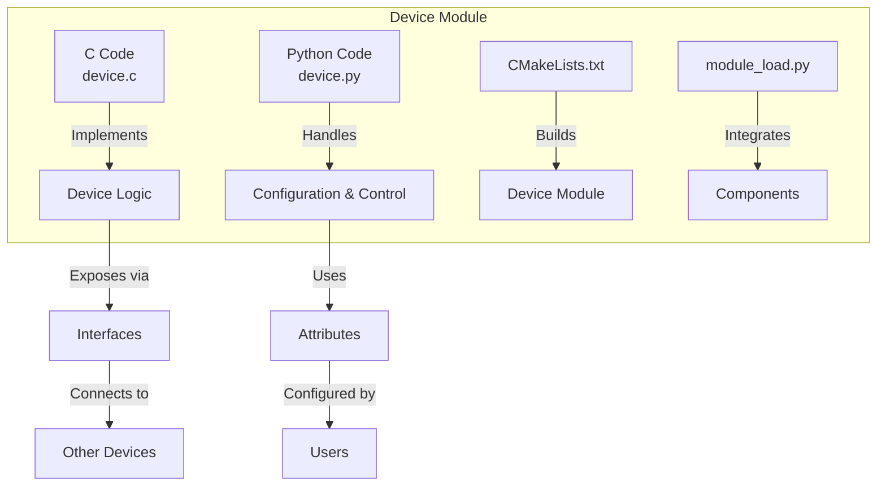
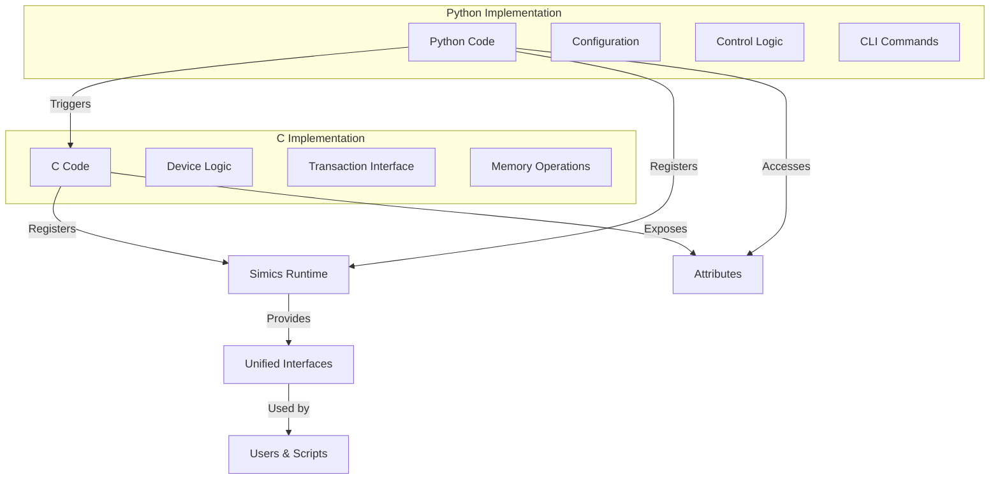
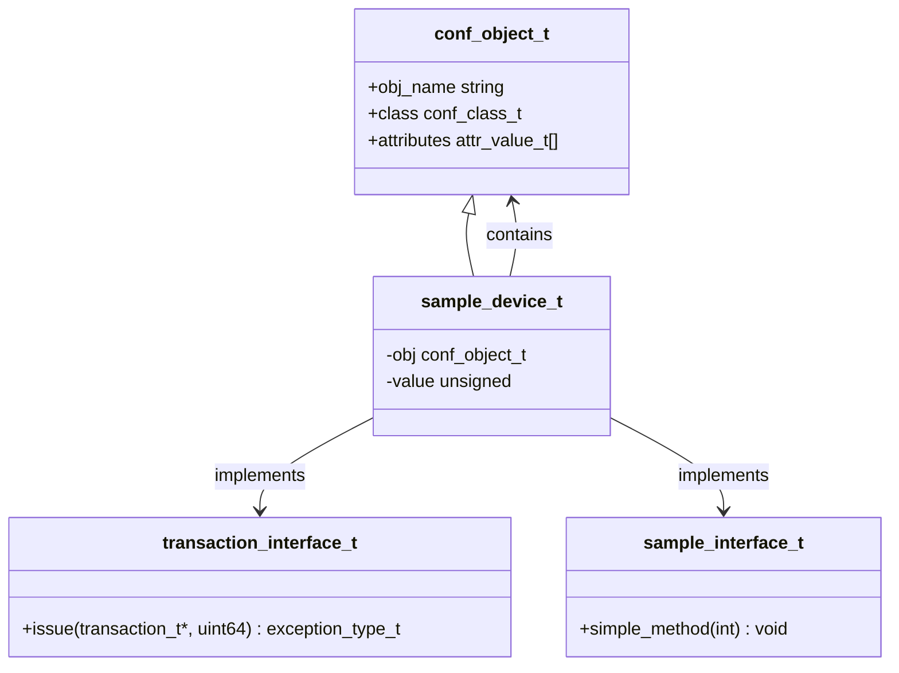
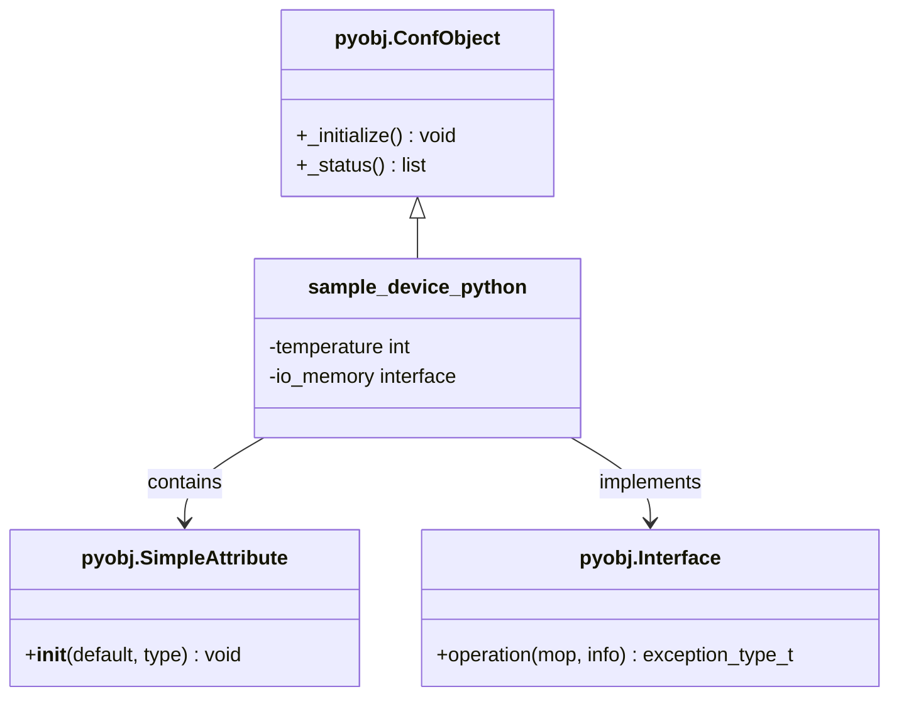
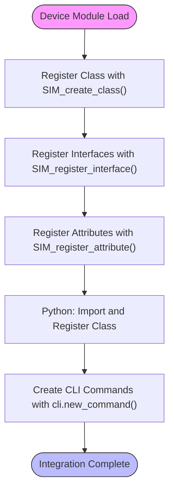
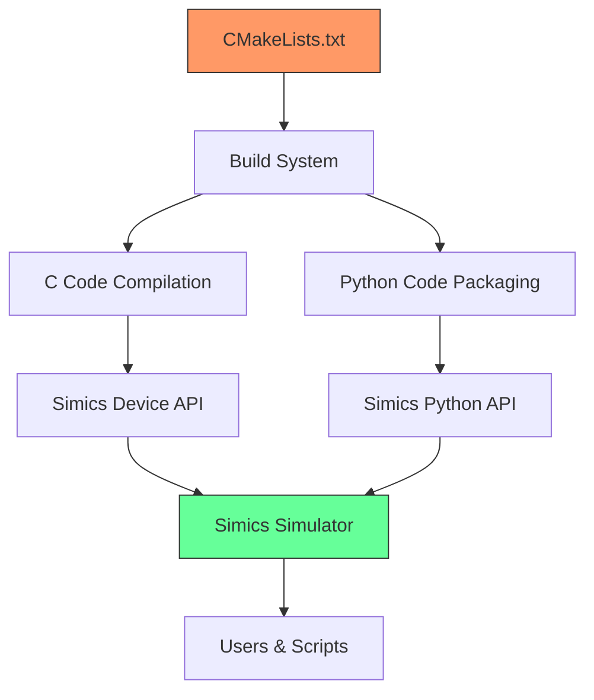

# C and Python Integration

<cite>
**Referenced Files in This Document**   
- [sample-device.c](file://simics-7.57.0/src/devices/sample-device-c/sample-device.c)
- [sample_device_python.py](file://simics-7.57.0/src/devices/sample-device-python/sample_device_python.py)
- [empty-device-c.c](file://simics-7.57.0/src/devices/empty-device-c/empty-device-c.c)
- [empty_device_python.py](file://simics-7.57.0/src/devices/empty-device-python/empty_device_python.py)
- [module_load.py](file://simics-7.57.0/src/devices/sample-device-c/module_load.py)
- [module_load.py](file://simics-7.57.0/src/devices/sample-device-python/module_load.py)
- [CMakeLists.txt](file://simics-7.57.0/src/devices/sample-device-c/CMakeLists.txt)
- [CMakeLists.txt](file://simics-7.57.0/src/devices/sample-device-python/CMakeLists.txt)
- [can-interface.h](file://simics-7.57.0/src/devices/can-interface/can-interface.h)
- [i2c-link-v2.c](file://simics-7.57.0/src/devices/i2c-link-v2/i2c-link-v2.c)
- [generic-flash-memory.c](file://simics-7.57.0/src/devices/generic-flash-memory/generic-flash-memory.c)
- [pci_proxy.py](file://simics-7.57.0/src/devices/pci-proxy/pci_proxy.py)
- [simics_start.py](file://simics-7.57.0/src/devices/eth-links/simics_start.py)
</cite>

## Table of Contents
1. [Introduction](#introduction)
2. [Project Structure](#project-structure)
3. [Core Components](#core-components)
4. [Architecture Overview](#architecture-overview)
5. [Detailed Component Analysis](#detailed-component-analysis)
6. [Dependency Analysis](#dependency-analysis)
7. [Performance Considerations](#performance-considerations)
8. [Troubleshooting Guide](#troubleshooting-guide)
9. [Conclusion](#conclusion)

## Introduction
This document provides comprehensive architectural documentation for the C and Python integration architecture in Simics device modeling. The hybrid implementation approach leverages C for performance-critical device logic and Python for configuration, integration, and control. This architecture enables efficient low-level emulation while maintaining flexibility and ease of use for high-level orchestration. The integration pattern follows Simics' modular design principles, allowing seamless interaction between components implemented in different languages through well-defined interfaces and attribute systems.

## Project Structure
The Simics device modeling architecture follows a modular structure with clear separation between C implementations for device logic and Python scripts for configuration and control. Each device module contains both C and Python components that work together through Simics' object-oriented framework.

**Diagram sources**
- [CMakeLists.txt](file://simics-7.57.0/src/devices/sample-device-c/CMakeLists.txt)
- [sample-device.c](file://simics-7.57.0/src/devices/sample-device-c/sample-device.c)
- [sample_device_python.py](file://simics-7.57.0/src/devices/sample-device-python/sample_device_python.py)

**Section sources**
- [CMakeLists.txt](file://simics-7.57.0/src/devices/sample-device-c/CMakeLists.txt)
- [sample-device.c](file://simics-7.57.0/src/devices/sample-device-c/sample-device.c)

## Core Components
The C and Python integration architecture in Simics consists of several core components that enable the hybrid implementation pattern. The architecture separates concerns between performance-critical device emulation (implemented in C) and flexible configuration and control (implemented in Python). The integration is facilitated through Simics' object-oriented framework, which provides a unified interface system for cross-language communication.

The key components include:
- C implementations for device logic and low-level operations
- Python classes for configuration objects and high-level control
- Interface definitions that enable communication between components
- Attribute systems for configuration and state management
- Build system integration through CMake

**Section sources**
- [sample-device.c](file://simics-7.57.0/src/devices/sample-device-c/sample-device.c)
- [sample_device_python.py](file://simics-7.57.0/src/devices/sample-device-python/sample_device_python.py)
- [empty-device-c.c](file://simics-7.57.0/src/devices/empty-device-c/empty-device-c.c)
- [empty_device_python.py](file://simics-7.57.0/src/devices/empty-device-python/empty_device_python.py)

## Architecture Overview
The C and Python integration architecture in Simics follows a hybrid implementation pattern where C code handles performance-critical device emulation logic, while Python scripts manage configuration, integration, and control functions. This architectural approach leverages the strengths of both languages: C provides the necessary performance for low-level device emulation, while Python offers flexibility and ease of use for high-level orchestration and scripting.

The integration is achieved through Simics' object-oriented framework, which provides a unified system for defining device classes, interfaces, and attributes that can be accessed across language boundaries. Device classes are registered with the Simics runtime, and their methods and attributes are exposed through a consistent API regardless of the implementation language.

**Diagram sources**
- [sample-device.c](file://simics-7.57.0/src/devices/sample-device-c/sample-device.c)
- [sample_device_python.py](file://simics-7.57.0/src/devices/sample-device-python/sample_device_python.py)

## Detailed Component Analysis

### C Device Implementation Analysis
The C implementation in Simics device modeling focuses on performance-critical aspects of device emulation. The code is structured around configuration objects that represent device instances and implement the necessary interfaces for device functionality.

**Diagram sources**
- [sample-device.c](file://simics-7.57.0/src/devices/sample-device-c/sample-device.c)
- [empty-device-c.c](file://simics-7.57.0/src/devices/empty-device-c/empty-device-c.c)

**Section sources**
- [sample-device.c](file://simics-7.57.0/src/devices/sample-device-c/sample-device.c)
- [empty-device-c.c](file://simics-7.57.0/src/devices/empty-device-c/empty-device-c.c)

### Python Device Implementation Analysis
The Python implementation in Simics provides a higher-level interface for device configuration and control. It leverages the pyobj module to create Python classes that integrate with the Simics object system, allowing seamless interaction with C-implemented components.

**Diagram sources**
- [sample_device_python.py](file://simics-7.57.0/src/devices/sample-device-python/sample_device_python.py)
- [empty_device_python.py](file://simics-7.57.0/src/devices/empty-device-python/empty_device_python.py)

**Section sources**
- [sample_device_python.py](file://simics-7.57.0/src/devices/sample-device-python/sample_device_python.py)
- [empty_device_python.py](file://simics-7.57.0/src/devices/empty-device-python/empty_device_python.py)

### Interface and Attribute System Analysis
The interface and attribute system is the cornerstone of the C and Python integration architecture in Simics. It provides a consistent mechanism for components to communicate across language boundaries, enabling the hybrid implementation pattern.

**Diagram sources**
- [sample-device.c](file://simics-7.57.0/src/devices/sample-device-c/sample-device.c)
- [module_load.py](file://simics-7.57.0/src/devices/sample-device-c/module_load.py)
- [sample_device_python.py](file://simics-7.57.0/src/devices/sample-device-python/sample_device_python.py)

**Section sources**
- [sample-device.c](file://simics-7.57.0/src/devices/sample-device-c/sample-device.c)
- [module_load.py](file://simics-7.57.0/src/devices/sample-device-c/module_load.py)
- [sample_device_python.py](file://simics-7.57.0/src/devices/sample-device-python/sample_device_python.py)

## Dependency Analysis
The C and Python integration architecture in Simics has a well-defined dependency structure that ensures proper initialization and interaction between components. The build system, runtime framework, and component interfaces form a cohesive ecosystem that supports the hybrid implementation pattern.

**Diagram sources**
- [CMakeLists.txt](file://simics-7.57.0/src/devices/sample-device-c/CMakeLists.txt)
- [CMakeLists.txt](file://simics-7.57.0/src/devices/sample-device-python/CMakeLists.txt)

**Section sources**
- [CMakeLists.txt](file://simics-7.57.0/src/devices/sample-device-c/CMakeLists.txt)
- [CMakeLists.txt](file://simics-7.57.0/src/devices/sample-device-python/CMakeLists.txt)

## Performance Considerations
The C and Python integration architecture in Simics is designed to optimize performance by leveraging C for computationally intensive device emulation tasks while using Python for higher-level configuration and control. This separation ensures that the performance-critical path remains in compiled C code, minimizing overhead from the Python interpreter.

The architecture minimizes cross-language calls in performance-critical sections by designing interfaces that batch operations and reduce the frequency of context switching between C and Python. Data exchange between components is optimized through the use of Simics' attribute system, which provides efficient access to device state without requiring explicit serialization.

When performance analysis is required, the architecture supports profiling of both C and Python components independently, allowing developers to identify bottlenecks in either language implementation. The modular design also enables targeted optimization of specific components without affecting the overall system architecture.

## Troubleshooting Guide
When troubleshooting issues in the C and Python integration architecture, it's important to consider both language environments and their interaction points. Common issues include interface registration problems, attribute access errors, and initialization sequence conflicts.

Key troubleshooting steps include:
1. Verify that all interfaces are properly registered in the C code using SIM_register_interface()
2. Check that Python classes are correctly imported and registered in module_load.py
3. Ensure that attribute types and names match between C and Python implementations
4. Validate the build configuration in CMakeLists.txt to confirm all source files are included
5. Check the initialization order of components to prevent dependency issues

Debugging tools such as Simics' built-in logging facilities and external debuggers can be used to trace execution flow across language boundaries. The architecture's modular design facilitates isolation of issues to specific components, making it easier to identify and resolve problems.

**Section sources**
- [sample-device.c](file://simics-7.57.0/src/devices/sample-device-c/sample-device.c)
- [sample_device_python.py](file://simics-7.57.0/src/devices/sample-device-python/sample_device_python.py)
- [module_load.py](file://simics-7.57.0/src/devices/sample-device-c/module_load.py)

## Conclusion
The C and Python integration architecture in Simics device modeling provides a powerful and flexible approach to hardware emulation. By combining the performance advantages of C for low-level device logic with the flexibility and ease of use of Python for configuration and control, this architecture enables efficient and maintainable device models.

The integration is facilitated through Simics' object-oriented framework, which provides a consistent interface system that works seamlessly across language boundaries. This allows developers to choose the appropriate language for each aspect of device implementation while maintaining a cohesive overall design.

The architecture has proven effective in numerous device implementations, from simple I/O devices to complex system components. Its modular design, clear separation of concerns, and well-defined interfaces make it a robust foundation for building and maintaining device models in Simics.