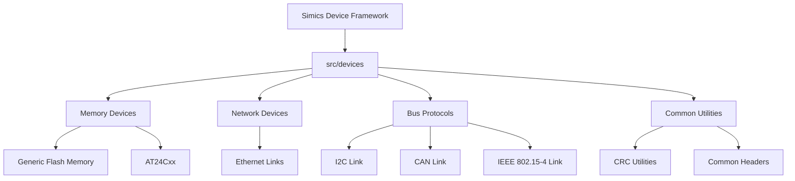
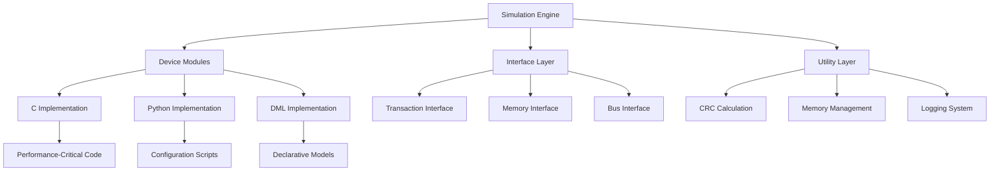
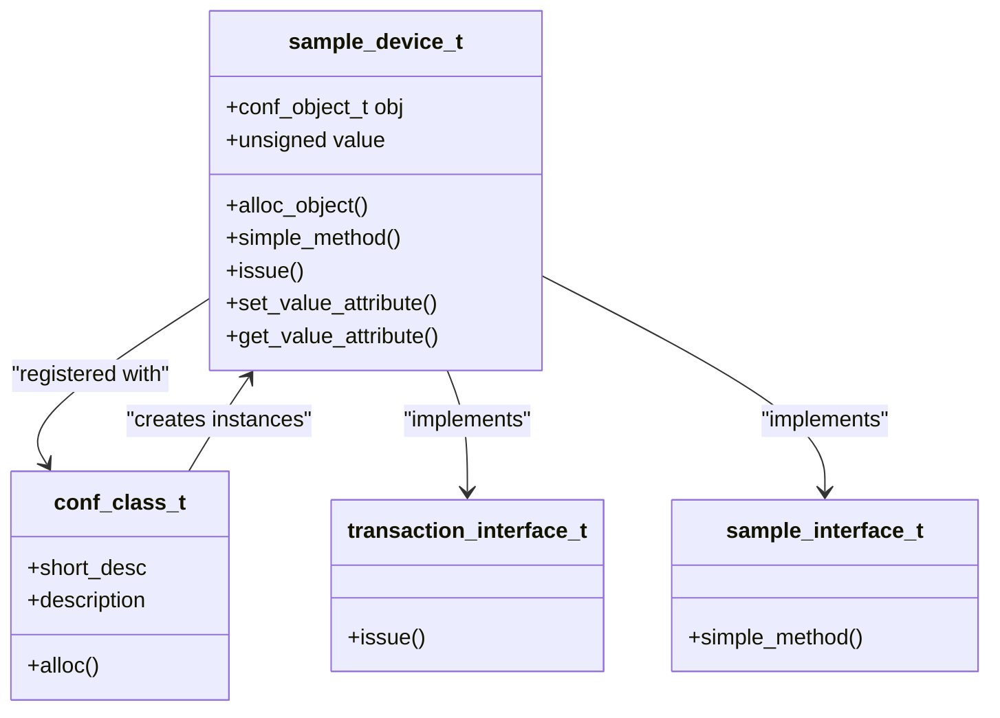
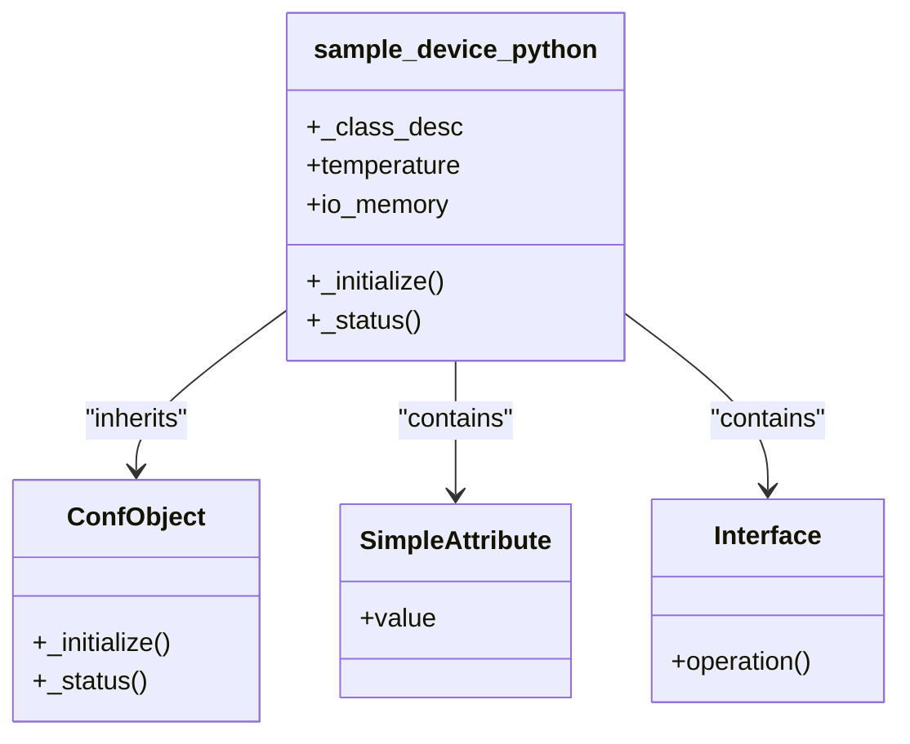
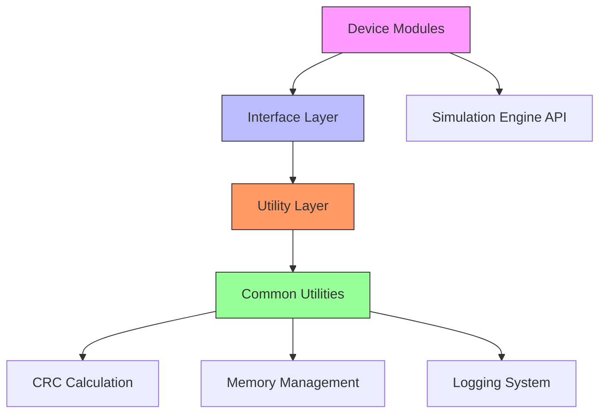

# Code Structure and Architecture

<cite>
**Referenced Files in This Document**   
- [sample-device.c](file://simics-7.57.0/src/devices/sample-device-c/sample-device.c)
- [sample_device_python.py](file://simics-7.57.0/src/devices/sample-device-python/sample_device_python.py)
- [module_load.py](file://simics-7.57.0/src/devices/sample-device-dml/module_load.py)
- [crc.c](file://simics-7.57.0/src/devices/common/crc.c)
- [common.c](file://simics-7.57.0/src/devices/eth-links/common.c)
- [generic-flash-memory.c](file://simics-7.57.0/src/devices/generic-flash-memory/generic-flash-memory.c)
- [AT24Cxx.c](file://simics-7.57.0/src/devices/AT24Cxx/AT24Cxx.c)
- [i2c-link-v2.c](file://simics-7.57.0/src/devices/i2c-link-v2/i2c-link-v2.c)
- [ieee-802-15-4-link.c](file://simics-7.57.0/src/devices/ieee-802-15-4-link/ieee-802-15-4-link.c)
- [can-link.c](file://simics-7.57.0/src/devices/can-link/can-link.c)
- [CMakeLists.txt](file://simics-7.57.0/src/devices/sample-device-c/CMakeLists.txt)
- [CMakeLists.txt](file://simics-7.57.0/src/devices/sample-device-python/CMakeLists.txt)
- [CMakeLists.txt](file://simics-7.57.0/src/devices/sample-device-dml/CMakeLists.txt)
</cite>

## Table of Contents
1. [Introduction](#introduction)
2. [Project Structure](#project-structure)
3. [Core Components](#core-components)
4. [Architecture Overview](#architecture-overview)
5. [Detailed Component Analysis](#detailed-component-analysis)
6. [Dependency Analysis](#dependency-analysis)
7. [Performance Considerations](#performance-considerations)
8. [Troubleshooting Guide](#troubleshooting-guide)
9. [Conclusion](#conclusion)

## Introduction
The Simics device modeling framework provides a comprehensive infrastructure for creating virtual device models that can be integrated into simulation environments. This documentation describes the high-level design, architectural patterns, and system boundaries of the framework. The architecture is built around modular device components with a clear separation between C implementations for performance-critical code and Python integration scripts for flexibility and ease of configuration. The framework supports various device categories including memory devices, network interfaces, storage devices, and various bus protocols (I2C, CAN, IEEE 802.15.4). Component interactions are managed through well-defined interfaces between device implementations, configuration scripts, and the Simics simulation engine.

## Project Structure
The Simics device modeling framework is organized in a hierarchical structure with clear separation of concerns. The core components are located in the `src/devices` directory, which contains individual device implementations organized by device type. Each device typically has its own subdirectory containing the implementation files, build configuration, and test cases. The framework supports multiple implementation languages, with C used for performance-critical device logic and Python used for configuration and integration. The build system is based on CMake, with each device module having its own CMakeLists.txt file that defines the build configuration. Common utilities and shared code are located in the `common` directory, while protocol-specific implementations are grouped by technology (eth-links, i2c-link-v2, ieee-802-15-4-link, etc.).



**Diagram sources**
- [generic-flash-memory.c](file://simics-7.57.0/src/devices/generic-flash-memory/generic-flash-memory.c)
- [AT24Cxx.c](file://simics-7.57.0/src/devices/AT24Cxx/AT24Cxx.c)
- [common.c](file://simics-7.57.0/src/devices/eth-links/common.c)
- [i2c-link-v2.c](file://simics-7.57.0/src/devices/i2c-link-v2/i2c-link-v2.c)
- [can-link.c](file://simics-7.57.0/src/devices/can-link/can-link.c)
- [ieee-802-15-4-link.c](file://simics-7.57.0/src/devices/ieee-802-15-4-link/ieee-802-15-4-link.c)
- [crc.c](file://simics-7.57.0/src/devices/common/crc.c)

**Section sources**
- [src/devices](file://simics-7.57.0/src/devices)
- [CMakeLists.txt](file://simics-7.57.0/src/devices/sample-device-c/CMakeLists.txt)

## Core Components
The Simics device modeling framework consists of several core components that work together to provide a flexible and extensible device modeling environment. The framework supports three primary implementation approaches: C-based devices for maximum performance, Python-based devices for rapid development and configuration, and DML (Device Modeling Language) based devices for declarative device modeling. Each device implementation follows a consistent pattern of registering classes, interfaces, and attributes with the Simics simulation engine. The core components include device classes that encapsulate device state, interfaces that define interaction patterns, and attributes that expose device configuration and status. The framework also includes a comprehensive set of utility functions for common operations such as CRC calculation, memory management, and transaction handling.

**Section sources**
- [sample-device.c](file://simics-7.57.0/src/devices/sample-device-c/sample-device.c)
- [sample_device_python.py](file://simics-7.57.0/src/devices/sample-device-python/sample_device_python.py)
- [module_load.py](file://simics-7.57.0/src/devices/sample-device-dml/module_load.py)

## Architecture Overview
The Simics device modeling framework follows a modular architecture with clear separation between different layers of functionality. The architecture is designed to support both high-performance device emulation and flexible configuration through a combination of C and Python implementations. The core architectural pattern is based on the component model where each device is implemented as a self-contained module with well-defined interfaces. The framework uses a plugin-based architecture where device modules are dynamically loaded into the simulation environment. Communication between components is handled through a message-passing system that supports both synchronous and asynchronous operations. The architecture also includes a comprehensive logging and debugging infrastructure that allows for detailed monitoring of device behavior during simulation.



**Diagram sources**
- [sample-device.c](file://simics-7.57.0/src/devices/sample-device-c/sample-device.c)
- [sample_device_python.py](file://simics-7.57.0/src/devices/sample-device-python/sample_device_python.py)
- [module_load.py](file://simics-7.57.0/src/devices/sample-device-dml/module_load.py)
- [crc.c](file://simics-7.57.0/src/devices/common/crc.c)

## Detailed Component Analysis

### C-Based Device Implementation
The C-based device implementation provides the highest performance for device models that require low-level hardware emulation. The implementation follows a structured pattern where device state is encapsulated in a structure, and device behavior is defined through function pointers registered with the simulation engine. The sample device implementation demonstrates the core patterns used in C-based devices, including memory-mapped I/O handling, attribute access, and interface registration. The architecture uses a callback-based approach where the simulation engine invokes device methods in response to specific events such as memory transactions or timer expirations.



**Diagram sources**
- [sample-device.c](file://simics-7.57.0/src/devices/sample-device-c/sample-device.c)

**Section sources**
- [sample-device.c](file://simics-7.57.0/src/devices/sample-device-c/sample-device.c)

### Python-Based Device Implementation
The Python-based device implementation provides a more accessible and flexible approach to device modeling, particularly for configuration and integration tasks. The implementation uses Python classes that inherit from the Simics ConfObject base class, allowing for object-oriented design patterns. The Python implementation demonstrates how device state can be managed through class attributes and methods, with automatic attribute registration and serialization. This approach is particularly well-suited for devices that require complex configuration logic or integration with external systems, as Python's extensive standard library and ecosystem can be leveraged directly.



**Diagram sources**
- [sample_device_python.py](file://simics-7.57.0/src/devices/sample-device-python/sample_device_python.py)

**Section sources**
- [sample_device_python.py](file://simics-7.57.0/src/devices/sample-device-python/sample_device_python.py)

### Device Interconnection and Bus Protocols
The device interconnection system provides a flexible framework for connecting devices through various bus protocols. The architecture supports multiple bus types including I2C, CAN, and IEEE 802.15-4, each implemented as a specialized link component. The interconnection system uses a message-passing architecture where devices communicate through endpoints connected to a shared link. The framework handles protocol-specific details such as arbitration, addressing, and error detection, allowing device models to focus on their core functionality. The bus protocols are implemented as reusable components that can be instantiated and configured for different simulation scenarios.

```mermaid
sequenceDiagram
participant DeviceA
participant Link
participant DeviceB
DeviceA->>Link : Send Message
Link->>DeviceB : Deliver Message
DeviceB->>Link : Response
Link->>DeviceA : Deliver Response
Note over DeviceA,DeviceB : Bus protocol handling including<br/>arbitration, addressing, and error detection
```

**Diagram sources**
- [i2c-link-v2.c](file://simics-7.57.0/src/devices/i2c-link-v2/i2c-link-v2.c)
- [can-link.c](file://simics-7.57.0/src/devices/can-link/can-link.c)
- [ieee-802-15-4-link.c](file://simics-7.57.0/src/devices/ieee-802-15-4-link/ieee-802-15-4-link.c)

**Section sources**
- [i2c-link-v2.c](file://simics-7.57.0/src/devices/i2c-link-v2/i2c-link-v2.c)
- [can-link.c](file://simics-7.57.0/src/devices/can-link/can-link.c)
- [ieee-802-15-4-link.c](file://simics-7.57.0/src/devices/ieee-802-15-4-link/ieee-802-15-4-link.c)

## Dependency Analysis
The Simics device modeling framework has a well-defined dependency structure that ensures modularity and reusability. The core dependencies are managed through the build system, with each device module explicitly declaring its dependencies in its CMakeLists.txt file. The framework uses a layered architecture where higher-level components depend on lower-level utilities, but not vice versa. Shared utilities such as CRC calculation are implemented in the common directory and made available to all device modules. The interface system ensures loose coupling between components, with dependencies expressed through interface contracts rather than direct implementation references. This design allows for easy replacement and extension of components without affecting the overall system stability.



**Diagram sources**
- [CMakeLists.txt](file://simics-7.57.0/src/devices/sample-device-c/CMakeLists.txt)
- [CMakeLists.txt](file://simics-7.57.0/src/devices/sample-device-python/CMakeLists.txt)
- [CMakeLists.txt](file://simics-7.57.0/src/devices/sample-device-dml/CMakeLists.txt)
- [crc.c](file://simics-7.57.0/src/devices/common/crc.c)

**Section sources**
- [CMakeLists.txt](file://simics-7.57.0/src/devices/sample-device-c/CMakeLists.txt)
- [CMakeLists.txt](file://simics-7.57.0/src/devices/sample-device-python/CMakeLists.txt)
- [CMakeLists.txt](file://simics-7.57.0/src/devices/sample-device-dml/CMakeLists.txt)

## Performance Considerations
The Simics device modeling framework makes strategic trade-offs between performance and flexibility. Performance-critical device logic is implemented in C to minimize overhead and maximize execution speed, while configuration and integration tasks are implemented in Python for ease of development and maintenance. The framework uses efficient data structures and algorithms for common operations such as CRC calculation and memory management. The message-passing architecture is optimized for low-latency communication between components, with careful attention to memory allocation and deallocation patterns. For large simulation scenarios, the modular design allows for selective loading of only the required device modules, reducing memory footprint and initialization time.

**Section sources**
- [sample-device.c](file://simics-7.57.0/src/devices/sample-device-c/sample-device.c)
- [crc.c](file://simics-7.57.0/src/devices/common/crc.c)

## Troubleshooting Guide
When developing and debugging device models in the Simics framework, several common issues may arise. These include incorrect interface registration, improper memory management, and protocol violations in bus communications. The framework provides comprehensive logging capabilities that can be used to trace device behavior and identify issues. When troubleshooting, it is recommended to first verify that all required interfaces are properly registered and that device attributes are correctly defined. For bus protocol issues, the message-passing system can be monitored to ensure that messages are being sent and received correctly. Memory-related issues can often be identified through the framework's memory management functions and logging system.

**Section sources**
- [sample-device.c](file://simics-7.57.0/src/devices/sample-device-c/sample-device.c)
- [common.c](file://simics-7.57.0/src/devices/eth-links/common.c)
- [i2c-link-v2.c](file://simics-7.57.0/src/devices/i2c-link-v2/i2c-link-v2.c)

## Conclusion
The Simics device modeling framework provides a robust and flexible architecture for creating virtual device models. The framework's modular design, with clear separation between C implementations for performance and Python scripts for configuration, allows for efficient development of complex device models. The component-based architecture with well-defined interfaces promotes reusability and maintainability. The framework supports a wide range of device categories and bus protocols, making it suitable for diverse simulation scenarios. The build system and dependency management ensure that device modules can be developed and integrated in a consistent manner. Overall, the architecture strikes a balance between performance, flexibility, and ease of use, making it a powerful tool for virtual platform development.