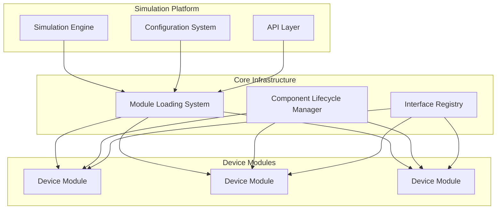
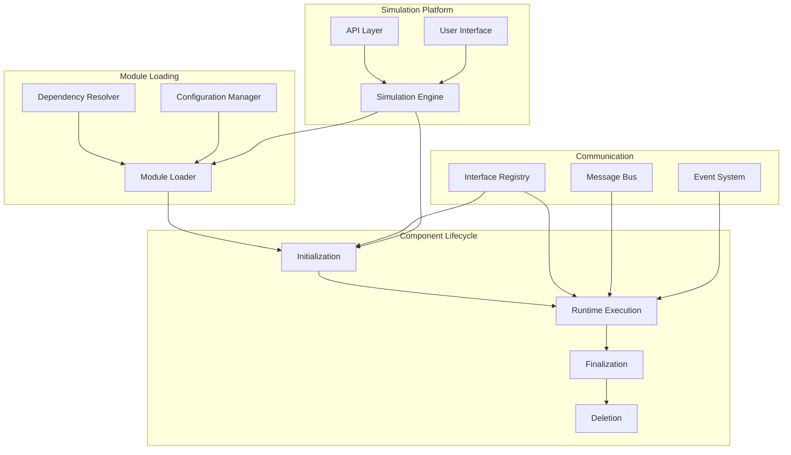
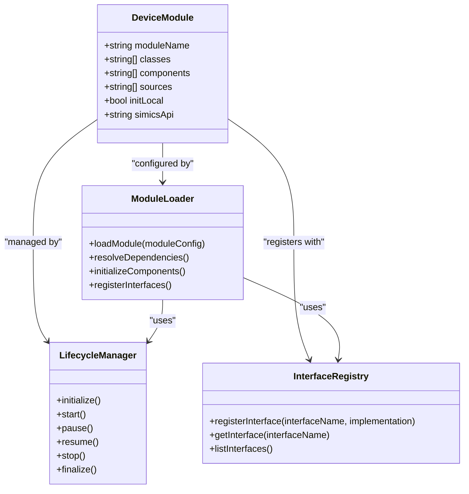
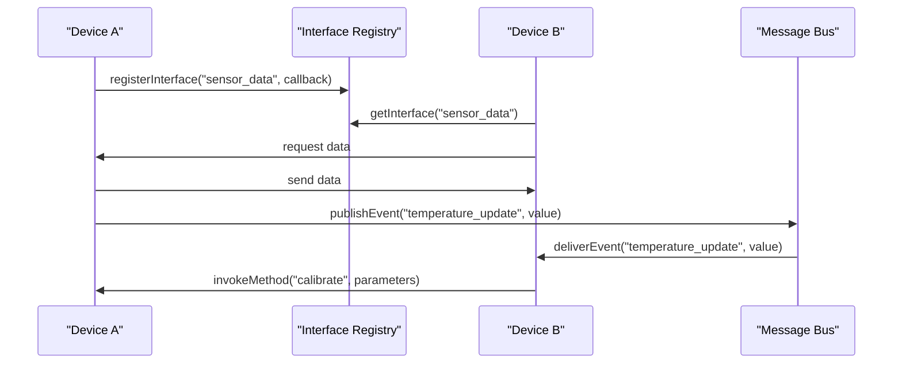
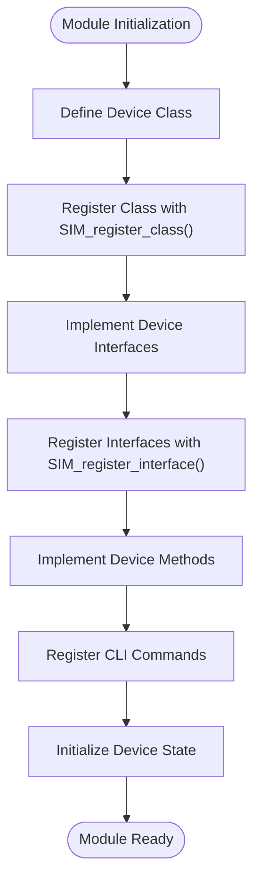
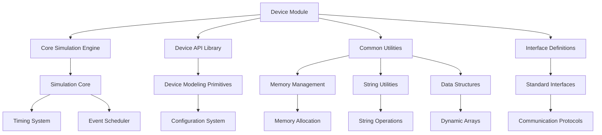

# Modular Design

<cite>
**Referenced Files in This Document**   
- [module_load.py](file://simics-7.57.0/src/devices/sample-device-c/module_load.py)
- [module_load.py](file://simics-7.57.0/src/devices/sample-device-dml/module_load.py)
- [module_load.py](file://simics-7.57.0/src/devices/sample-device-python/module_load.py)
- [sample_device_python.py](file://simics-7.57.0/src/devices/sample-device-python/sample_device_python.py)
- [generic-flash-memory.c](file://simics-7.57.0/src/devices/generic-flash-memory/generic-flash-memory.c)
- [can-link.c](file://simics-7.57.0/src/devices/can-link/can-link.c)
- [CMakeLists.txt](file://simics-7.57.0/src/devices/sample-device-c/CMakeLists.txt)
- [CMakeLists.txt](file://simics-7.57.0/src/devices/generic-flash-memory/CMakeLists.txt)
- [CMakeLists.txt](file://simics-7.57.0/src/devices/eth-links/CMakeLists.txt)
- [simics_start.py](file://simics-7.57.0/src/devices/eth-links/simics_start.py)
</cite>

## Table of Contents
1. [Introduction](#introduction)
2. [Project Structure](#project-structure)
3. [Core Components](#core-components)
4. [Architecture Overview](#architecture-overview)
5. [Detailed Component Analysis](#detailed-component-analysis)
6. [Dependency Analysis](#dependency-analysis)
7. [Performance Considerations](#performance-considerations)
8. [Troubleshooting Guide](#troubleshooting-guide)
9. [Conclusion](#conclusion)

## Introduction
This document provides comprehensive architectural documentation for the modular device design in Simics, a full-system simulation platform. The modular design enables independent, self-contained device components to be integrated into simulation platforms, promoting reusability, maintainability, and scalability. The architecture is built around component isolation, well-defined interfaces, and lifecycle management, allowing for flexible composition of complex systems from modular components. This documentation covers the technical decisions behind the modular implementation, infrastructure requirements, deployment options, and cross-cutting concerns such as version compatibility, security, monitoring, and error recovery.

## Project Structure
The Simics modular device architecture is organized in a hierarchical structure with clear separation of concerns. Device implementations are located in the `src/devices` directory, with each device having its own subdirectory containing implementation files, build configuration, and test code. The modular design follows a pattern where each device component is self-contained with its own lifecycle management, interface definitions, and configuration.



**Diagram sources**
- [CMakeLists.txt](file://simics-7.57.0/src/devices/sample-device-c/CMakeLists.txt)
- [module_load.py](file://simics-7.57.0/src/devices/sample-device-c/module_load.py)

**Section sources**
- [CMakeLists.txt](file://simics-7.57.0/src/devices/sample-device-c/CMakeLists.txt)
- [module_load.py](file://simics-7.57.0/src/devices/sample-device-c/module_load.py)

## Core Components
The modular device architecture in Simics consists of several core components that work together to enable flexible and reusable device modeling. These components include device classes, interface definitions, lifecycle management, and communication mechanisms. Each device module is designed to be independent and self-contained, with well-defined boundaries and interfaces that allow for seamless integration into simulation platforms.

**Section sources**
- [module_load.py](file://simics-7.57.0/src/devices/sample-device-c/module_load.py)
- [module_load.py](file://simics-7.57.0/src/devices/sample-device-dml/module_load.py)
- [module_load.py](file://simics-7.57.0/src/devices/sample-device-python/module_load.py)

## Architecture Overview
The modular device architecture in Simics follows a component-based design pattern where each device is implemented as an independent module with well-defined interfaces and lifecycle management. The architecture enables dynamic loading and composition of device components, allowing users to build complex simulation platforms by combining modular components. The design emphasizes component isolation, reusability, and extensibility while maintaining performance and simulation accuracy.



**Diagram sources**
- [module_load.py](file://simics-7.57.0/src/devices/sample-device-c/module_load.py)
- [CMakeLists.txt](file://simics-7.57.0/src/devices/sample-device-c/CMakeLists.txt)

## Detailed Component Analysis
This section provides a detailed analysis of the key components in the modular device architecture, including their implementation patterns, interfaces, and interactions.

### Device Module Implementation
Device modules in Simics are implemented as self-contained components with well-defined interfaces and lifecycle management. Each module includes implementation code, configuration files, and build scripts that define its behavior and dependencies. The modular design allows for multiple implementation approaches, including C, DML (Device Modeling Language), and Python.

#### Implementation Patterns
The device module implementation follows several patterns that enable flexibility and reusability:



**Diagram sources**
- [CMakeLists.txt](file://simics-7.57.0/src/devices/sample-device-c/CMakeLists.txt)
- [module_load.py](file://simics-7.57.0/src/devices/sample-device-c/module_load.py)

#### Interface and Communication
Device modules communicate through well-defined interfaces and message passing mechanisms. The architecture supports multiple communication patterns, including direct method calls, event-driven messaging, and shared memory.



**Diagram sources**
- [can-link.c](file://simics-7.57.0/src/devices/can-link/can-link.c)
- [module_load.py](file://simics-7.57.0/src/devices/sample-device-c/module_load.py)

**Section sources**
- [can-link.c](file://simics-7.57.0/src/devices/can-link/can-link.c)
- [module_load.py](file://simics-7.57.0/src/devices/sample-device-c/module_load.py)

### Python-based Device Implementation
Python-based device implementations in Simics leverage the pyobj framework to create device models using Python classes. This approach provides a high-level, object-oriented interface for device modeling while maintaining integration with the underlying simulation engine.

```mermaid
classDiagram
class ConfObject {
+_initialize()
+_finalize()
+_status()
}
class SimpleAttribute {
+value
+type
}
class Interface {
+methods
}
class sample_device_python {
+temperature
+io_memory
+_initialize()
+_status()
}
sample_device_python --> ConfObject : "inherits"
sample_device_python --> SimpleAttribute : "uses"
sample_device_python --> Interface : "implements"
sample_device_python : temperature : SimpleAttribute
sample_device_python : io_memory : Interface
```

**Diagram sources**
- [sample_device_python.py](file://simics-7.57.0/src/devices/sample-device-python/sample_device_python.py)
- [module_load.py](file://simics-7.57.0/src/devices/sample-device-python/module_load.py)

**Section sources**
- [sample_device_python.py](file://simics-7.57.0/src/devices/sample-device-python/sample_device_python.py)
- [module_load.py](file://simics-7.57.0/src/devices/sample-device-python/module_load.py)

### C-based Device Implementation
C-based device implementations in Simics follow a structured pattern using the Device API and configuration object system. These implementations provide high-performance device models with fine-grained control over simulation behavior.



**Diagram sources**
- [generic-flash-memory.c](file://simics-7.57.0/src/devices/generic-flash-memory/generic-flash-memory.c)
- [module_load.py](file://simics-7.57.0/src/devices/sample-device-c/module_load.py)

**Section sources**
- [generic-flash-memory.c](file://simics-7.57.0/src/devices/generic-flash-memory/generic-flash-memory.c)
- [module_load.py](file://simics-7.57.0/src/devices/sample-device-c/module_load.py)

## Dependency Analysis
The modular device architecture in Simics manages dependencies through a combination of build-time configuration and runtime resolution. Dependencies are declared in build files and resolved during module loading, ensuring that all required components are available before initialization.



**Diagram sources**
- [CMakeLists.txt](file://simics-7.57.0/src/devices/generic-flash-memory/CMakeLists.txt)
- [CMakeLists.txt](file://simics-7.57.0/src/devices/eth-links/CMakeLists.txt)

**Section sources**
- [CMakeLists.txt](file://simics-7.57.0/src/devices/generic-flash-memory/CMakeLists.txt)
- [CMakeLists.txt](file://simics-7.57.0/src/devices/eth-links/CMakeLists.txt)

## Performance Considerations
The modular device architecture in Simics balances reusability and performance through several design decisions. Component isolation allows for independent optimization of device models, while the interface-based communication enables efficient message passing and event handling. The architecture supports both high-level modeling for rapid prototyping and low-level implementation for performance-critical components.

The build system optimizes module loading by pre-resolving dependencies and generating efficient initialization sequences. Runtime performance is enhanced through interface caching, method dispatch optimization, and memory management strategies that minimize allocation overhead.

**Section sources**
- [generic-flash-memory.c](file://simics-7.57.0/src/devices/generic-flash-memory/generic-flash-memory.c)
- [can-link.c](file://simics-7.57.0/src/devices/can-link/can-link.c)

## Troubleshooting Guide
When working with the modular device architecture in Simics, several common issues may arise related to module loading, interface resolution, and component initialization. The following guidance helps diagnose and resolve these issues:

1. **Module Loading Failures**: Verify that all dependencies are available and properly declared in the CMakeLists.txt file. Check that the module name matches the directory name and that all source files are listed in the SOURCES directive.

2. **Interface Resolution Errors**: Ensure that interfaces are properly registered using SIM_register_interface() and that the interface name matches between the provider and consumer. Verify that the interface implementation is correctly initialized before use.

3. **Lifecycle Management Issues**: Confirm that all lifecycle methods (_initialize, _finalize, etc.) are properly implemented and that resource allocation and deallocation are balanced. Check for proper error handling in initialization code.

4. **Communication Problems**: Validate that message formats and data types are consistent between communicating components. Verify that event handlers are properly registered and that message queues are not overflowing.

**Section sources**
- [module_load.py](file://simics-7.57.0/src/devices/sample-device-c/module_load.py)
- [simics_start.py](file://simics-7.57.0/src/devices/eth-links/simics_start.py)

## Conclusion
The modular device architecture in Simics provides a robust foundation for building flexible and reusable simulation components. By emphasizing component isolation, well-defined interfaces, and lifecycle management, the architecture enables the creation of complex simulation platforms from independent, self-contained device modules. The design supports multiple implementation languages and patterns, allowing developers to choose the appropriate approach for their specific use case.

The infrastructure for module loading, dependency resolution, and component composition enables scalable system modeling while maintaining performance and simulation accuracy. Cross-cutting concerns such as version compatibility, security, monitoring, and error recovery are addressed through standardized patterns and mechanisms that ensure reliable operation in diverse simulation scenarios.

This architectural approach facilitates collaboration, knowledge sharing, and component reuse across different simulation projects, ultimately accelerating development and improving the quality of simulation models.