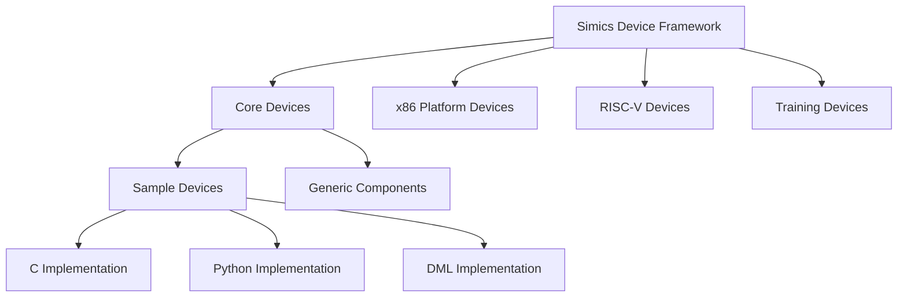
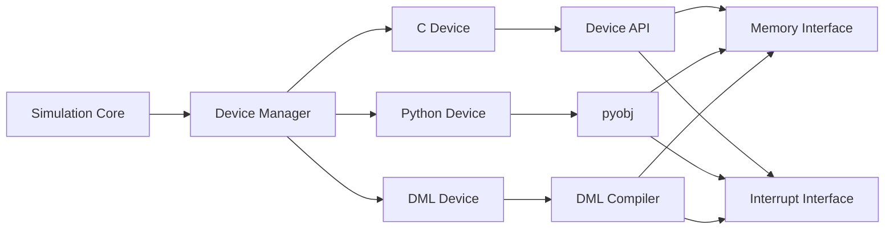
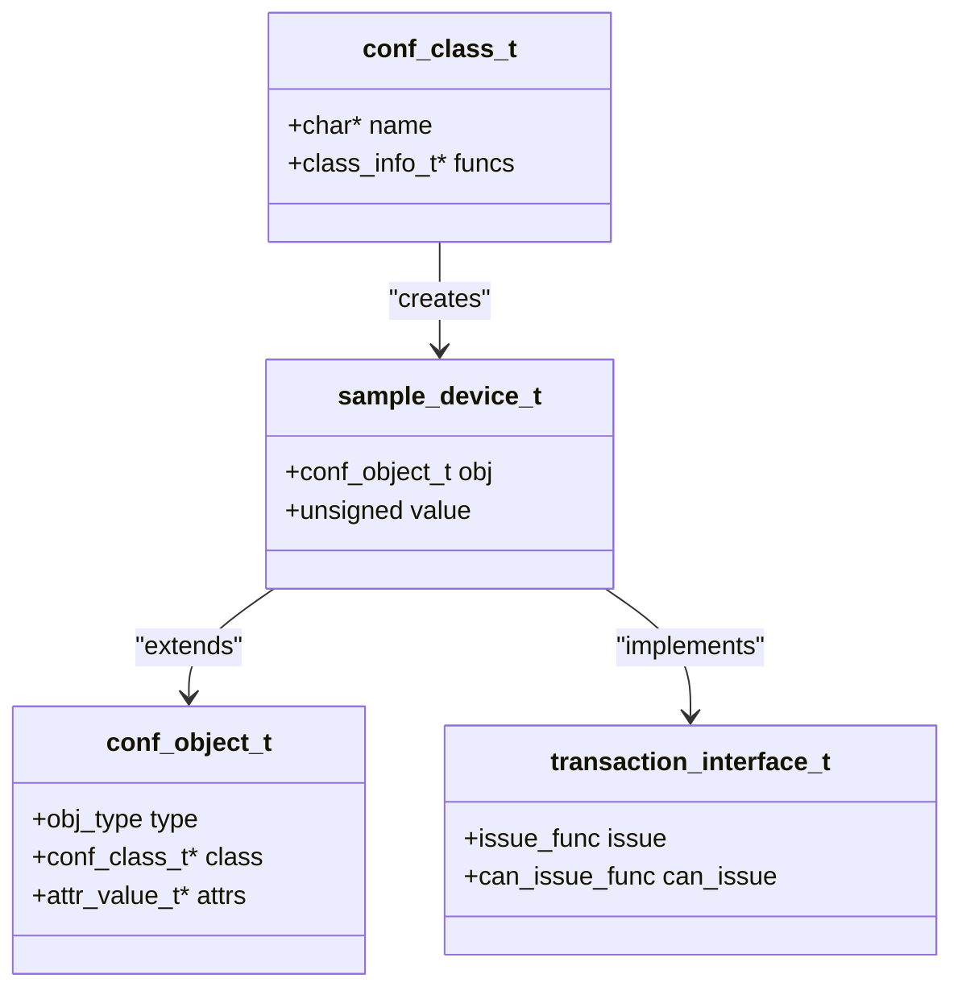
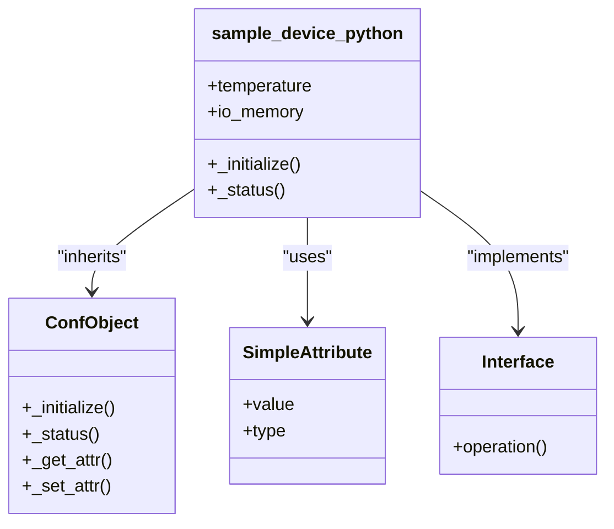
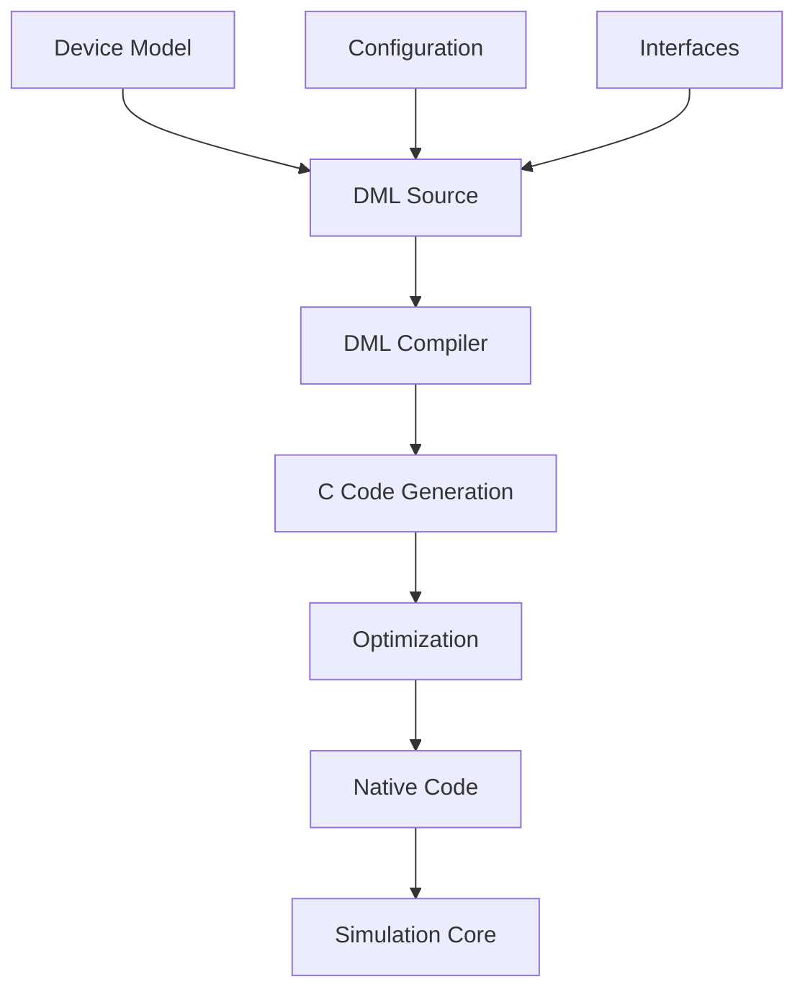
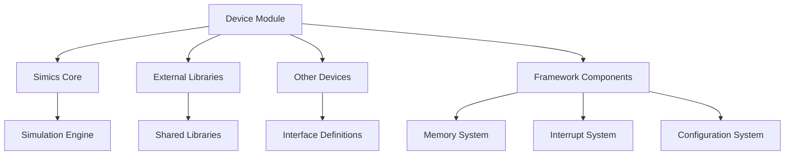

# Developer Guide

<cite>
**Referenced Files in This Document**   
- [README.md](file://README.md)
- [sample-device.c](file://simics-7.57.0/src/devices/sample-device-c/sample-device.c)
- [sample_device_python.py](file://simics-7.57.0/src/devices/sample-device-python/sample_device_python.py)
- [module_load.py](file://simics-7.57.0/src/devices/sample-device-dml/module_load.py)
- [generic-flash-memory.c](file://simics-7.57.0/src/devices/generic-flash-memory/generic-flash-memory.c)
- [sample-device-with-external-lib.dml](file://simics-7.57.0/src/devices/sample-device-with-external-lib/sample-device-with-external-lib.dml)
- [CMakeLists.txt](file://simics-7.57.0/src/devices/sample-device-c/CMakeLists.txt)
- [README.md](file://simics-7.57.0/src/devices/sample-device-with-external-lib/README.md)
</cite>

## Table of Contents
1. [Introduction](#introduction)
2. [Project Structure](#project-structure)
3. [Core Components](#core-components)
4. [Architecture Overview](#architecture-overview)
5. [Detailed Component Analysis](#detailed-component-analysis)
6. [Dependency Analysis](#dependency-analysis)
7. [Performance Considerations](#performance-considerations)
8. [Troubleshooting Guide](#troubleshooting-guide)
9. [Conclusion](#conclusion)

## Introduction
This developer guide provides comprehensive documentation for the Simics device modeling framework, serving as both an onboarding resource for new developers and a reference for experienced contributors. The guide covers the architecture of device modeling in Simics, development workflows, best practices, and contribution procedures. It is designed to support developers working with various implementation approaches including C, Python, and DML (Device Modeling Language).

**Section sources**
- [README.md](file://README.md)

## Project Structure
The Simics device modeling framework is organized into multiple packages, each containing device source code structured by platform and functionality. The core structure includes:

- `simics-7.57.0/src/devices`: Core Simics devices and foundational components
- `simics-qsp-x86-7.38.0/src/devices`: Quick Start Platform x86-specific devices
- `simics-risc-v-simple-7.12.0/src/devices`: RISC-V Simple platform devices
- `simics-training-7.0.0-pre.11/src/devices`: Training package devices for educational purposes

Each device directory follows a consistent pattern with CMakeLists.txt for build configuration, module_load.py for module initialization, and source files in C, Python, or DML. The framework supports multiple implementation languages and provides sample devices to illustrate different modeling approaches.

**Diagram sources**
- [README.md](file://README.md)
- [CMakeLists.txt](file://simics-7.57.0/src/devices/sample-device-c/CMakeLists.txt)

**Section sources**
- [README.md](file://README.md)
- [CMakeLists.txt](file://simics-7.57.0/src/devices/sample-device-c/CMakeLists.txt)

## Core Components
The Simics device modeling framework provides several core components that enable developers to create virtual device models. These include:

- **Device API**: The foundational interface for device implementation using C
- **pyobj**: Python-based object system for implementing devices in Python
- **DML (Device Modeling Language)**: Domain-specific language for device modeling
- **Configuration System**: Framework for device configuration and attribute management
- **Transaction System**: Interface for memory-mapped I/O operations

The framework supports multiple implementation approaches, allowing developers to choose the most appropriate method based on complexity, performance requirements, and development preferences. Sample devices demonstrate basic implementations in each language, providing templates for new device development.

**Section sources**
- [sample-device.c](file://simics-7.57.0/src/devices/sample-device-c/sample-device.c)
- [sample_device_python.py](file://simics-7.57.0/src/devices/sample-device-python/sample_device_python.py)
- [module_load.py](file://simics-7.57.0/src/devices/sample-device-dml/module_load.py)

## Architecture Overview
The Simics device modeling framework follows a modular architecture that separates device implementation from the simulation core. Devices interact with the simulator through well-defined interfaces and callbacks. The architecture supports three primary implementation methods:

1. **C-based devices**: High-performance implementations using the Simics Device API
2. **Python-based devices**: Rapid development using pyobj and Python interfaces
3. **DML-based devices**: Declarative modeling using the Device Modeling Language

Devices register themselves with the simulation core during initialization, providing callbacks for allocation, configuration, and interface implementation. The framework handles object lifecycle management, attribute access, and interface dispatch.

**Diagram sources**
- [sample-device.c](file://simics-7.57.0/src/devices/sample-device-c/sample-device.c)
- [sample_device_python.py](file://simics-7.57.0/src/devices/sample-device-python/sample_device_python.py)
- [module_load.py](file://simics-7.57.0/src/devices/sample-device-dml/module_load.py)

## Detailed Component Analysis

### C-Based Device Implementation
C-based devices provide the highest performance and most direct access to the Simics API. The implementation follows a structured pattern with initialization, object allocation, and interface registration.

**Diagram sources**
- [sample-device.c](file://simics-7.57.0/src/devices/sample-device-c/sample-device.c)

**Section sources**
- [sample-device.c](file://simics-7.57.0/src/devices/sample-device-c/sample-device.c)

### Python-Based Device Implementation
Python-based devices use the pyobj system to provide a more accessible development experience. The approach uses Python classes and decorators to define device behavior and interfaces.

**Diagram sources**
- [sample_device_python.py](file://simics-7.57.0/src/devices/sample-device-python/sample_device_python.py)

**Section sources**
- [sample_device_python.py](file://simics-7.57.0/src/devices/sample-device-python/sample_device_python.py)

### DML-Based Device Implementation
DML provides a domain-specific language for device modeling that abstracts away low-level implementation details. DML files are compiled into efficient C code, combining the productivity of high-level modeling with the performance of native code.

**Diagram sources**
- [sample-device-with-external-lib.dml](file://simics-7.57.0/src/devices/sample-device-with-external-lib/sample-device-with-external-lib.dml)

**Section sources**
- [module_load.py](file://simics-7.57.0/src/devices/sample-device-dml/module_load.py)
- [sample-device-with-external-lib.dml](file://simics-7.57.0/src/devices/sample-device-with-external-lib/sample-device-with-external-lib.dml)

## Dependency Analysis
The Simics device modeling framework manages dependencies through a combination of build system integration and runtime loading. Devices can depend on external libraries, other device models, or framework components.

**Diagram sources**
- [generic-flash-memory.c](file://simics-7.57.0/src/devices/generic-flash-memory/generic-flash-memory.c)
- [sample-device-with-external-lib.dml](file://simics-7.57.0/src/devices/sample-device-with-external-lib/sample-device-with-external-lib.dml)

**Section sources**
- [generic-flash-memory.c](file://simics-7.57.0/src/devices/generic-flash-memory/generic-flash-memory.c)
- [README.md](file://simics-7.57.0/src/devices/sample-device-with-external-lib/README.md)

## Performance Considerations
Device implementation choice significantly impacts simulation performance. C-based implementations provide the highest performance, followed by DML-compiled devices, with Python-based devices having the highest overhead. Performance-critical devices should use C or DML implementations. The framework provides timing models and event systems to manage device timing and synchronization.

## Troubleshooting Guide
Common issues in device development include:

- **Interface registration errors**: Ensure all required interfaces are properly registered
- **Memory access violations**: Validate address ranges and transaction types
- **Attribute access problems**: Verify attribute registration and type compatibility
- **Initialization failures**: Check module_load.py execution and dependency ordering
- **External library issues**: Verify library paths and version compatibility

The framework provides logging and diagnostic tools to help identify and resolve these issues. Developers should use the provided sample devices as references for correct implementation patterns.

**Section sources**
- [sample-device.c](file://simics-7.57.0/src/devices/sample-device-c/sample-device.c)
- [sample_device_python.py](file://simics-7.57.0/src/devices/sample-device-python/sample_device_python.py)
- [README.md](file://simics-7.57.0/src/devices/sample-device-with-external-lib/README.md)

## Conclusion
The Simics device modeling framework provides a comprehensive environment for developing virtual device models. With support for multiple implementation languages and a well-defined architecture, it enables developers to create both simple and complex device models. The framework's modular design, extensive sample code, and clear development patterns make it accessible to new developers while providing the power and flexibility needed by experienced contributors.