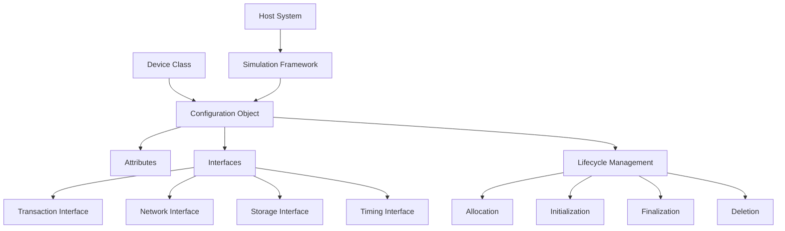
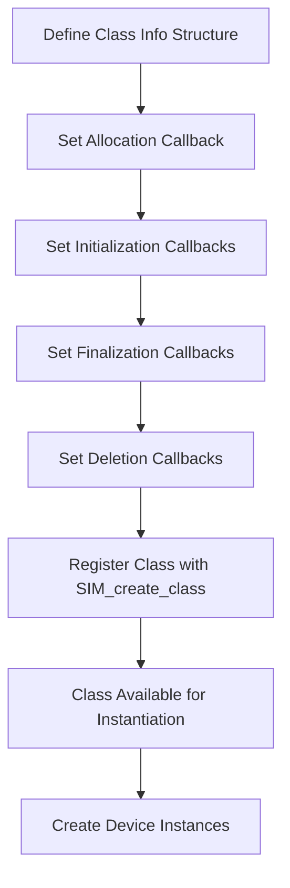
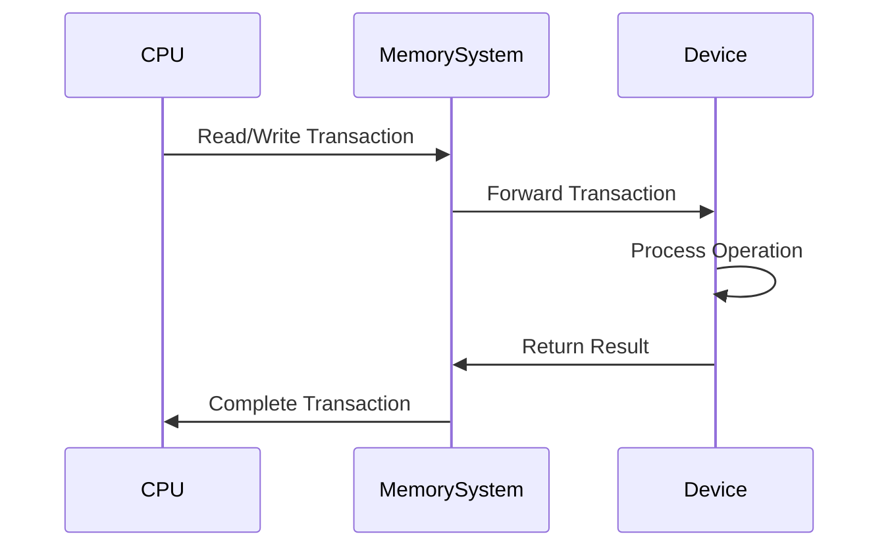
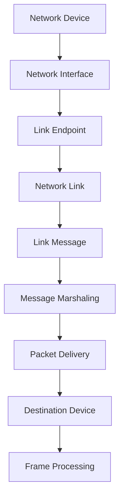
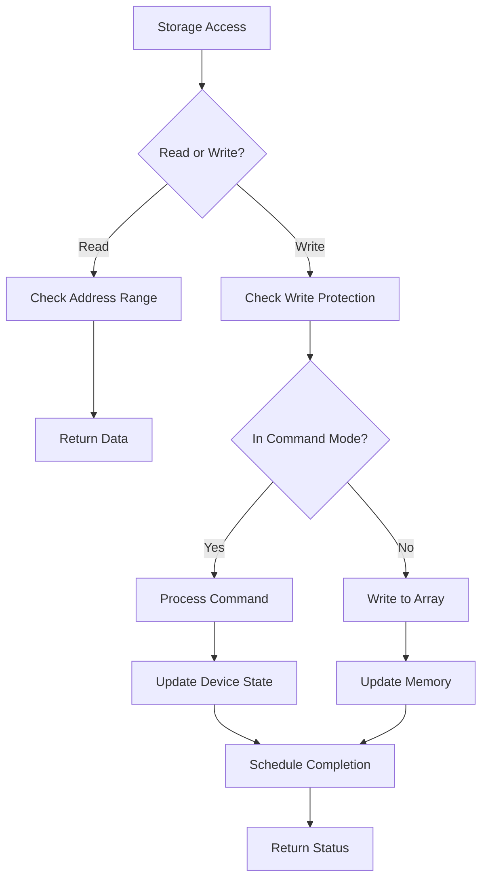
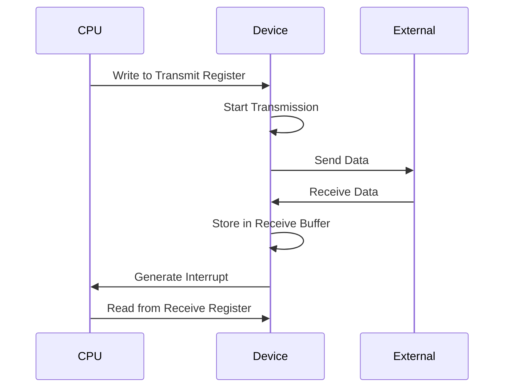
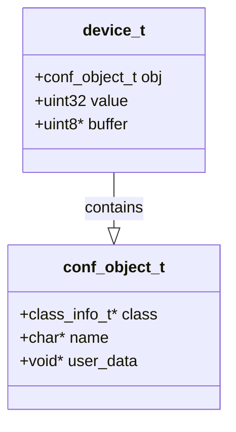
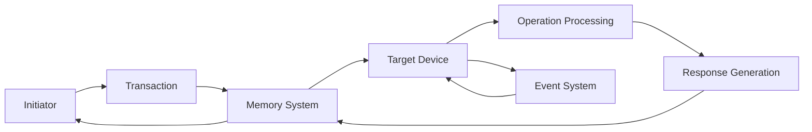
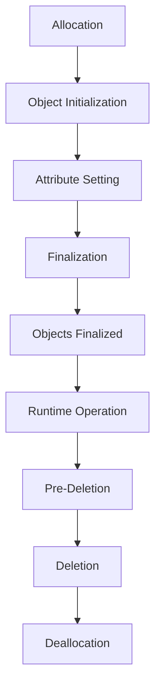
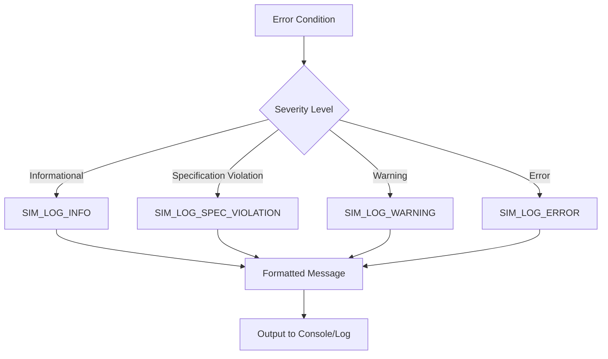

# Device Implementation

<cite>
**Referenced Files in This Document**   
- [sample-device.c](file://simics-7.57.0\src\devices\sample-device-c\sample-device.c)
- [empty-device-c.c](file://simics-7.57.0\src\devices\empty-device-c\empty-device-c.c)
- [simple-byte-dump.c](file://simics-7.57.0\src\devices\simple-byte-dump\simple-byte-dump.c)
- [common.c](file://simics-7.57.0\src\devices\eth-links\common.c)
- [generic-flash-memory.c](file://simics-7.57.0\src\devices\generic-flash-memory\generic-flash-memory.c)
- [can-link.c](file://simics-7.57.0\src\devices\can-link\can-link.c)
- [sample_device_python.py](file://simics-7.57.0\src\devices\sample-device-python\sample_device_python.py)
- [README.md](file://simics-7.57.0\src\devices\sample-device-with-external-lib\README.md)
</cite>

## Table of Contents
1. [Introduction](#introduction)
2. [Core Architecture](#core-architecture)
3. [Device Class Registration](#device-class-registration)
4. [Memory-Mapped I/O Implementation](#memory-mapped-io-implementation)
5. [Network Device Implementation](#network-device-implementation)
6. [Storage Device Implementation](#storage-device-implementation)
7. [I/O and Timing Devices](#io-and-timing-devices)
8. [Implementation Patterns Across Device Types](#implementation-patterns-across-device-types)
9. [Data Flow and Message Passing](#data-flow-and-message-passing)
10. [Device Lifecycle Management](#device-lifecycle-management)
11. [Error Handling and Logging](#error-handling-and-logging)
12. [Conclusion](#conclusion)

## Introduction

Device implementation in the Simics framework serves as the core functionality layer for hardware device simulation, enabling accurate modeling of physical hardware components in a virtual environment. This documentation provides comprehensive guidance on implementing various device types within the Simics simulation framework, covering both conceptual foundations for beginners and technical details for experienced developers.

The Simics device implementation architecture supports multiple device categories through standardized implementation patterns, allowing developers to create network, storage, I/O, and timing devices using consistent methodologies. Device models are implemented primarily in C, with support for Python and DML (Device Modeling Language), providing flexibility in development approaches while maintaining integration with the core simulation engine.

At its foundation, Simics device implementation revolves around the concept of configuration objects that represent simulated hardware components. These objects interact with the simulation framework through well-defined interfaces and callbacks, enabling communication between devices and the virtual system. The implementation approach emphasizes modularity, with devices exposing attributes that can be configured and monitored during simulation.

This documentation will explore the architectural principles behind Simics device implementation, examine common patterns across different device types, and provide practical examples demonstrating implementation techniques for various hardware categories. By understanding these concepts, developers can effectively create and extend device models to support complex simulation scenarios.

**Section sources**
- [sample-device.c](file://simics-7.57.0\src\devices\sample-device-c\sample-device.c#L1-L119)

## Core Architecture

The Simics device implementation architecture is built around a modular framework that enables the creation of hardware device models through standardized interfaces and object-oriented design patterns. At the core of this architecture is the configuration object system, which represents each simulated device as a configurable entity with attributes, interfaces, and lifecycle management.

The framework follows a layered approach where device implementations interact with the simulation engine through well-defined APIs. The primary components of the architecture include device classes, interfaces, attributes, and the transaction system. Device classes define the blueprint for device instances, specifying their behavior through callback functions for allocation, initialization, and cleanup operations.

Interfaces serve as the primary mechanism for inter-device communication, allowing devices to expose functionality to other components in the simulation. The framework provides a rich set of standard interfaces for common device types, including transaction interfaces for memory-mapped I/O, network interfaces for packet-based communication, and specialized interfaces for storage, timing, and interrupt handling.

**Diagram sources**
- [sample-device.c](file://simics-7.57.0\src\devices\sample-device-c\sample-device.c#L15-L119)
- [empty-device-c.c](file://simics-7.57.0\src\devices\empty-device-c\empty-device-c.c#L9-L137)

**Section sources**
- [sample-device.c](file://simics-7.57.0\src\devices\sample-device-c\sample-device.c#L15-L119)
- [empty-device-c.c](file://simics-7.57.0\src\devices\empty-device-c\empty-device-c.c#L9-L137)

## Device Class Registration

Device class registration is the foundational step in Simics device implementation, establishing the blueprint for device instances within the simulation framework. Each device class is registered with the simulation engine through the `SIM_create_class` or `SIM_register_class` functions, which associate the class name with a set of callback functions that define its behavior throughout the object lifecycle.

The registration process involves defining a `class_info_t` or `class_data_t` structure that specifies various callback functions for object management. These callbacks include `alloc` for memory allocation, `init` for object initialization, `finalize` for post-configuration setup, `objects_finalized` for inter-object initialization, `deinit` for cleanup before deletion, and `dealloc` for memory deallocation. This comprehensive lifecycle management ensures proper resource handling and initialization sequencing.

When registering a device class, developers must specify both the class name and a description that provides documentation for the device type. The class name becomes the identifier used when creating instances of the device in simulation scripts or configuration files. Additionally, the registration process allows specifying the class kind, which determines how the object is treated within the simulation environment.

The framework supports multiple implementation approaches for device classes, including pure C implementations, Python-based implementations using pyobj, and DML-based implementations. Each approach follows the same fundamental registration pattern but provides different levels of abstraction and ease of use. The choice of implementation method depends on the complexity of the device being modeled and the developer's familiarity with the respective programming languages.

**Section sources**
- [sample-device.c](file://simics-7.57.0\src\devices\sample-device-c\sample-device.c#L80-L119)
- [empty-device-c.c](file://simics-7.57.0\src\devices\empty-device-c\empty-device-c.c#L104-L137)

## Memory-Mapped I/O Implementation

Memory-mapped I/O implementation in Simics provides the mechanism for devices to interact with the system through address space mappings, enabling CPU access to device registers and memory. This implementation pattern is fundamental to most hardware device models, allowing processors to communicate with peripherals using standard load and store operations.

The core of memory-mapped I/O implementation revolves around the transaction interface, which handles read and write operations to device memory regions. Devices register the transaction interface with callback functions that process incoming transactions, typically implemented through the `issue` function. This function examines the transaction type (read or write), extracts the address and data, performs the appropriate operation, and returns an exception status.

In the implementation, devices must handle both aligned and unaligned accesses, with proper byte ordering for little-endian or big-endian devices. The framework provides utility functions such as `SIM_get_transaction_value_le` and `SIM_set_transaction_value_le` for little-endian value extraction and assignment, ensuring correct data handling regardless of the host system architecture.

Attribute registration is another critical aspect of memory-mapped I/O implementation, allowing device state to be exposed and modified through the simulation interface. Attributes are registered with getter and setter functions that bridge the gap between the configuration system and the device's internal state. This enables both programmatic access and interactive modification of device parameters during simulation.

**Section sources**
- [sample-device.c](file://simics-7.57.0\src\devices\sample-device-c\sample-device.c#L47-L77)
- [simple-byte-dump.c](file://simics-7.57.0\src\devices\simple-byte-dump\simple-byte-dump.c#L44-L74)

## Network Device Implementation

Network device implementation in Simics follows a specialized architecture designed to model packet-based communication between simulated systems. The framework provides a comprehensive set of interfaces and utilities for implementing Ethernet, CAN bus, and other network technologies, with a focus on accurate timing and protocol behavior.

The core of network device implementation is the link-based architecture, where devices connect to network links that handle packet routing and delivery. This separation of concerns allows multiple device types to share the same underlying network infrastructure while maintaining device-specific functionality. The link system implements broadcast, unicast, and multicast delivery semantics, with support for network segmentation and bridging.

Network devices typically implement the `ethernet_common_interface_t` or similar interface types, providing callback functions for frame reception and transmission. When a device sends a packet, it creates a transaction or uses a specialized send function that forwards the frame to the connected link. The link then broadcasts or routes the packet to all connected devices, which receive it through their respective interface callbacks.

The implementation includes support for various network features such as CRC checking, frame validation, and error injection. Devices can participate in network breakpoint systems, allowing simulation scripts to monitor and manipulate traffic based on specific criteria such as source/destination addresses or protocol types. This enables sophisticated network testing and analysis scenarios within the simulation environment.

**Section sources**
- [common.c](file://simics-7.57.0\src\devices\eth-links\common.c#L1-L418)
- [can-link.c](file://simics-7.57.0\src\devices\can-link\can-link.c#L1-L347)

## Storage Device Implementation

Storage device implementation in Simics provides a sophisticated framework for modeling various storage technologies, from simple byte-dump devices to complex flash memory controllers with command sets and timing models. The architecture supports both block-based and file-based storage devices, with mechanisms for handling read/write operations, command processing, and state management.

Flash memory implementation represents one of the most complex storage device types, requiring accurate modeling of command sets, timing characteristics, and state transitions. The generic flash memory device demonstrates a comprehensive implementation that supports both Intel and AMD command sets, with proper handling of read, write, erase, and lock operations. The implementation includes CFI (Common Flash Interface) query support, allowing the simulated system to discover device capabilities.

The implementation uses a state machine approach to manage the various operational modes of flash memory, including read array, program, erase, and various command modes. Each state transition is carefully managed, with appropriate timing delays simulated using the framework's event system. This ensures accurate modeling of real-world flash memory behavior, where operations take finite time to complete.

For simpler storage devices, the framework provides utilities for implementing basic memory-mapped storage with file backing. The simple-byte-dump device demonstrates this pattern, capturing all write operations to a specified file. This type of implementation is useful for debugging and monitoring purposes, allowing developers to trace specific memory accesses during simulation.

**Section sources**
- [generic-flash-memory.c](file://simics-7.57.0\src\devices\generic-flash-memory\generic-flash-memory.c#L1-L800)
- [simple-byte-dump.c](file://simics-7.57.0\src\devices\simple-byte-dump\simple-byte-dump.c#L1-L137)

## I/O and Timing Devices

I/O and timing device implementation in Simics encompasses a wide range of peripheral types, from simple serial interfaces to complex timer units. These devices typically interact with the system through memory-mapped registers or dedicated I/O ports, providing essential functionality for system operation and communication.

Serial device implementation follows the memory-mapped I/O pattern, with device registers exposed at specific address ranges. The implementation handles UART functionality such as data transmission, reception, and status reporting, with proper modeling of baud rate timing and interrupt generation. Devices like the NS16x50 demonstrate how to implement standard UART functionality with support for various configuration options and operational modes.

Timing devices implement various clock sources and timer units, providing timekeeping functionality for the simulated system. These devices typically use the framework's event system to generate periodic interrupts or one-shot timeouts. The implementation must accurately model the timing characteristics of the hardware being simulated, including clock frequency, prescalers, and counter behavior.

The framework supports multiple approaches to I/O device implementation, including pure C implementations, Python-based implementations using pyobj, and DML-based implementations. The choice of implementation method depends on the complexity of the device and the desired level of abstraction. Python implementations offer rapid development and easy debugging, while C implementations provide maximum performance and low-level control.

**Section sources**
- [sample_device_python.py](file://simics-7.57.0\src\devices\sample-device-python\sample_device_python.py#L1-L80)
- [empty-device-c.c](file://simics-7.57.0\src\devices\empty-device-c\empty-device-c.c#L9-L137)

## Implementation Patterns Across Device Types

Across different device types in Simics, several common implementation patterns emerge that reflect the framework's architectural principles and best practices. These patterns provide a consistent approach to device development, making it easier to understand and maintain device models while ensuring compatibility with the simulation environment.

The most fundamental pattern is the configuration object structure, where each device is implemented as a C structure that begins with a `conf_object_t` member followed by device-specific data. This pattern enables type-safe casting between the generic configuration object and the specific device type, providing access to both framework-managed fields and device state.

Another common pattern is the use of static interface structures registered with the device class. These structures contain function pointers to implementation methods, allowing the framework to invoke device-specific functionality through well-defined interfaces. This approach enables polymorphic behavior while maintaining type safety and performance.

Lifecycle management follows a consistent pattern across device types, with initialization divided into multiple phases: allocation, object initialization, attribute setting, finalization, and post-finalization setup. This multi-phase approach ensures proper initialization ordering and allows devices to establish relationships with other components in the system.

Error handling and logging follow standardized patterns using framework-provided macros such as `SIM_LOG_INFO`, `SIM_LOG_ERROR`, and `SIM_LOG_SPEC_VIOLATION`. These macros provide consistent logging output with configurable verbosity levels, enabling detailed debugging while maintaining clean code.

**Section sources**
- [sample-device.c](file://simics-7.57.0\src\devices\sample-device-c\sample-device.c#L21-L28)
- [empty-device-c.c](file://simics-7.57.0\src\devices\empty-device-c\empty-device-c.c#L13-L20)
- [can-link.c](file://simics-7.57.0\src\devices\can-link\can-link.c#L18-L29)

## Data Flow and Message Passing

Data flow and message passing in Simics device implementation follows a structured approach that ensures reliable communication between components while maintaining simulation accuracy. The framework provides multiple mechanisms for data transfer, each suited to different types of device interactions and performance requirements.

The transaction system serves as the primary mechanism for memory-mapped I/O operations, where data flows between processors and devices through read and write transactions. These transactions carry atomic operations with metadata such as address, size, data, and initiator information. The framework ensures atomicity and ordering of transactions, providing a consistent view of memory operations across the simulated system.

For network and inter-device communication, the link-based message passing system provides a flexible infrastructure for packet-based data transfer. Messages are encapsulated in `link_message_t` structures and routed through network links to destination endpoints. The system supports message marshaling and unmarshaling, allowing data to be serialized for transmission and reconstructed at the destination.

The implementation includes support for various data flow patterns, including synchronous and asynchronous operations. Synchronous operations block until completion, while asynchronous operations use callbacks or events to signal completion. This flexibility allows devices to model both fast peripherals with immediate responses and slow devices with significant latency.

Data integrity is maintained through checksum calculation and validation, with support for various error detection mechanisms. The framework provides utilities for CRC calculation and other data validation techniques, ensuring accurate modeling of real-world communication protocols and their error handling characteristics.

**Section sources**
- [common.c](file://simics-7.57.0\src\devices\eth-links\common.c#L1-L418)
- [can-link.c](file://simics-7.57.0\src\devices\can-link\can-link.c#L1-L347)

## Device Lifecycle Management

Device lifecycle management in Simics follows a comprehensive multi-phase approach that ensures proper initialization, configuration, and cleanup of device instances. The lifecycle is carefully orchestrated to maintain system consistency and handle dependencies between components, with each phase serving a specific purpose in the device's existence within the simulation.

The lifecycle begins with object allocation, where memory is allocated for the device structure using `MM_ZALLOC`. This is followed by object initialization, where basic device state is set up before any attributes are configured. During this phase, devices should avoid establishing connections to other objects or posting events, as the system may not be fully configured.

After attribute setting, devices enter the finalization phase, where they can perform setup that depends on their configured parameters but still avoid external communication. The final phase of initialization, `objects_finalized`, allows devices to establish connections with other objects and post initial events, as the entire system configuration is now complete.

During runtime operation, devices respond to transactions, generate interrupts, and interact with other components according to their functionality. When the simulation ends or the device is removed, the lifecycle reverses through pre-deletion (for cleanup of external references), deletion, and deallocation phases.

This structured approach ensures that devices are properly initialized in the correct order, with dependencies resolved appropriately, and that resources are cleanly released when no longer needed. The framework enforces this lifecycle through callback registration, requiring devices to implement the appropriate functions for each phase.

**Section sources**
- [empty-device-c.c](file://simics-7.57.0\src\devices\empty-device-c\empty-device-c.c#L22-L70)
- [can-link.c](file://simics-7.57.0\src\devices\can-link\can-link.c#L249-L301)

## Error Handling and Logging

Error handling and logging in Simics device implementation follows a standardized approach that ensures consistent reporting of issues while maintaining simulation stability. The framework provides a comprehensive set of macros and functions for logging messages at different severity levels, allowing developers to provide meaningful feedback during simulation execution.

The logging system supports multiple log groups and verbosity levels, enabling detailed debugging output to be selectively enabled. Messages are categorized by severity, including informational messages (`SIM_LOG_INFO`), specification violations (`SIM_LOG_SPEC_VIOLATION`), warnings, and errors (`SIM_LOG_ERROR`). This hierarchy allows users to filter output based on their needs, from high-level operation summaries to detailed diagnostic information.

Exception handling is implemented through return codes rather than exceptions, with functions returning `exception_type_t` values such as `Sim_PE_No_Exception` or specific error codes. This approach ensures predictable control flow and allows callers to handle errors appropriately. For transaction processing, the return value indicates whether the operation completed successfully or encountered an issue.

The framework encourages defensive programming practices, with assertions used to catch internal inconsistencies during development. These assertions are typically disabled in production builds but provide valuable debugging information during testing. Additionally, attribute validation ensures that device parameters are within acceptable ranges before being applied.

**Section sources**
- [sample-device.c](file://simics-7.57.0\src\devices\sample-device-c\sample-device.c#L43-L44)
- [simple-byte-dump.c](file://simics-7.57.0\src\devices\simple-byte-dump\simple-byte-dump.c#L55-L56)
- [generic-flash-memory.c](file://simics-7.57.0\src\devices\generic-flash-memory\generic-flash-memory.c#L349-L354)

## Conclusion

Device implementation in the Simics framework provides a robust and flexible architecture for creating accurate hardware simulations across various device categories. The framework's design emphasizes modularity, consistency, and performance, enabling developers to implement network, storage, I/O, and timing devices using standardized patterns and interfaces.

The core principles of device implementation revolve around configuration objects, interfaces, and lifecycle management, providing a structured approach to device modeling. Memory-mapped I/O serves as the foundation for most device interactions, with transaction-based communication ensuring accurate modeling of hardware behavior. The framework supports multiple implementation languages, including C, Python, and DML, allowing developers to choose the appropriate level of abstraction for their needs.

Key implementation patterns emerge across device types, including the use of configuration object structures, static interface registrations, and multi-phase initialization. These patterns ensure consistency and maintainability across the codebase while providing the flexibility needed for diverse hardware models. The data flow and message passing systems enable reliable communication between components, with support for both synchronous and asynchronous operations.

The comprehensive lifecycle management system ensures proper initialization and cleanup of devices, handling dependencies and resource management automatically. Error handling and logging mechanisms provide consistent reporting and debugging capabilities, helping developers identify and resolve issues efficiently.

By following these principles and patterns, developers can create high-quality device models that integrate seamlessly with the Simics simulation environment, enabling accurate and efficient hardware simulation for a wide range of applications.