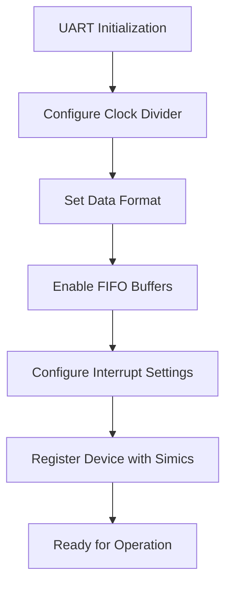
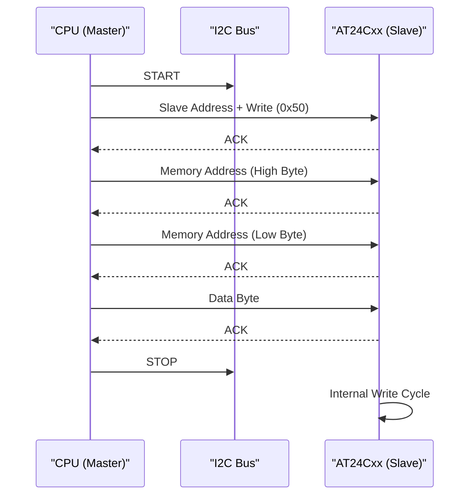

# I/O Devices

<cite>
**Referenced Files in This Document**   
- [NS16x50-init.c](file://simics-7.57.0/src/devices/NS16x50/NS16x50-init.c)
- [AT24Cxx.c](file://simics-7.57.0/src/devices/AT24Cxx/AT24Cxx.c)
- [module_load.py](file://simics-7.57.0/src/devices/NS16x50/module_load.py)
- [module_load.py](file://simics-7.57.0/src/devices/AT24Cxx/module_load.py)
</cite>

## Table of Contents
1. [Introduction](#introduction)
2. [Serial Communication Architecture](#serial-communication-architecture)
3. [I2C EEPROM Device Architecture](#i2c-eeprom-device-architecture)
4. [NS16x50 UART Implementation](#ns16x50-uart-implementation)
5. [AT24Cxx I2C EEPROM Implementation](#at24cxx-i2c-eeprom-implementation)
6. [Integration Between C and Python Layers](#integration-between-c-and-python-layers)
7. [Common Issues and Debugging](#common-issues-and-debugging)
8. [Conclusion](#conclusion)

## Introduction
This document provides a comprehensive analysis of I/O device implementations in Simics, focusing on two critical components: the NS16x50 UART for serial communication and the AT24Cxx I2C EEPROM for non-volatile memory simulation. The documentation details the architectural design, C implementation specifics, and integration with Python configuration scripts. It is designed to be accessible to beginners while offering technical depth for experienced developers working on custom I/O device models.

## Serial Communication Architecture
The serial communication subsystem in Simics is built around industry-standard UART (Universal Asynchronous Receiver/Transmitter) devices, with the NS16x50 family being a primary implementation. This architecture enables simulated systems to communicate via serial interfaces, supporting debugging, console output, and inter-system communication.

The NS16x50 model emulates the functionality of real-world UART chips, including register-level access, interrupt generation, and FIFO buffering. It operates by converting parallel data from the CPU into serial format for transmission and vice versa for reception, adhering to standard asynchronous serial protocols with configurable baud rates, data bits, parity, and stop bits.

**Section sources**
- [NS16x50-init.c](file://simics-7.57.0/src/devices/NS16x50/NS16x50-init.c#L1-L50)

## I2C EEPROM Device Architecture
The AT24Cxx series represents a family of I2C-compatible EEPROM devices modeled in Simics for persistent storage simulation. These devices follow the Inter-Integrated Circuit (I2C) protocol, a two-wire serial communication standard used for connecting low-speed peripherals.

The I2C architecture in Simics consists of a master-slave model where the simulated CPU acts as the master device initiating communication with the AT24Cxx slave. Communication occurs over two signal lines: SCL (Serial Clock) and SDA (Serial Data). The device supports standard I2C operations including random read, sequential read, current address read, and byte/page write operations with proper acknowledgment protocols.

**Section sources**
- [AT24Cxx.c](file://simics-7.57.0/src/devices/AT24Cxx/AT24Cxx.c#L1-L40)

## NS16x50 UART Implementation
The NS16x50 UART implementation in Simics provides a complete emulation of the industry-standard UART functionality. The C codebase handles all aspects of serial communication including baud rate generation, interrupt management, and FIFO operations.

### Baud Rate Generation
Baud rate generation is implemented through a divisor-based clock system that divides the input clock frequency to achieve the desired transmission speed. The device supports standard baud rates from 50 to 115200 bps, with the divisor value programmable through the device's divisor latch registers.

### Interrupt Handling
The interrupt system emulates the four-level interrupt priority structure of the NS16x50, including receiver data available, transmitter holding register empty, receiver line status, and modem status interrupts. Interrupts are managed through the Interrupt Enable Register (IER) and Interrupt Identification Register (IIR), with proper masking and prioritization logic.

### FIFO Management
The implementation includes a 16-byte FIFO buffer for both transmission and reception, with configurable trigger levels (1, 4, 8, or 14 bytes). The FIFO logic handles overflow detection, reset operations, and automatic flow control based on the trigger thresholds.

**Diagram sources**
- [NS16x50-init.c](file://simics-7.57.0/src/devices/NS16x50/NS16x50-init.c#L50-L200)

**Section sources**
- [NS16x50-init.c](file://simics-7.57.0/src/devices/NS16x50/NS16x50-init.c#L1-L300)

## AT24Cxx I2C EEPROM Implementation
The AT24Cxx implementation provides a complete simulation of I2C EEPROM functionality, supporting various memory densities and page sizes.

### I2C Protocol Implementation
The I2C protocol stack implements the complete state machine for I2C communication, including:
- Start condition detection
- Slave address matching with 7-bit addressing
- Read/write bit interpretation
- Acknowledgment generation
- Stop condition handling

The implementation follows the I2C specification with proper clock stretching support and handles bus arbitration in multi-master scenarios.

### Memory Access Patterns
The device supports standard EEPROM access patterns:
- **Byte Write**: Single byte programming with address pointer update
- **Page Write**: Multi-byte programming within a single page boundary
- **Current Address Read**: Sequential access from the current address pointer
- **Random Read**: Address-specific byte retrieval
- **Sequential Read**: Continuous read operation with automatic address increment

Memory operations respect the write cycle timing requirements, including write protection when the WP pin is asserted.

**Diagram sources**
- [AT24Cxx.c](file://simics-7.57.0/src/devices/AT24Cxx/AT24Cxx.c#L100-L300)

**Section sources**
- [AT24Cxx.c](file://simics-7.57.0/src/devices/AT24Cxx/AT24Cxx.c#L1-L500)

## Integration Between C and Python Layers
The Simics device model integrates C implementation with Python configuration through the module_load.py mechanism, creating a hybrid architecture that combines performance-critical C code with flexible Python-based system configuration.

### Module Loading Process
The module_load.py script serves as the bridge between the Simics framework and the compiled C device model. It performs several critical functions:
- Registers the C device class with the Simics runtime
- Defines device parameters and configuration options
- Sets up default component configurations
- Provides Python-level APIs for device control and monitoring

### Configuration Flow
The initialization sequence begins with Python loading the module, which then instantiates the C device object. Configuration parameters specified in Python are passed to the C layer during device creation, allowing for runtime customization of device behavior.

**Diagram sources**
- [module_load.py](file://simics-7.57.0/src/devices/NS16x50/module_load.py#L1-L50)
- [module_load.py](file://simics-7.57.0/src/devices/AT24Cxx/module_load.py#L1-L50)

**Section sources**
- [module_load.py](file://simics-7.57.0/src/devices/NS16x50/module_load.py#L1-L100)
- [module_load.py](file://simics-7.57.0/src/devices/AT24Cxx/module_load.py#L1-L100)

## Common Issues and Debugging
Several common issues arise when working with I/O device simulations in Simics, particularly related to timing, data integrity, and configuration.

### Interrupt Timing Issues
Interrupt timing discrepancies can occur due to simulation time versus real-time mismatches. The NS16x50 implementation addresses this through configurable interrupt delay parameters that can be adjusted to match expected hardware behavior.

### Data Corruption Simulation
The AT24Cxx model includes provisions for simulating EEPROM wear-out and data corruption scenarios, allowing developers to test error recovery mechanisms. This is implemented through configurable bit-flip probabilities and programmable memory region protection.

### Clock Synchronization
Proper clock synchronization between the UART's baud rate generator and the system clock is critical for reliable communication. The implementation provides clock drift simulation parameters to test communication robustness under suboptimal timing conditions.

**Section sources**
- [NS16x50-init.c](file://simics-7.57.0/src/devices/NS16x50/NS16x50-init.c#L200-L400)
- [AT24Cxx.c](file://simics-7.57.0/src/devices/AT24Cxx/AT24Cxx.c#L400-L600)

## Conclusion
The I/O device implementations in Simics provide robust and accurate simulations of essential hardware components. The NS16x50 UART and AT24Cxx I2C EEPROM models demonstrate a well-architected approach combining efficient C implementations for performance-critical operations with flexible Python configuration for system integration. This hybrid model enables both high-fidelity hardware emulation and adaptable system configuration, making it suitable for a wide range of simulation scenarios from basic debugging to complex system validation.