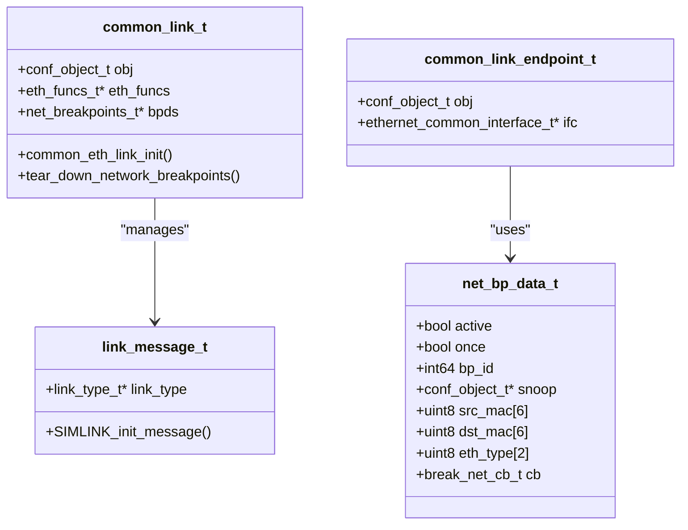

# Network Devices Implementation in Simics

<cite>
**Referenced Files in This Document**
- [eth-cable-link.c](file://simics-7.57.0/src/devices/eth-links/eth-cable-link.c)
- [eth-switch-link.c](file://simics-7.57.0/src/devices/eth-links/eth-switch-link.c)
- [eth-hub-link.c](file://simics-7.57.0/src/devices/eth-links/eth-hub-link.c)
- [common.c](file://simics-7.57.0/src/devices/eth-links/common.c)
- [common.h](file://simics-7.57.0/src/devices/eth-links/common.h)
- [module_load.py](file://simics-7.57.0/src/devices/eth-links/module_load.py)
- [simics_start.py](file://simics-7.57.0/src/devices/eth-links/simics_start.py)
- [test/s-get-free-connector.py](file://simics-7.57.0/src/devices/eth-links/test/s-get-free-connector.py)
</cite>

## Table of Contents
1. [Introduction](#introduction)
2. [Architecture Overview](#architecture-overview)
3. [Core Components](#core-components)
4. [Ethernet Link Implementations](#ethernet-link-implementations)
5. [C Implementation Details](#c-implementation-details)
6. [Python Configuration Layer](#python-configuration-layer)
7. [Network Topology Simulation](#network-topology-simulation)
8. [Advanced Features](#advanced-features)
9. [Common Issues and Solutions](#common-issues-and-solutions)
10. [Best Practices](#best-practices)
11. [Troubleshooting Guide](#troubleshooting-guide)
12. [Conclusion](#conclusion)

## Introduction

Simics provides a comprehensive network devices implementation that enables realistic simulation of Ethernet networks. The system consists of three primary network topologies: Ethernet cables, hubs, and switches, each implemented with sophisticated packet handling, link state management, and VLAN support capabilities.

The network devices implementation follows a layered architecture where C code handles low-level packet processing and link management, while Python provides high-level configuration and control interfaces. This design enables both performance-critical operations and flexible network topology construction.

## Architecture Overview

The Simics network devices architecture is built around several key abstractions that work together to provide a complete Ethernet simulation environment.


**Diagram sources**
- [common.c](file://simics-7.57.0/src/devices/eth-links/common.c#L200-L220)
- [eth-cable-link.c](file://simics-7.57.0/src/devices/eth-links/eth-cable-link.c#L225-L245)
- [eth-hub-link.c](file://simics-7.57.0/src/devices/eth-links/eth-hub-link.c#L134-L154)
- [eth-switch-link.c](file://simics-7.57.0/src/devices/eth-links/eth-switch-link.c#L593-L615)

The architecture separates concerns between high-level configuration (Python) and low-level networking operations (C), enabling both ease of use and performance optimization.

**Section sources**
- [common.h](file://simics-7.57.0/src/devices/eth-links/common.h#L42-L57)
- [module_load.py](file://simics-7.57.0/src/devices/eth-links/module_load.py#L394-L418)

## Core Components

The network devices implementation consists of several fundamental components that work together to provide comprehensive Ethernet simulation capabilities.

### Common Link Infrastructure

The common infrastructure provides shared functionality across all Ethernet link types, including message handling, endpoint management, and breakpoint support.



**Diagram sources**
- [common.h](file://simics-7.57.0/src/devices/eth-links/common.h#L42-L57)
- [common.h](file://simics-7.57.0/src/devices/eth-links/common.h#L21-L40)

### Message Types and Processing

Each link type defines specific message types for different network operations:

| Message Type | Purpose | Content |
|--------------|---------|---------|
| Frame Messages | Ethernet frame transmission | Frame data, CRC status |
| Status Messages | Link state changes | Boolean link status |
| Unlearn Messages | MAC address table updates | Endpoint ID removal |
| VLAN Tag Messages | VLAN-aware forwarding | VLAN tags, destination MAC |

**Section sources**
- [common.c](file://simics-7.57.0/src/devices/eth-links/common.c#L100-L140)
- [eth-cable-link.c](file://simics-7.57.0/src/devices/eth-links/eth-cable-link.c#L31-L45)

## Ethernet Link Implementations

Simics provides three distinct Ethernet link implementations, each optimized for different network topologies and use cases.

### Ethernet Cable Link

The cable link implementation provides a simple point-to-point connection between two devices, suitable for direct device connections.


**Diagram sources**
- [eth-cable-link.c](file://simics-7.57.0/src/devices/eth-links/eth-cable-link.c#L165-L200)

Key characteristics of the cable link:
- **Point-to-Point**: Only two endpoints supported
- **Direct Forwarding**: Frames are immediately delivered to the connected device
- **CRC Validation**: Built-in frame integrity checking
- **Status Monitoring**: Link up/down state management

**Section sources**
- [eth-cable-link.c](file://simics-7.57.0/src/devices/eth-links/eth-cable-link.c#L218-L356)

### Ethernet Hub Link

The hub link implements a broadcasting network topology where all connected devices receive every transmitted frame.


**Diagram sources**
- [eth-hub-link.c](file://simics-7.57.0/src/devices/eth-links/eth-hub-link.c#L105-L116)

Hub link features:
- **Broadcasting**: All frames sent to all connected endpoints
- **Simple Filtering**: Basic frame validation and filtering
- **Scalable**: Supports multiple concurrent endpoints
- **Legacy Compatibility**: Compatible with older network configurations

**Section sources**
- [eth-hub-link.c](file://simics-7.57.0/src/devices/eth-links/eth-hub-link.c#L118-L237)

### Ethernet Switch Link

The switch link provides the most sophisticated network topology with intelligent frame forwarding and VLAN support.


**Diagram sources**
- [eth-switch-link.c](file://simics-7.57.0/src/devices/eth-links/eth-switch-link.c#L24-L49)

Switch link capabilities:
- **Intelligent Forwarding**: MAC address learning and table-based routing
- **VLAN Support**: 802.1Q VLAN tagging and trunking
- **Multiple Ports**: Scalable to many concurrent endpoints
- **Performance Optimization**: Efficient hash table lookups for MAC addresses

**Section sources**
- [eth-switch-link.c](file://simics-7.57.0/src/devices/eth-links/eth-switch-link.c#L24-L800)

## C Implementation Details

The C implementation provides the core networking functionality with optimized packet processing and link management.

### Packet Handling Architecture


**Diagram sources**
- [eth-switch-link.c](file://simics-7.57.0/src/devices/eth-links/eth-switch-link.c#L726-L800)

### Memory Management

The implementation uses careful memory management to optimize performance:

| Component | Allocation Strategy | Cleanup Method |
|-----------|-------------------|----------------|
| Link Messages | `MM_MALLOC`/`MM_FREE` | Automatic cleanup |
| MAC Address Tables | Hash table with `ht_insert_int` | Manual cleanup |
| Frame Buffers | Dynamic allocation | Reference counting |
| Endpoint Lists | Vector-based storage | Iterative cleanup |

**Section sources**
- [common.c](file://simics-7.57.0/src/devices/eth-links/common.c#L35-L100)

### Link State Management

Each link type maintains different state information:


**Diagram sources**
- [eth-cable-link.c](file://simics-7.57.0/src/devices/eth-links/eth-cable-link.c#L291-L300)

**Section sources**
- [eth-cable-link.c](file://simics-7.57.0/src/devices/eth-links/eth-cable-link.c#L203-L220)

## Python Configuration Layer

The Python layer provides high-level configuration and control interfaces for network devices.

### Module Loading and Initialization


**Diagram sources**
- [module_load.py](file://simics-7.57.0/src/devices/eth-links/module_load.py#L394-L418)

### Command Interface

The Python layer exposes commands for network management:

| Command Category | Available Commands | Purpose |
|------------------|-------------------|---------|
| Link Management | `create-ethernet-cable`, `create-ethernet-hub`, `create-ethernet-switch` | Network topology creation |
| Connector Control | `get-free-connector`, `connect`, `disconnect` | Device attachment/detachment |
| VLAN Configuration | `add-vlan`, `get-free-trunk-connector` | VLAN setup and management |
| Traffic Capture | `pcap-dump`, `wireshark`, `tcpdump` | Network monitoring |

**Section sources**
- [module_load.py](file://simics-7.57.0/src/devices/eth-links/module_load.py#L128-L330)

### Configuration Examples

Here are practical examples of network configuration using the Python interface:

```python
# Example: Creating a simple cable connection
SIM_load_module("eth-links")
cable = SIM_create_object("ethernet-cable", "cable0")
connector1 = cable.get_free_connector()
connector2 = cable.get_free_connector()

# Connect devices to the cable
connect(connector1, device1)
connect(connector2, device2)

# Example: Creating a VLAN-enabled switch
switch = SIM_create_object("ethernet-vlan-switch", "switch0")
switch.add_vlan(100)  # Create VLAN 100
switch.add_vlan(200)  # Create VLAN 200

# Get connectors for different VLANs
vlan100_connector = switch.get_free_connector(vlan_id=100)
vlan200_connector = switch.get_free_connector(vlan_id=200)
trunk_connector = switch.get_free_trunk_connector()

# Connect devices to appropriate VLANs
connect(vlan100_connector, device1)
connect(vlan200_connector, device2)
connect(trunk_connector, device3)
```

**Section sources**
- [test/s-get-free-connector.py](file://simics-7.57.0/src/devices/eth-links/test/s-get-free-connector.py#L87-L105)

## Network Topology Simulation

The network devices implementation supports various topology patterns commonly found in real-world networks.

### Topology Comparison

| Topology | Bandwidth Utilization | Collision Domain | Security Level | Use Case |
|----------|----------------------|------------------|----------------|----------|
| Cable | Full Duplex | Single Device | Low | Point-to-point connections |
| Hub | Shared Medium | All Devices | Low | Small networks, testing |
| Switch | Dedicated Paths | Individual Ports | High | Production networks |

### VLAN Implementation

The switch link provides comprehensive VLAN support with 802.1Q tagging:


**Diagram sources**
- [eth-switch-link.c](file://simics-7.57.0/src/devices/eth-links/eth-switch-link.c#L418-L447)

**Section sources**
- [eth-switch-link.c](file://simics-7.57.0/src/devices/eth-links/eth-switch-link.c#L81-L118)

## Advanced Features

### Packet Loss Simulation

The network devices support configurable packet loss simulation for realistic network conditions:


Packet loss can be configured at different levels:
- **Link Level**: Global packet loss rate for all traffic
- **Port Level**: Per-port packet loss configuration
- **Protocol Level**: Specific protocols or MAC addresses subject to loss

### Network Latency Configuration

Latency simulation is implemented through the goal latency mechanism:

| Latency Type | Configuration | Impact |
|--------------|---------------|--------|
| Goal Latency | `set-goal-latency` command | Target round-trip time |
| Effective Latency | Automatically calculated | Actual observed latency |
| Minimum Latency | Hardware-dependent | Lower bound for timing |

**Section sources**
- [module_load.py](file://simics-7.57.0/src/devices/eth-links/module_load.py#L353-L362)

### Breakpoint System

The network breakpoint system allows for detailed traffic analysis:


Breakpoints can be configured based on:
- **Source MAC Address**: Filter by origin device
- **Destination MAC Address**: Target specific recipients
- **Ethernet Type**: Protocol-specific filtering
- **Once-Only Execution**: Single-trigger breakpoints

**Section sources**
- [common.c](file://simics-7.57.0/src/devices/eth-links/common.c#L318-L378)

## Common Issues and Solutions

### Packet Loss Scenarios

**Issue**: Unexpected packet loss in network simulations
**Causes**:
- Incorrect CRC calculation leading to frame rejection
- Buffer overflow in high-throughput scenarios
- Timing synchronization issues

**Solutions**:
- Verify CRC calculation correctness
- Increase buffer sizes for high-bandwidth scenarios
- Adjust timing parameters for better synchronization

### VLAN Configuration Problems

**Issue**: VLAN traffic not properly isolated
**Causes**:
- Incorrect VLAN tag configuration
- Misconfigured trunk ports
- MAC address learning failures

**Solutions**:
- Verify VLAN ID assignments
- Check trunk port configuration
- Monitor MAC address table learning

### Performance Bottlenecks

**Issue**: Poor network performance in simulations
**Causes**:
- Inefficient hash table lookups
- Excessive breakpoint overhead
- Memory allocation/deallocation overhead

**Solutions**:
- Optimize hash table sizing
- Reduce breakpoint frequency
- Implement memory pooling

## Best Practices

### Network Design Guidelines

1. **Topology Selection**: Choose appropriate link types based on network requirements
   - Use cables for point-to-point connections
   - Use hubs for small, simple networks
   - Use switches for production environments

2. **VLAN Planning**: Design VLAN structure carefully
   - Group related devices logically
   - Plan for future growth
   - Consider security implications

3. **Performance Tuning**: Optimize for simulation performance
   - Minimize breakpoint usage
   - Use efficient data structures
   - Configure appropriate buffer sizes

### Configuration Management

1. **Documentation**: Maintain clear documentation of network configurations
2. **Version Control**: Track changes to network topologies
3. **Testing**: Validate configurations before deployment
4. **Monitoring**: Implement traffic monitoring for troubleshooting

### Debugging Strategies

1. **Traffic Capture**: Use pcap dumps for detailed analysis
2. **Breakpoint Usage**: Strategically place breakpoints for targeted debugging
3. **Logging Levels**: Configure appropriate logging verbosity
4. **Performance Profiling**: Monitor resource usage during simulations

## Troubleshooting Guide

### Common Error Messages

| Error Message | Cause | Solution |
|---------------|-------|----------|
| "Device does not implement ethernet_common interface" | Missing interface implementation | Verify device compatibility |
| "No free connectors available" | Maximum connector limit reached | Disconnect unused devices |
| "Malformed MAC address" | Invalid MAC address format | Check MAC address syntax |
| "VLAN ID out of range" | Invalid VLAN identifier | Use VLAN IDs 1-4095 |

### Diagnostic Commands

```bash
# Check link status
info ethernet-cable
status ethernet-switch

# List connected devices
show ethernet-switch.endpoints

# Capture network traffic
ethernet-switch.pcap-dump traffic.pcap

# Stop traffic capture
ethernet-switch.pcap-dump-stop
```

### Performance Monitoring

Monitor key performance indicators:
- **Throughput**: Measure data transfer rates
- **Latency**: Track round-trip times
- **Packet Loss**: Monitor dropped frames
- **CPU Usage**: Watch for performance bottlenecks

**Section sources**
- [test/s-get-free-connector.py](file://simics-7.57.0/src/devices/eth-links/test/s-get-free-connector.py#L20-L35)

## Conclusion

The Simics network devices implementation provides a comprehensive and flexible framework for simulating Ethernet networks. The combination of C-level performance optimization and Python-level configurability makes it suitable for both research and production simulation environments.

Key strengths of the implementation include:
- **Modular Architecture**: Clean separation between different link types
- **VLAN Support**: Full 802.1Q VLAN implementation with trunking
- **Performance Optimization**: Efficient packet processing and memory management
- **Extensibility**: Easy addition of new link types and features
- **Debugging Tools**: Comprehensive traffic capture and breakpoint systems

The implementation serves as an excellent foundation for network research, protocol development, and system validation in simulated environments. Its design principles of modularity, performance, and usability make it a valuable tool for network simulation professionals.

Future enhancements could include support for additional network protocols, improved QoS mechanisms, and expanded monitoring capabilities. The solid architectural foundation ensures that such extensions can be integrated seamlessly while maintaining backward compatibility.