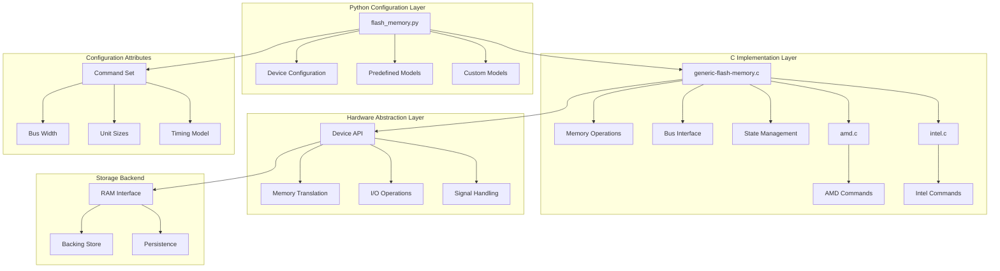
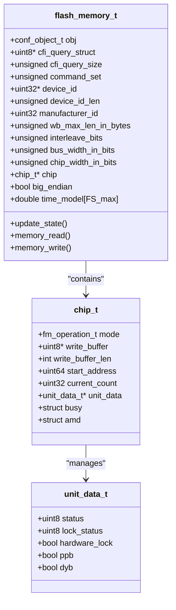
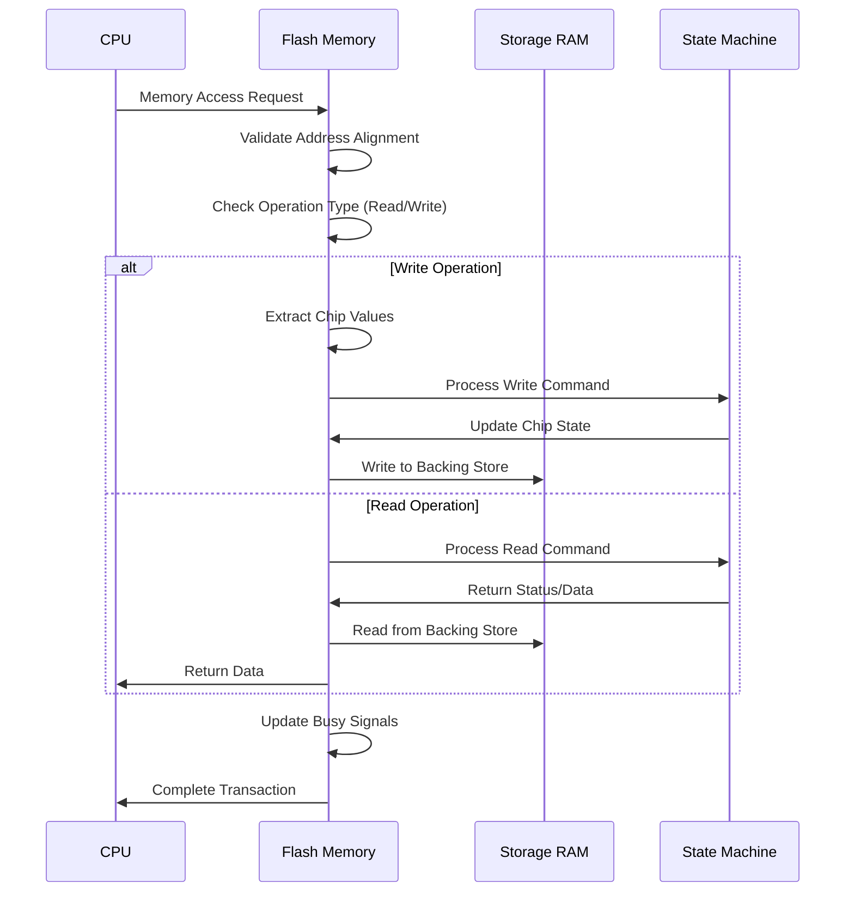
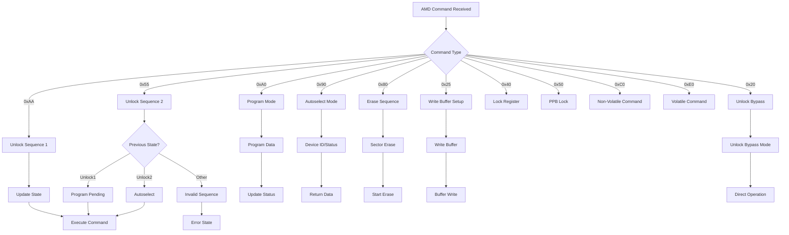
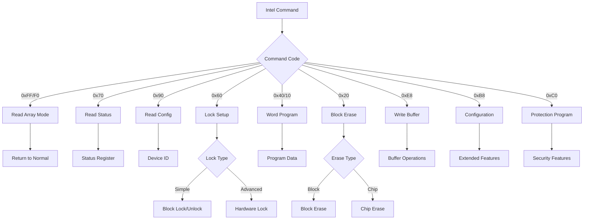
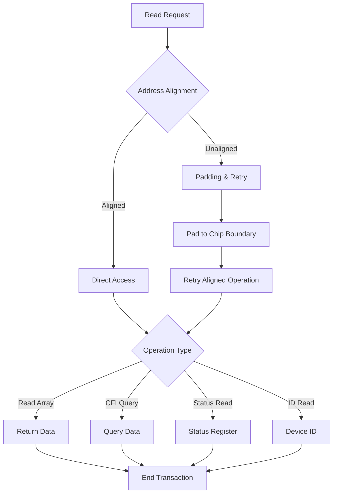
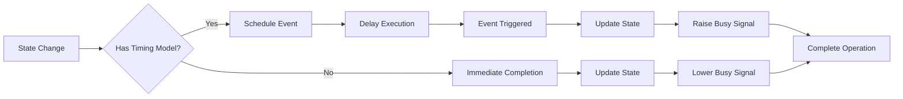

# Storage Devices Implementation in Simics

<cite>
**Referenced Files in This Document**
- [generic-flash-memory.c](file://simics-7.57.0/src/devices/generic-flash-memory/generic-flash-memory.c)
- [flash-memory.h](file://simics-7.57.0/src/devices/generic-flash-memory/flash-memory.h)
- [amd.c](file://simics-7.57.0/src/devices/generic-flash-memory/amd.c)
- [intel.c](file://simics-7.57.0/src/devices/generic-flash-memory/intel.c)
- [module_load.py](file://simics-7.57.0/src/devices/generic-flash-memory/module_load.py)
- [CMakeLists.txt](file://simics-7.57.0/src/devices/generic-flash-memory/CMakeLists.txt)
- [Makefile](file://simics-7.57.0/src/devices/generic-flash-memory/Makefile)
- [flash_memory.py](file://simics-7.57.0/linux64/lib/python-py3/flash_memory.py)
</cite>

## Table of Contents
1. [Introduction](#introduction)
2. [Architecture Overview](#architecture-overview)
3. [Core Components](#core-components)
4. [Flash Memory Simulation Framework](#flash-memory-simulation-framework)
5. [AMD Flash Chip Implementation](#amd-flash-chip-implementation)
6. [Intel Flash Chip Implementation](#intel-flash-chip-implementation)
7. [Python Configuration Interface](#python-configuration-interface)
8. [Memory Operations and Bus Interface](#memory-operations-and-bus-interface)
9. [Timing Model and Power Loss Behavior](#timing-model-and-power-loss-behavior)
10. [Common Issues and Troubleshooting](#common-issues-and-troubleshooting)
11. [Implementation Examples](#implementation-examples)
12. [Best Practices](#best-practices)

## Introduction

Simics provides a sophisticated flash memory simulation framework that accurately models various flash memory technologies including AMD and Intel flash chips. This implementation serves as a foundation for simulating embedded storage devices in system-level simulations, enabling developers to test firmware and operating systems that interact with flash memory.

The flash memory simulation supports multiple command sets, various memory architectures, and realistic timing behavior essential for accurate system simulation. It handles complex operations such as sector erasure, write protection, and power loss scenarios while maintaining compatibility with real-world flash memory characteristics.

## Architecture Overview

The Simics flash memory implementation follows a layered architecture that separates concerns between hardware simulation, command processing, and configuration management.



**Diagram sources**
- [generic-flash-memory.c](file://simics-7.57.0/src/devices/generic-flash-memory/generic-flash-memory.c#L2335-L2801)
- [flash_memory.h](file://simics-7.57.0/src/devices/generic-flash-memory/flash-memory.h#L166-L255)

The architecture consists of four primary layers:

1. **Python Configuration Layer**: Provides high-level device configuration and predefined flash models
2. **C Implementation Layer**: Handles low-level memory operations and command processing
3. **Hardware Abstraction Layer**: Manages device API interactions and memory translation
4. **Storage Backend**: Interfaces with RAM objects for persistent storage

**Section sources**
- [generic-flash-memory.c](file://simics-7.57.0/src/devices/generic-flash-memory/generic-flash-memory.c#L2335-L2801)
- [flash_memory.h](file://simics-7.57.0/src/devices/generic-flash-memory/flash-memory.h#L166-L255)

## Core Components

The flash memory simulation is built around several key components that work together to provide comprehensive flash memory emulation.

### Flash Memory Structure

The central data structure `flash_memory_t` encapsulates all flash memory state and configuration:



**Diagram sources**
- [flash-memory.h](file://simics-7.57.0/src/devices/generic-flash-memory/flash-memory.h#L136-L165)
- [flash-memory.h](file://simics-7.57.0/src/devices/generic-flash-memory/flash-memory.h#L128-L151)

### State Machine Architecture

The flash memory implements a comprehensive state machine to track operational modes:

```mermaid
stateDiagram-v2
[*] --> FS_read_array
FS_read_array --> FS_cfi_query : "CFI Access"
FS_read_array --> FS_amd_unlock1 : "AMD Command"
FS_read_array --> FS_intel_read_status : "Intel Command"
-- AMD States --
FS_amd_unlock1 --> FS_amd_unlock2 : "0x55"
FS_amd_unlock2 --> FS_amd_program_pending : "0xA0"
FS_amd_unlock2 --> FS_amd_autoselect : "0x90"
FS_amd_unlock2 --> FS_amd_erase3 : "0x80"
FS_amd_unlock2 --> FS_amd_unlock_bypass : "0x20"
-- Intel States --
FS_intel_read_status --> FS_intel_word_program : "Program"
FS_intel_read_status --> FS_intel_block_erase : "Erase"
FS_intel_read_status --> FS_write_buffer_size : "Write Buffer"
-- Operation States --
FS_amd_program --> FS_read_array : "Complete"
FS_intel_word_program --> FS_intel_read_status : "Complete"
FS_amd_erase_in_progress --> FS_read_array : "Complete"
FS_chip_erase_in_progress --> FS_read_array : "Complete"
```

**Diagram sources**
- [flash-memory.h](file://simics-7.57.0/src/devices/generic-flash-memory/flash-memory.h#L51-L106)

**Section sources**
- [flash-memory.h](file://simics-7.57.0/src/devices/generic-flash-memory/flash-memory.h#L136-L165)
- [flash-memory.h](file://simics-7.57.0/src/devices/generic-flash-memory/flash-memory.h#L51-L106)

## Flash Memory Simulation Framework

The core flash memory simulation framework provides the foundation for all flash memory operations, including memory transactions, command processing, and state management.

### Memory Transaction Processing

The framework handles both read and write operations through a unified transaction processing system:



**Diagram sources**
- [generic-flash-memory.c](file://simics-7.57.0/src/devices/generic-flash-memory/generic-flash-memory.c#L746-L804)
- [generic-flash-memory.c](file://simics-7.57.0/src/devices/generic-flash-memory/generic-flash-memory.c#L807-L872)

### Bus Interface Handling

The flash memory implements sophisticated bus interface handling to support various memory architectures:

| Attribute | Description | Default Value | Range |
|-----------|-------------|---------------|-------|
| `bus_width` | Total data path width in bits | 32 | 8, 16, 32, 64 |
| `interleave` | Number of parallel chips | Required | 1, 2, 4, 8 |
| `max_chip_width` | Maximum chip data width | 8 | 8, 16, 32, 64 |
| `big_endian` | Endianness configuration | 0 (little) | 0, 1 |

**Section sources**
- [generic-flash-memory.c](file://simics-7.57.0/src/devices/generic-flash-memory/generic-flash-memory.c#L1177-L1230)

## AMD Flash Chip Implementation

The AMD flash chip implementation provides comprehensive support for AMD's flash memory command set, including advanced features like non-volatile protection bits and volatile sector protection.

### AMD Command Processing

The AMD implementation handles a wide range of commands through a state-driven command processor:



**Diagram sources**
- [amd.c](file://simics-7.57.0/src/devices/generic-flash-memory/amd.c#L525-L800)

### Protection Mechanisms

AMD flash chips implement multiple protection mechanisms:

| Protection Type | Purpose | Configuration |
|----------------|---------|---------------|
| PPB (Persistent Protection Bit) | Non-volatile sector protection | Per-sector enable/disable |
| DYB (Dynamic Protection Bit) | Volatile sector protection | Runtime control |
| Hardware Write Protect | Physical write protection | Pin-controlled |
| Lock Register | Advanced protection control | Programmable register |

**Section sources**
- [amd.c](file://simics-7.57.0/src/devices/generic-flash-memory/amd.c#L175-L245)

## Intel Flash Chip Implementation

The Intel flash chip implementation focuses on Intel's flash memory command set with support for various Intel flash families and advanced features.

### Intel Command Processing

Intel flash commands follow a streamlined command structure optimized for Intel's flash architecture:



**Diagram sources**
- [intel.c](file://simics-7.57.0/src/devices/generic-flash-memory/intel.c#L445-L699)

### Locking Systems

Intel flash chips implement sophisticated locking mechanisms:

| Lock Type | Scope | Control Method |
|-----------|-------|----------------|
| Simple Lock | Entire device | Global enable/disable |
| Advanced Lock | Individual sectors | Hardware/software |
| Hardware Lock | Physical protection | Pin state |
| Lock Down | Permanent protection | Special sequence |

**Section sources**
- [intel.c](file://simics-7.57.0/src/devices/generic-flash-memory/intel.c#L163-L290)

## Python Configuration Interface

The Python configuration interface provides a high-level abstraction for configuring flash memory devices, including predefined models and custom configurations.

### Predefined Flash Models

The framework includes numerous predefined flash memory models covering major manufacturers and device families:

| Manufacturer | Device Family | Key Features |
|--------------|---------------|--------------|
| Intel | StrataFlash® | Write buffer, advanced locking |
| Intel | 28FxxxC3x | Boot block flash memory |
| AMD | Am29F040B | Standard flash memory |
| AMD | Am29LV640DH | Large capacity flash |
| Spansion | S29GLxxxN | Enterprise flash memory |

### Configuration Functions

The Python interface provides several key functions for flash memory configuration:

```python
# Create flash memory with predefined model
flash = flash_create_memory("Intel_28F320J3", "320")

# Create custom flash memory
custom_flash = flash_create_memory_anon({
    "command_set": 1,  # Intel
    "bus_width": 16,
    "interleave": 1,
    "unit_size": [0x10000, 0x2000],
    "device_id": 0x88C5,
    "manufacturer_id": 0x89
})
```

**Section sources**
- [flash_memory.py](file://simics-7.57.0/linux64/lib/python-py3/flash_memory.py#L26-L61)

## Memory Operations and Bus Interface

The flash memory implementation provides comprehensive support for various memory operations and bus interface configurations.

### Read Operations

Flash memory read operations support multiple access patterns:



**Diagram sources**
- [generic-flash-memory.c](file://simics-7.57.0/src/devices/generic-flash-memory/generic-flash-memory.c#L807-L872)

### Write Operations

Write operations implement sophisticated buffering and validation:

| Operation Type | Buffering | Validation | Timing |
|----------------|-----------|------------|--------|
| Direct Write | None | Address/Value | Immediate |
| Write Buffer | Internal | Size/Address | Delayed |
| Program | None | Protection | Asynchronous |
| Erase | None | Protection | Long delay |

**Section sources**
- [generic-flash-memory.c](file://simics-7.57.0/src/devices/generic-flash-memory/generic-flash-memory.c#L746-L804)

## Timing Model and Power Loss Behavior

The flash memory simulation implements realistic timing behavior and power loss handling to support accurate system-level simulation.

### Timing Model Implementation

The timing model associates each flash state with specific duration values:



**Diagram sources**
- [generic-flash-memory.c](file://simics-7.57.0/src/devices/generic-flash-memory/generic-flash-memory.c#L2156-L2182)

### Power Loss Handling

The implementation provides robust power loss behavior simulation:

| Scenario | Behavior | Recovery |
|----------|----------|----------|
| Write During Power Loss | Partial write | Corrupted data |
| Erase During Power Loss | Interrupted erase | Partially erased |
| Reset During Operation | Abort operation | Return to idle |
| Power Cycle | Preserve state | Restore from persistence |

**Section sources**
- [generic-flash-memory.c](file://simics-7.57.0/src/devices/generic-flash-memory/generic-flash-memory.c#L2156-L2182)

## Common Issues and Troubleshooting

Understanding common issues helps developers implement reliable flash memory simulations.

### Timing Accuracy Problems

Common timing-related issues include:

1. **Incorrect State Duration**: Verify timing model values match real flash characteristics
2. **Busy Signal Timing**: Ensure busy signals are properly raised/lowered
3. **Operation Overlap**: Prevent simultaneous operations on same sectors

### Wear Leveling Simulation

Wear leveling challenges include:

1. **Sector Distribution**: Ensure even wear across sectors
2. **Bad Block Management**: Implement realistic bad block detection
3. **Erase Count Tracking**: Monitor erase cycle counts

### Power Loss Behavior

Power loss simulation considerations:

1. **Data Integrity**: Handle partial operations correctly
2. **State Preservation**: Maintain state consistency across resets
3. **Recovery Procedures**: Implement proper recovery sequences

**Section sources**
- [generic-flash-memory.c](file://simics-7.57.0/src/devices/generic-flash-memory/generic-flash-memory.c#L2325-L2332)

## Implementation Examples

Practical examples demonstrate how to configure and use the flash memory simulation effectively.

### Basic Intel Flash Configuration

```python
# Configure Intel StrataFlash memory
intel_flash = flash_create_memory("Intel_28F320J3", "320")
intel_flash.intel_write_buffer = True
intel_flash.intel_chip_erase = True
intel_flash.intel_lock = 2  # Advanced locking
```

### Custom AMD Flash Configuration

```python
# Create custom AMD flash with specific parameters
custom_amd = flash_create_memory_anon({
    "command_set": 2,  # AMD
    "bus_width": 16,
    "interleave": 2,
    "unit_size": [0x10000, 0x2000, 0x4000],
    "device_id": [0x227E, 0x2213, 0x2200],
    "manufacturer_id": 0x22,
    "max_chip_width": 16
})
```

### Multi-Chip Configuration

```python
# Configure interleaved flash memory
flash_config = {
    "command_set": 1,
    "bus_width": 32,
    "interleave": 4,
    "unit_size": [0x100000, 0x20000],
    "device_id": 0x88C5,
    "manufacturer_id": 0x89
}
```

**Section sources**
- [flash_memory.py](file://simics-7.57.0/linux64/lib/python-py3/flash_memory.py#L26-L61)

## Best Practices

Effective flash memory simulation requires adherence to established best practices.

### Configuration Guidelines

1. **Command Set Selection**: Choose appropriate command set for target flash type
2. **Bus Width Matching**: Ensure bus width matches system architecture
3. **Unit Size Planning**: Design logical sector/block organization
4. **Timing Model Accuracy**: Use realistic timing values for operations

### Performance Optimization

1. **Write Buffer Usage**: Enable write buffers for bulk operations
2. **State Optimization**: Minimize unnecessary state transitions
3. **Memory Layout**: Optimize memory layout for access patterns
4. **Parallel Operations**: Utilize interleave for improved throughput

### Debugging and Testing

1. **State Monitoring**: Track flash state changes for debugging
2. **Operation Logging**: Enable detailed logging for complex operations
3. **Timing Verification**: Validate timing model accuracy
4. **Error Simulation**: Test error conditions and recovery

### Integration Considerations

1. **System Compatibility**: Ensure compatibility with target system
2. **Driver Support**: Verify driver support for selected features
3. **Performance Impact**: Consider performance implications
4. **Resource Usage**: Monitor memory and CPU resource usage

**Section sources**
- [generic-flash-memory.c](file://simics-7.57.0/src/devices/generic-flash-memory/generic-flash-memory.c#L2325-L2332)