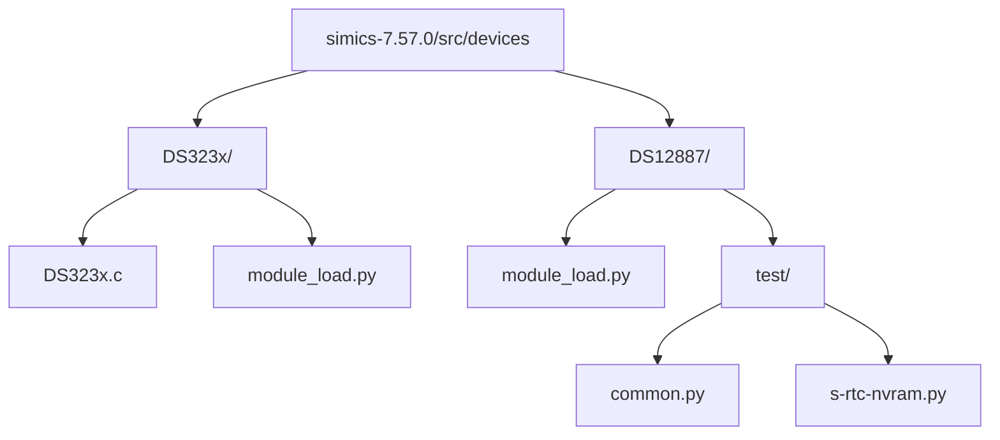
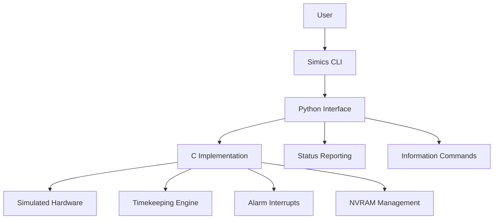
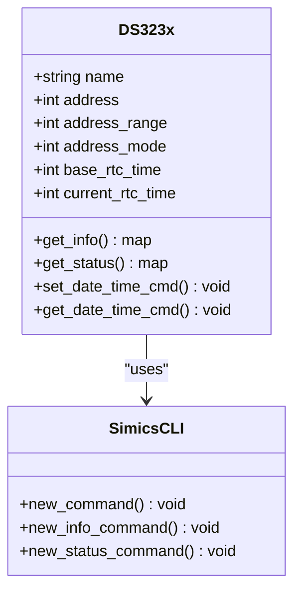
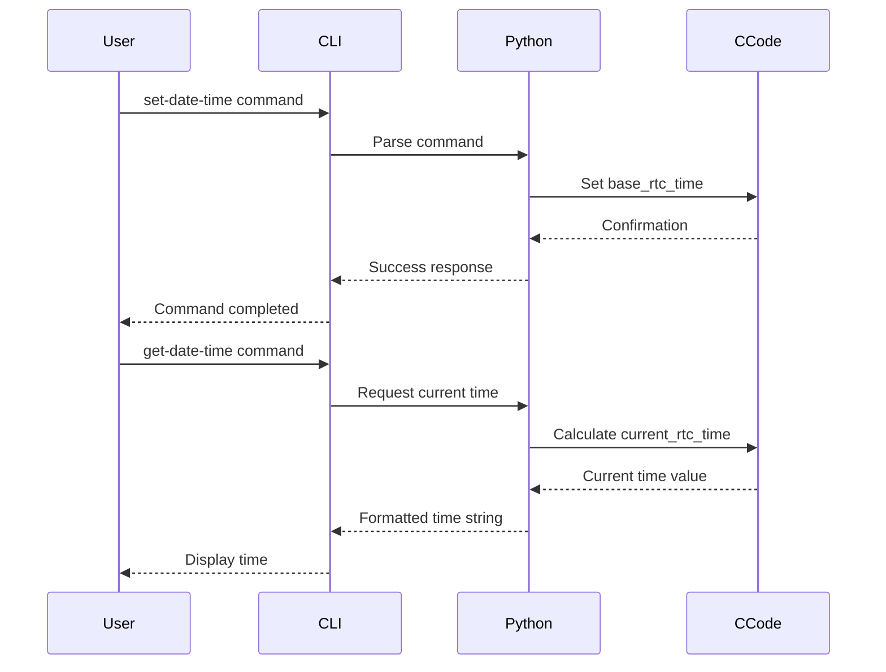
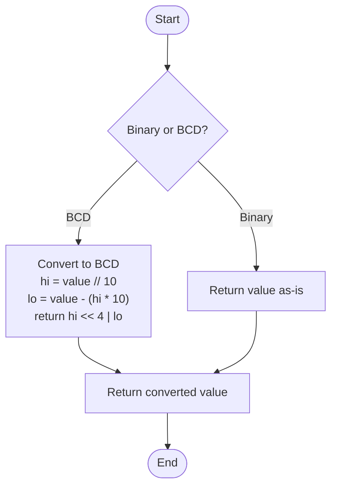
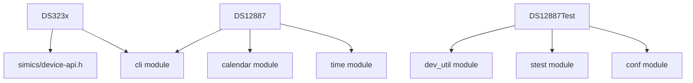

# Timing Devices

<cite>
**Referenced Files in This Document**   
- [DS323x.c](file://simics-7.57.0/src/devices/DS323x/DS323x.c)
- [module_load.py](file://simics-7.57.0/src/devices/DS323x/module_load.py)
- [DS12887/module_load.py](file://simics-7.57.0/src/devices/DS12887/module_load.py)
- [DS12887/test/common.py](file://simics-7.57.0/src/devices/DS12887/test/common.py)
- [DS12887/test/s-rtc-nvram.py](file://simics-7.57.0/src/devices/DS12887/test/s-rtc-nvram.py)
</cite>

## Table of Contents
1. [Introduction](#introduction)
2. [Project Structure](#project-structure)
3. [Core Components](#core-components)
4. [Architecture Overview](#architecture-overview)
5. [Detailed Component Analysis](#detailed-component-analysis)
6. [Dependency Analysis](#dependency-analysis)
7. [Performance Considerations](#performance-considerations)
8. [Troubleshooting Guide](#troubleshooting-guide)
9. [Conclusion](#conclusion)

## Introduction
This document provides a comprehensive analysis of the timing device implementations in Simics, focusing on the DS323x and DS12887 real-time clock (RTC) models. The documentation covers the architectural design, C implementation details for timekeeping, alarm functionality, temperature compensation, and battery-backed memory. It also explains the integration between C code and Python configuration scripts, particularly through module_load.py. The content is designed to be accessible to beginners while offering technical depth for experienced developers working on custom timing devices or modifying existing ones.

## Project Structure
The timing device implementations are organized within the Simics source tree under the devices directory. Two primary RTC models are implemented: DS323x and DS12887, each with its own subdirectory containing C source files, Python configuration scripts, and test suites. The DS323x implementation is located in `simics-7.57.0/src/devices/DS323x/` and includes the core C implementation in DS323x.c along with module_load.py for Python integration. The DS12887 implementation follows a similar structure with its own module_load.py and an extensive test suite that validates RTC NVRAM behavior and other functionalities.

**Diagram sources**
- [DS323x.c](file://simics-7.57.0/src/devices/DS323x/DS323x.c)
- [module_load.py](file://simics-7.57.0/src/devices/DS323x/module_load.py)
- [DS12887/module_load.py](file://simics-7.57.0/src/devices/DS12887/module_load.py)

**Section sources**
- [DS323x.c](file://simics-7.57.0/src/devices/DS323x/DS323x.c)
- [module_load.py](file://simics-7.57.0/src/devices/DS323x/module_load.py)
- [DS12887/module_load.py](file://simics-7.57.0/src/devices/DS12887/module_load.py)

## Core Components
The core components of the timing device implementation include the DS323x real-time clock model implemented in C and its corresponding Python interface for configuration and control. The DS323x.c file contains the low-level implementation of timekeeping functionality, while module_load.py provides the Python interface that allows users to interact with the RTC through Simics commands. The DS12887 implementation complements this with its own Python-based configuration and extensive testing framework. Key components include time register management, alarm interrupt generation, and NVRAM handling for battery-backed storage.

**Section sources**
- [DS323x.c](file://simics-7.57.0/src/devices/DS323x/DS323x.c)
- [module_load.py](file://simics-7.57.0/src/devices/DS323x/module_load.py)
- [DS12887/module_load.py](file://simics-7.57.0/src/devices/DS12887/module_load.py)

## Architecture Overview
The timing device architecture in Simics follows a modular design where C implementations handle low-level hardware simulation while Python scripts provide configuration interfaces and high-level control. The DS323x model uses a C-based implementation for timekeeping operations, with the init_local() function registering the device class. The Python module_load.py file defines CLI commands for setting and getting date/time, status reporting, and information queries. The architecture separates time representation (base_rtc_time) from current time calculation (current_rtc_time), allowing for accurate simulation of time progression in the virtual environment.

**Diagram sources**
- [DS323x.c](file://simics-7.57.0/src/devices/DS323x/DS323x.c)
- [module_load.py](file://simics-7.57.0/src/devices/DS323x/module_load.py)

## Detailed Component Analysis

### DS323x Implementation Analysis
The DS323x implementation provides a real-time clock simulation with I2C interface support. The C code in DS323x.c initializes the device class and handles low-level time operations, while the Python module_load.py provides user-facing commands. The implementation tracks time using base_rtc_time as a reference point and calculates current_rtc_time based on simulation progress. The device supports standard RTC operations including time setting, reading, and status reporting through Simics CLI commands.

#### For Object-Oriented Components:

**Diagram sources**
- [DS323x.c](file://simics-7.57.0/src/devices/DS323x/DS323x.c)
- [module_load.py](file://simics-7.57.0/src/devices/DS323x/module_load.py)

#### For API/Service Components:

**Diagram sources**
- [module_load.py](file://simics-7.57.0/src/devices/DS323x/module_load.py)
- [DS323x.c](file://simics-7.57.0/src/devices/DS323x/DS323x.c)

### DS12887 Implementation Analysis
The DS12887 RTC implementation is entirely Python-based, providing comprehensive NVRAM management and RTC functionality. The module_load.py file defines command-line interfaces for setting and retrieving date/time, calculating CMOS checksums, and managing register values in either binary or BCD format. The implementation includes detailed status reporting that exposes all RTC registers and their bit fields, allowing users to monitor the device state comprehensively. The test suite in the DS12887/test directory validates NVRAM behavior and other critical functionalities.

#### For Complex Logic Components:

**Diagram sources**
- [DS12887/module_load.py](file://simics-7.57.0/src/devices/DS12887/module_load.py)

**Section sources**
- [DS323x.c](file://simics-7.57.0/src/devices/DS323x/DS323x.c)
- [module_load.py](file://simics-7.57.0/src/devices/DS323x/module_load.py)
- [DS12887/module_load.py](file://simics-7.57.0/src/devices/DS12887/module_load.py)
- [DS12887/test/common.py](file://simics-7.57.0/src/devices/DS12887/test/common.py)
- [DS12887/test/s-rtc-nvram.py](file://simics-7.57.0/src/devices/DS12887/test/s-rtc-nvram.py)

## Dependency Analysis
The timing device implementations have minimal external dependencies, primarily relying on core Simics APIs for device registration, CLI integration, and time management. The DS323x implementation depends on the Simics device API for class registration and object management, while both implementations use the CLI module for command registration. The DS12887 implementation additionally uses standard Python libraries like calendar and time for date/time calculations. The test suite for DS12887 depends on Simics testing utilities and configuration modules to create test environments and validate behavior.

**Diagram sources**
- [DS323x.c](file://simics-7.57.0/src/devices/DS323x/DS323x.c)
- [module_load.py](file://simics-7.57.0/src/devices/DS323x/module_load.py)
- [DS12887/module_load.py](file://simics-7.57.0/src/devices/DS12887/module_load.py)

**Section sources**
- [DS323x.c](file://simics-7.57.0/src/devices/DS323x/DS323x.c)
- [module_load.py](file://simics-7.57.0/src/devices/DS323x/module_load.py)
- [DS12887/module_load.py](file://simics-7.57.0/src/devices/DS12887/module_load.py)

## Performance Considerations
The timing device implementations are designed for accuracy rather than performance optimization, as RTC operations are infrequent and not performance-critical in most simulation scenarios. The DS323x implementation calculates current time on demand rather than maintaining continuous updates, reducing computational overhead. The DS12887 implementation performs CMOS checksum calculations only when necessary, avoiding unnecessary computation. Both implementations use efficient data structures for register storage and access, with direct array indexing for NVRAM and register values. The Python-based implementations leverage Simics' optimized CLI and configuration systems to minimize command execution overhead.

## Troubleshooting Guide
Common issues with timing device simulation include time drift, incorrect alarm generation, and NVRAM corruption. For time drift issues, verify that the simulation clock is properly configured and that the base_rtc_time is correctly initialized. For alarm functionality problems, check that the interrupt device and level are properly configured in the DS12887 implementation. When experiencing NVRAM issues, ensure that the CMOS checksum is correctly calculated and that register values are properly formatted in either binary or BCD as required by the system configuration. The get-status command can be used to inspect all RTC registers and their bit fields to diagnose configuration issues.

**Section sources**
- [DS12887/module_load.py](file://simics-7.57.0/src/devices/DS12887/module_load.py)
- [DS12887/test/common.py](file://simics-7.57.0/src/devices/DS12887/test/common.py)

## Conclusion
The Simics timing device implementations provide accurate and flexible real-time clock simulation through the DS323x and DS12887 models. The architecture effectively separates low-level C implementation from high-level Python configuration, allowing for both performance-critical operations and user-friendly interfaces. The DS323x implementation demonstrates a clean C-based approach to timekeeping with I2C interface support, while the DS12887 implementation showcases the power of Python for device configuration and testing. Together, these implementations provide a solid foundation for simulating RTC functionality in various system configurations, with clear pathways for extending or customizing the behavior for specific use cases.