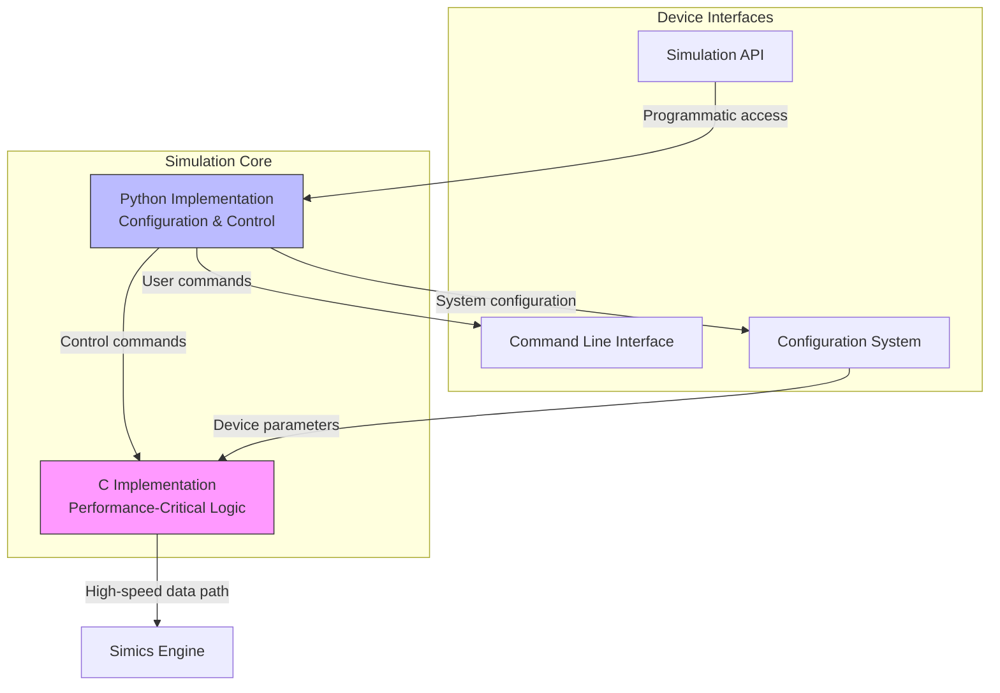
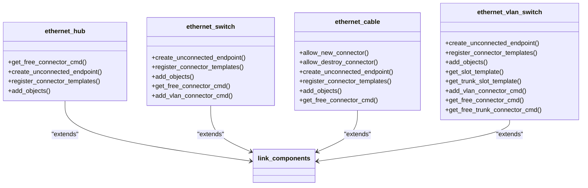
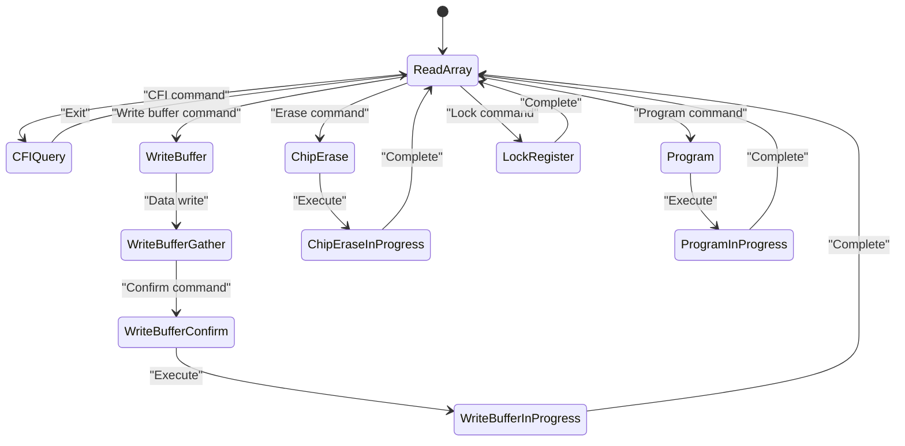
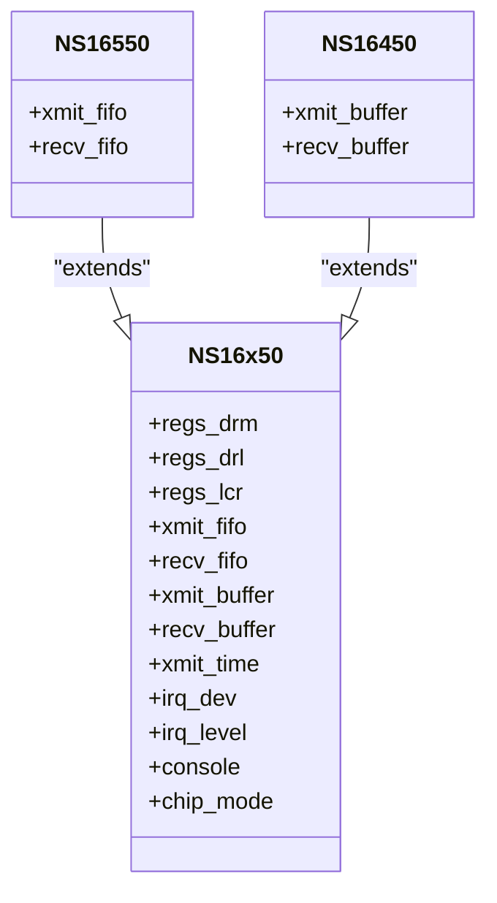
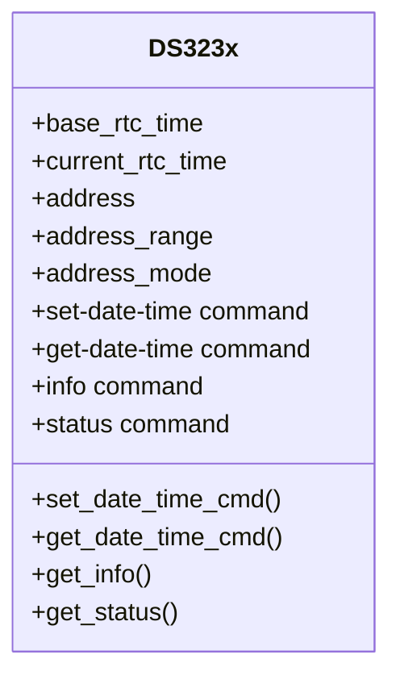
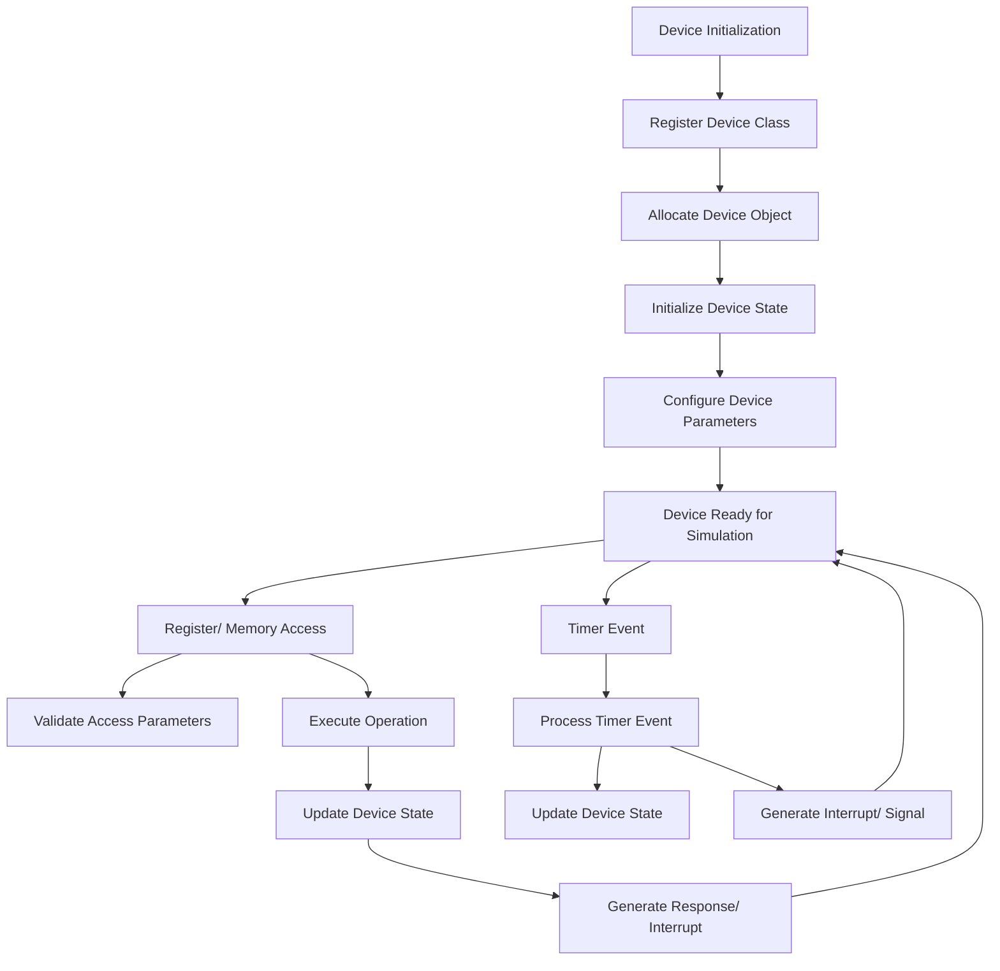
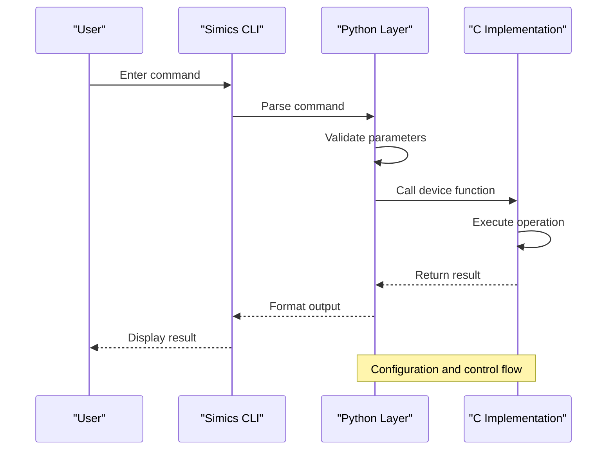
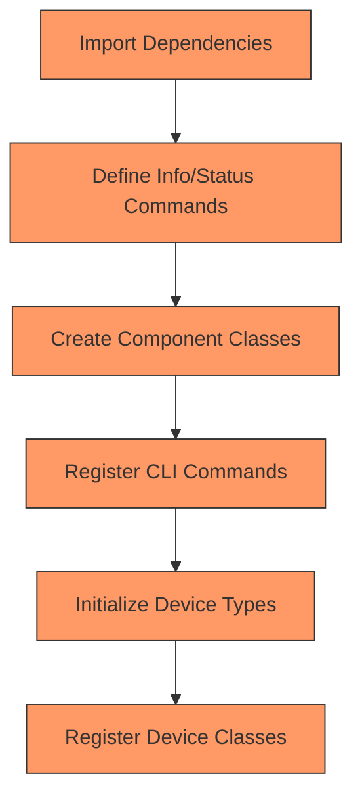

# Core Simics Devices

<cite>
**Referenced Files in This Document**   
- [eth-links/module_load.py](file://simics-7.57.0/src/devices/eth-links/module_load.py)
- [generic-flash-memory/module_load.py](file://simics-7.57.0/src/devices/generic-flash-memory/module_load.py)
- [NS16x50/module_load.py](file://simics-7.57.0/src/devices/NS16x50/module_load.py)
- [DS323x/module_load.py](file://simics-7.57.0/src/devices/DS323x/module_load.py)
- [eth-links/common.c](file://simics-7.57.0/src/devices/eth-links/common.c)
- [generic-flash-memory/generic-flash-memory.c](file://simics-7.57.0/src/devices/generic-flash-memory/generic-flash-memory.c)
- [eth-links/eth-hub-link.c](file://simics-7.57.0/src/devices/eth-links/eth-hub-link.c)
- [generic-flash-memory/flash-memory.h](file://simics-7.57.0/src/devices/generic-flash-memory/flash-memory.h)
</cite>

## Table of Contents
1. [Introduction](#introduction)
2. [Architecture Overview](#architecture-overview)
3. [Core Device Examples](#core-device-examples)
4. [Implementation Patterns](#implementation-patterns)
5. [Configuration and Initialization](#configuration-and-initialization)
6. [Runtime Interaction and Troubleshooting](#runtime-interaction-and-troubleshooting)
7. [Performance Considerations](#performance-considerations)
8. [Conclusion](#conclusion)

## Introduction

Core Simics Devices form the foundation of hardware modeling in the Simics simulation environment, providing accurate emulation of real-world systems through modular, interface-standardized components. These devices enable the creation of complex virtual platforms by implementing essential hardware functionality across various domains including networking, storage, serial I/O, and real-time clock systems. The architecture combines performance-critical C implementations with Python-based configuration and control logic, allowing for both high-fidelity simulation and flexible system composition. This document explores the design principles, implementation patterns, and practical usage of core Simics devices, focusing on representative examples such as eth-links for networking, generic-flash-memory for storage, NS16x50 for serial I/O, and DS323x for real-time clock functionality.

**Section sources**
- [eth-links/module_load.py](file://simics-7.57.0/src/devices/eth-links/module_load.py#L1-L927)
- [generic-flash-memory/module_load.py](file://simics-7.57.0/src/devices/generic-flash-memory/module_load.py#L1-L60)

## Architecture Overview

The Simics device architecture follows a modular design pattern that separates performance-critical simulation logic from configuration and control interfaces. At its core, the architecture implements a dual-language approach where C handles time-sensitive operations and hardware state management, while Python provides configuration, command-line interface (CLI) integration, and high-level control. This separation enables optimal performance for simulation-critical paths while maintaining flexibility in system composition and user interaction.

The architecture is built around standardized interfaces that promote interoperability between components. Devices expose well-defined interfaces for communication, configuration, and introspection, allowing them to be connected and controlled through a consistent framework. The link-based architecture, exemplified by the eth-links implementation, demonstrates this principle through standardized endpoint and link abstractions that support various network topologies including hubs, switches, and point-to-point connections.

**Diagram sources **
- [eth-links/common.c](file://simics-7.57.0/src/devices/eth-links/common.c#L1-L418)
- [generic-flash-memory/generic-flash-memory.c](file://simics-7.57.0/src/devices/generic-flash-memory/generic-flash-memory.c#L1-L200)

**Section sources**
- [eth-links/common.c](file://simics-7.57.0/src/devices/eth-links/common.c#L1-L418)
- [generic-flash-memory/generic-flash-memory.c](file://simics-7.57.0/src/devices/generic-flash-memory/generic-flash-memory.c#L1-L200)

## Core Device Examples

### Networking: eth-links

The eth-links implementation provides a comprehensive suite of Ethernet networking devices that emulate various network topologies. This includes hub, switch, and cable link types, each implemented as a separate component with distinct behavior characteristics. The architecture follows a common pattern where the C implementation handles packet forwarding and timing, while Python manages configuration, CLI commands, and component composition.

The hub implementation broadcasts all received frames to all connected endpoints, simulating a simple shared medium. The switch implementation maintains a MAC address table to optimize packet routing, learning source addresses from incoming frames and forwarding packets only to the appropriate destination port. The cable implementation provides a point-to-point connection between exactly two devices, enforcing the physical constraints of a direct cable connection.

**Diagram sources **
- [eth-links/module_load.py](file://simics-7.57.0/src/devices/eth-links/module_load.py#L94-L350)
- [eth-links/eth-hub-link.c](file://simics-7.57.0/src/devices/eth-links/eth-hub-link.c#L1-L200)

**Section sources**
- [eth-links/module_load.py](file://simics-7.57.0/src/devices/eth-links/module_load.py#L94-L350)
- [eth-links/eth-hub-link.c](file://simics-7.57.0/src/devices/eth-links/eth-hub-link.c#L1-L200)

### Storage: generic-flash-memory

The generic-flash-memory device provides a comprehensive model of flash memory behavior, supporting both Intel and AMD command sets with accurate timing models. This device implements the complete state machine for flash operations including read, write, erase, and various command modes. The implementation handles both uniform and non-uniform sector layouts, supporting complex flash geometries with varying block sizes.

The device architecture separates the timing model from the functional implementation, allowing for configurable timing parameters that can be adjusted to match specific flash memory characteristics. The write buffer functionality is implemented with proper state transitions, ensuring that partial writes are handled correctly according to the flash memory specification. The device also supports CFI (Common Flash Interface) queries, enabling operating systems and boot loaders to discover the flash memory characteristics at runtime.

**Diagram sources **
- [generic-flash-memory/generic-flash-memory.c](file://simics-7.57.0/src/devices/generic-flash-memory/generic-flash-memory.c#L1-L200)
- [generic-flash-memory/flash-memory.h](file://simics-7.57.0/src/devices/generic-flash-memory/flash-memory.h#L1-L200)

**Section sources**
- [generic-flash-memory/module_load.py](file://simics-7.57.0/src/devices/generic-flash-memory/module_load.py#L1-L60)
- [generic-flash-memory/generic-flash-memory.c](file://simics-7.57.0/src/devices/generic-flash-memory/generic-flash-memory.c#L1-L200)

### Serial I/O: NS16x50

The NS16x50 device implements a UART (Universal Asynchronous Receiver-Transmitter) compatible with the industry-standard NS16x50 family. This device models the register interface, interrupt generation, and data transmission/reception behavior of real UART hardware. The implementation supports both the basic NS16450 functionality and the enhanced FIFO capabilities of the NS16550 variant.

The device architecture separates the register interface from the transmission logic, allowing for clean state management and interrupt handling. The transmit and receive FIFOs are modeled with accurate timing, and the device generates interrupts according to the configured interrupt enable and trigger levels. The console interface allows for connection to host terminal emulators, enabling interactive use of the simulated system.

**Diagram sources **
- [NS16x50/module_load.py](file://simics-7.57.0/src/devices/NS16x50/module_load.py#L1-L66)
- [NS16x50/NS16x50-init.c](file://simics-7.57.0/src/devices/NS16x50/NS16x50-init.c#L1-L22)

**Section sources**
- [NS16x50/module_load.py](file://simics-7.57.0/src/devices/NS16x50/module_load.py#L1-L66)

### Real-Time Clock: DS323x

The DS323x device models a real-time clock with calendar functionality, providing accurate timekeeping for simulated systems. This device implements the I2C interface for configuration and data access, supporting the standard DS323x register map for time, date, alarm, and control functions. The implementation maintains the current time in both RTC (Real-Time Clock) format and base time representation, allowing for efficient time calculations and checkpointing.

The device supports configuration commands for setting and retrieving the current date and time, with proper validation of input parameters. The implementation handles both BCD (Binary-Coded Decimal) and binary register formats, accommodating different system requirements. The device also maintains proper state across simulation checkpoints and restores, ensuring time continuity when saving and loading simulation states.

**Diagram sources **
- [DS323x/module_load.py](file://simics-7.57.0/src/devices/DS323x/module_load.py#L1-L96)
- [DS323x/DS323x.c](file://simics-7.57.0/src/devices/DS323x/DS323x.c#L1-L22)

**Section sources**
- [DS323x/module_load.py](file://simics-7.57.0/src/devices/DS323x/module_load.py#L1-L96)

## Implementation Patterns

### C Implementation for Performance-Critical Logic

The C implementation of Simics devices focuses on performance-critical operations and hardware state management. This includes packet processing in network devices, memory operations in storage devices, and register access in I/O devices. The C code is structured around standardized interfaces that define the contract between the device and the simulation engine.

For example, the eth-links implementation uses the SIMLINK interface to handle message passing between network endpoints. The common_link_t structure provides a foundation for all link types, with type-specific functions registered through function pointers. This pattern allows for efficient message delivery while maintaining a consistent interface across different link types.

The generic-flash-memory implementation demonstrates another key pattern: state machine management. The flash memory device maintains its current operation state in the chip_t structure, with state transitions triggered by register accesses and command execution. The update_state function handles state changes with proper logging, enabling detailed debugging of flash operations.

**Diagram sources **
- [eth-links/common.c](file://simics-7.57.0/src/devices/eth-links/common.c#L1-L418)
- [generic-flash-memory/generic-flash-memory.c](file://simics-7.57.0/src/devices/generic-flash-memory/generic-flash-memory.c#L1-L200)

**Section sources**
- [eth-links/common.c](file://simics-7.57.0/src/devices/eth-links/common.c#L1-L418)
- [generic-flash-memory/generic-flash-memory.c](file://simics-7.57.0/src/devices/generic-flash-memory/generic-flash-memory.c#L1-L200)

### Python Implementation for Configuration and Control

The Python implementation provides the configuration interface and command-line integration for Simics devices. This layer handles component creation, parameter validation, and user interaction through the Simics CLI. The module_load.py files in each device directory contain the Python code that registers device classes, defines configuration parameters, and implements user commands.

The eth-links implementation demonstrates this pattern with its component classes (ethernet_hub, ethernet_switch, etc.) that inherit from link_components.link_component. These classes define the component interface, connector templates, and configuration parameters. The Python code also registers CLI commands for device management, such as get-free-connector and set-goal-latency.

The generic-flash-memory implementation shows a simpler pattern with direct command registration using cli.new_command. This approach is suitable for devices with straightforward configuration requirements. The implementation also registers info and status commands that provide human-readable device state information.

**Diagram sources **
- [eth-links/module_load.py](file://simics-7.57.0/src/devices/eth-links/module_load.py#L94-L350)
- [generic-flash-memory/module_load.py](file://simics-7.57.0/src/devices/generic-flash-memory/module_load.py#L1-L60)

**Section sources**
- [eth-links/module_load.py](file://simics-7.57.0/src/devices/eth-links/module_load.py#L94-L350)
- [generic-flash-memory/module_load.py](file://simics-7.57.0/src/devices/generic-flash-memory/module_load.py#L1-L60)

## Configuration and Initialization

### Module Load Scripts

The module_load.py scripts serve as the entry point for device initialization and configuration. These scripts perform several critical functions: registering device classes with the simulation engine, defining configuration parameters, and implementing user commands. The scripts follow a consistent pattern across different device types, making it easier to understand and extend the device framework.

For the eth-links devices, the module_load.py script defines component classes that inherit from link_components.link_component. These classes specify the underlying link type, endpoint type, and connector type, establishing the relationship between the component interface and the implementation. The script also registers info and status commands that provide device-specific information to users.

**Diagram sources **
- [eth-links/module_load.py](file://simics-7.57.0/src/devices/eth-links/module_load.py#L1-L927)

**Section sources**
- [eth-links/module_load.py](file://simics-7.57.0/src/devices/eth-links/module_load.py#L1-L927)

### Device Initialization Sequence

The device initialization sequence follows a standardized pattern that ensures proper setup of both the C and Python components. When a device is created, the simulation engine calls the init_local function, which registers the device class and initializes any shared resources. For the eth-links implementation, this includes initializing the SIMLINK library and registering the snoop endpoint class.

After class registration, device instances are created through the component interface. The allocation function (alloc_object) creates the device structure, followed by the initialization function (init_object) that sets up the initial device state. The finalize_instance function is called after configuration to complete the setup process.

For the generic-flash-memory device, the initialization sequence includes setting up the timing model, configuring the flash geometry, and initializing the CFI data structure. The device parameters (command_set, device_id, manufacturer_id, etc.) are used to configure the device behavior to match the characteristics of the physical flash memory being modeled.

**Section sources**
- [eth-links/common.c](file://simics-7.57.0/src/devices/eth-links/common.c#L394-L417)
- [generic-flash-memory/generic-flash-memory.c](file://simics-7.57.0/src/devices/generic-flash-memory/generic-flash-memory.c#L1-L200)

## Runtime Interaction and Troubleshooting

### Configuration Options

Simics devices provide various configuration options that allow users to customize device behavior. These options are exposed through the component interface and can be set during system configuration. For the eth-links devices, key configuration options include goal_latency (desired communication latency) and global_id (identifier for link grouping).

The generic-flash-memory device offers configuration parameters such as command_set (Intel or AMD command set), device_id (device identifier), manufacturer_id (manufacturer code), interleave (number of interleaved chips), and bus_width (data bus width in bits). These parameters allow the device to be configured to match specific flash memory parts.

The NS16x50 device provides configuration options for the transmit interval (xmit_time), interrupt device and level (irq_dev, irq_level), and console connection (console). These parameters enable integration with different system architectures and interrupt controllers.

**Section sources**
- [eth-links/module_load.py](file://simics-7.57.0/src/devices/eth-links/module_load.py#L94-L350)
- [generic-flash-memory/module_load.py](file://simics-7.57.0/src/devices/generic-flash-memory/module_load.py#L1-L60)
- [NS16x50/module_load.py](file://simics-7.57.0/src/devices/NS16x50/module_load.py#L1-L66)

### Common Modeling Issues

Several common issues can arise when modeling devices in Simics, particularly related to timing, interrupts, and register access. Timing inaccuracies can occur when the model does not accurately reflect the timing characteristics of the physical device. This can lead to system instability or incorrect behavior in time-sensitive applications.

Interrupt handling problems are another common issue, often manifesting as missed interrupts, spurious interrupts, or incorrect interrupt levels. These issues typically stem from improper synchronization between the device model and the interrupt controller, or from incorrect implementation of interrupt generation logic.

Register access errors can occur when the device model does not properly handle read/write operations, particularly for registers with side effects or complex access rules. This includes issues with write-only registers, read-clear registers, and registers that trigger actions on write.

### Troubleshooting Guidance

When troubleshooting device models, it is essential to use the available diagnostic tools and logging facilities. The Simics logging system provides detailed information about device operations, which can be invaluable for identifying issues. For example, the generic-flash-memory device includes log groups for read, write, command, lock, erase, and state operations, allowing users to trace the execution of flash operations.

For timing issues, verify that the timing model parameters match the specifications of the physical device. Use the simulation's time measurement tools to validate that operations complete within the expected time frame. For interrupt problems, check the interrupt signal connections and verify that the device is generating interrupts at the correct times and with the correct levels.

When debugging register access issues, use the simulation's memory access tracing to monitor read and write operations. Verify that the device responds correctly to all access patterns, including byte, half-word, and word accesses at various alignments. Pay particular attention to registers with side effects, ensuring that the side effects occur only on write operations and not on reads.

**Section sources**
- [eth-links/module_load.py](file://simics-7.57.0/src/devices/eth-links/module_load.py#L1-L927)
- [generic-flash-memory/module_load.py](file://simics-7.57.0/src/devices/generic-flash-memory/module_load.py#L1-L60)
- [NS16x50/module_load.py](file://simics-7.57.0/src/devices/NS16x50/module_load.py#L1-L66)
- [DS323x/module_load.py](file://simics-7.57.0/src/devices/DS323x/module_load.py#L1-L96)

## Performance Considerations

When modeling high-frequency devices or complex state machines in Simics, several performance considerations must be taken into account. The primary concern is minimizing the overhead of device operations, particularly for devices that are accessed frequently during simulation. This includes optimizing the C implementation for speed and minimizing the use of expensive operations such as memory allocation and string formatting.

For high-frequency devices, consider using batched operations where possible to reduce the number of individual transactions. For example, the generic-flash-memory device implements a write buffer that allows multiple bytes to be written in a single operation, reducing the overhead of individual byte writes.

When modeling complex state machines, avoid deep nesting of conditional statements and use lookup tables or state transition tables where appropriate. This can significantly improve performance by reducing the number of conditional checks required to determine the next state.

Another important consideration is the use of efficient data structures. For example, the eth-links implementation uses VECT (a vector container) to manage network breakpoints, providing efficient insertion and deletion operations. Similarly, the i2c-link-v2 implementation uses a hashtab (hash table) to manage device addresses, enabling fast lookup of slave devices.

Finally, be mindful of the impact of logging and debugging features on performance. While these features are invaluable for development and troubleshooting, they can significantly slow down simulation when enabled. Consider implementing log level controls that allow users to disable verbose logging in production simulations.

**Section sources**
- [eth-links/common.c](file://simics-7.57.0/src/devices/eth-links/common.c#L1-L418)
- [generic-flash-memory/generic-flash-memory.c](file://simics-7.57.0/src/devices/generic-flash-memory/generic-flash-memory.c#L1-L200)
- [i2c-link-v2/i2c-link-v2.c](file://simics-7.57.0/src/devices/i2c-link-v2/i2c-link-v2.c#L1-L200)

## Conclusion

Core Simics Devices provide a robust foundation for hardware modeling in the Simics simulation environment, combining the performance of C implementations with the flexibility of Python-based configuration and control. The architecture emphasizes modularity, interface standardization, and integration with the broader Simics framework, enabling the creation of accurate and efficient virtual platforms.

The examples examined—eth-links for networking, generic-flash-memory for storage, NS16x50 for serial I/O, and DS323x for real-time clock functionality—demonstrate common design principles including separation of performance-critical logic from configuration, standardized interfaces for interoperability, and comprehensive state management. These principles enable the creation of high-fidelity device models that accurately emulate real-world hardware behavior.

When implementing or using Simics devices, it is important to understand both the C and Python components, as well as their interaction through the simulation framework. Proper configuration, initialization, and runtime management are essential for achieving accurate simulation results. By following the patterns and best practices outlined in this document, developers can create effective device models that meet the demanding requirements of modern system simulation.