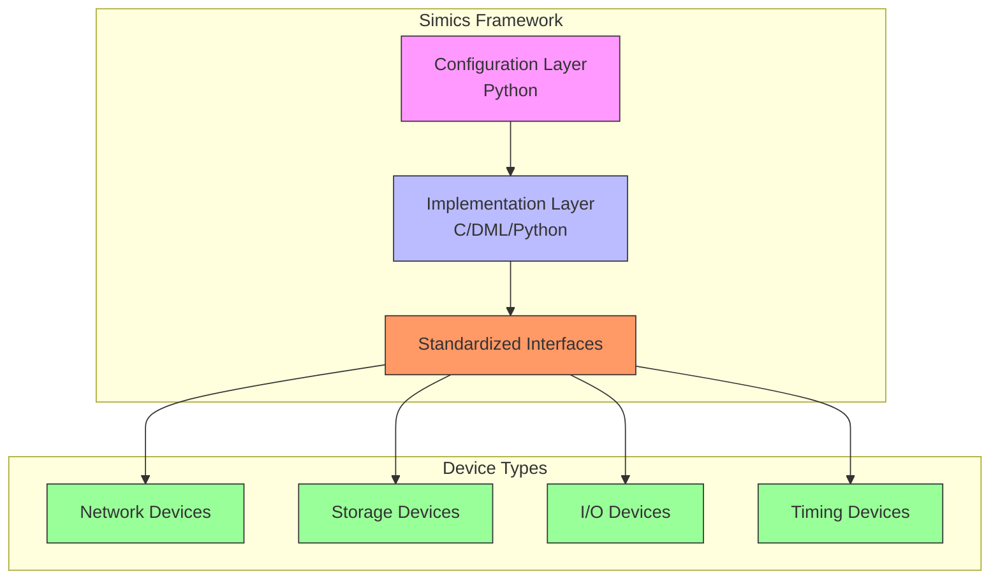
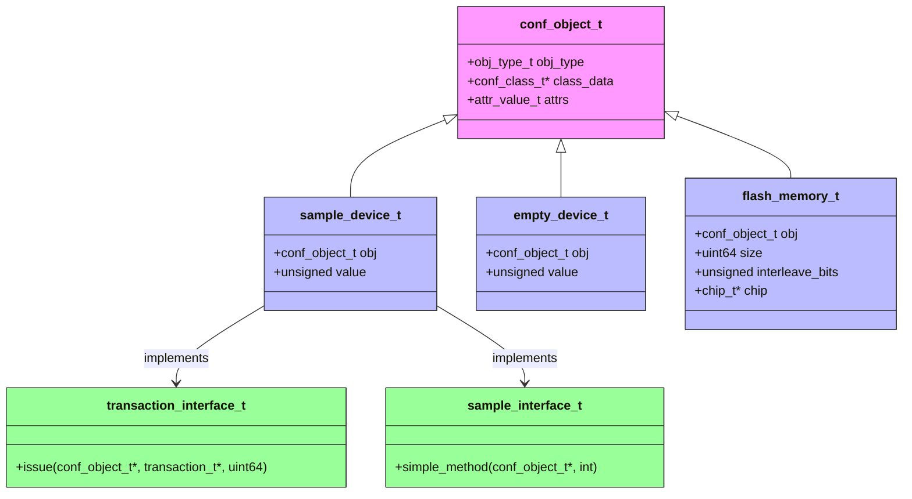
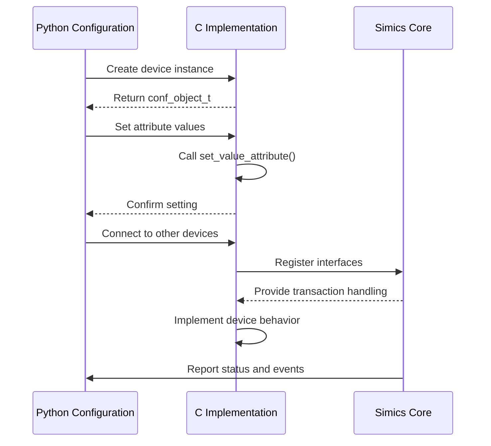
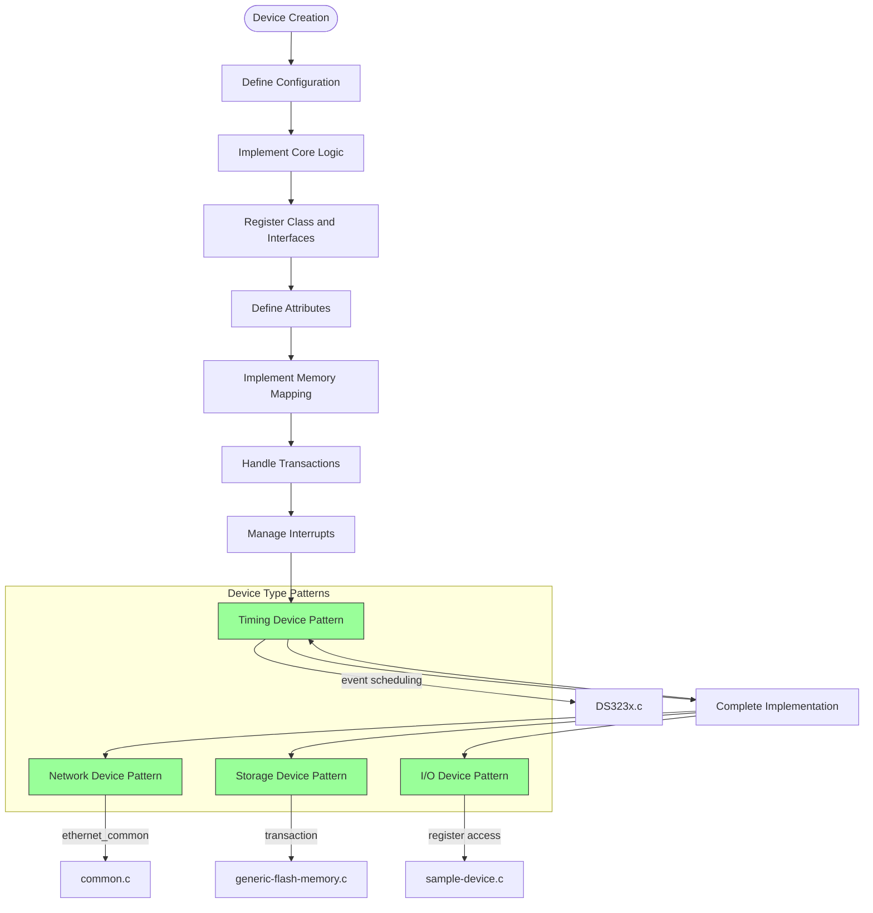
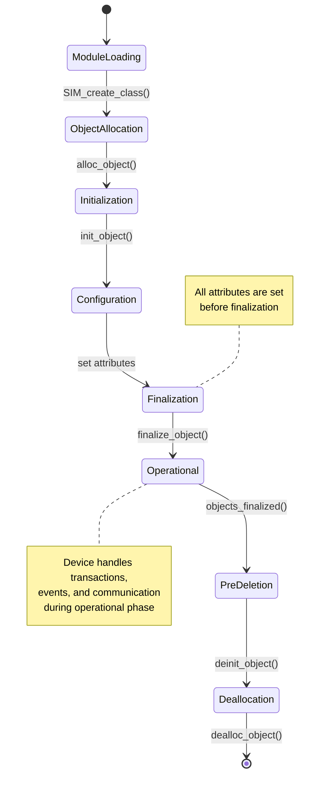

# Device Modeling in Simics

<cite>
**Referenced Files in This Document**   
- [sample-device.c](file://simics-7.57.0\src\devices\sample-device-c\sample-device.c)
- [sample_device_python.py](file://simics-7.57.0\src\devices\sample-device-python\sample_device_python.py)
- [empty-device-c.c](file://simics-7.57.0\src\devices\empty-device-c\empty-device-c.c)
- [generic-flash-memory.c](file://simics-7.57.0\src\devices\generic-flash-memory\generic-flash-memory.c)
- [common.c](file://simics-7.57.0\src\devices\eth-links\common.c)
- [attr-value.dml](file://simics-7.57.0\linux64\bin\dml\api\7\1.4\simics\base\attr-value.dml)
</cite>

## Table of Contents
1. [Introduction](#introduction)
2. [Device Modeling Architecture](#device-modeling-architecture)
3. [Implementation Patterns](#implementation-patterns)
4. [Configuration and Implementation Relationship](#configuration-and-implementation-relationship)
5. [Common Device Patterns](#common-device-patterns)
6. [Device Modeling Lifecycle](#device-modeling-lifecycle)
7. [Best Practices](#best-practices)
8. [Conclusion](#conclusion)

## Introduction

Device modeling in Simics provides a modular framework for creating hardware device simulations. This system enables developers to model various hardware components with standardized interfaces and implementation patterns. The framework supports multiple implementation languages including C, Python, and DML (Device Modeling Language), allowing flexibility in development approaches. Device models in Simics serve as virtual representations of physical hardware, enabling accurate simulation of system behavior for testing, development, and analysis purposes.

The device modeling system is designed to be extensible and maintainable, with clear separation between configuration (typically in Python) and implementation (in C or other languages). This separation allows for efficient development workflows where system configuration and device behavior can be developed and modified independently.

**Section sources**
- [sample-device.c](file://simics-7.57.0\src\devices\sample-device-c\sample-device.c#L1-L119)
- [sample_device_python.py](file://simics-7.57.0\src\devices\sample-device-python\sample_device_python.py#L1-L80)

## Device Modeling Architecture

The Simics device modeling architecture is built around a modular system that supports various device types through standardized interfaces. At its core, the architecture follows an object-oriented approach where each device is represented as a configuration object with associated interfaces and attributes. The architecture enables the creation of reusable device models that can be easily integrated into larger system simulations.

The framework provides a set of base classes and interfaces that define common device behaviors. Devices implement these interfaces to provide specific functionality, such as memory-mapped I/O operations, interrupt generation, or communication protocols. The architecture supports inheritance and composition, allowing complex devices to be built from simpler components.

**Diagram sources**
- [sample-device.c](file://simics-7.57.0\src\devices\sample-device-c\sample-device.c#L15-L119)
- [sample_device_python.py](file://simics-7.57.0\src\devices\sample-device-python\sample_device_python.py#L15-L80)

**Section sources**
- [sample-device.c](file://simics-7.57.0\src\devices\sample-device-c\sample-device.c#L15-L119)
- [sample_device_python.py](file://simics-7.57.0\src\devices\sample-device-python\sample_device_python.py#L15-L80)

## Implementation Patterns

Simics device modeling follows several established implementation patterns that ensure consistency and maintainability across different device types. These patterns are evident in the various sample devices provided in the codebase.

The most fundamental pattern is the use of configuration objects that encapsulate device state and behavior. Each device implementation follows a lifecycle with specific initialization and cleanup functions. The `init_local()` function is called once when the device module is loaded, responsible for registering the device class and its interfaces.

For C implementations, devices typically define a structure that inherits from `conf_object_t` and includes device-specific data members. The implementation includes allocation, initialization, and deallocation functions that manage the device's lifecycle. Memory-mapped devices implement the transaction interface with an `issue` function that handles read and write operations.

**Diagram sources**
- [sample-device.c](file://simics-7.57.0\src\devices\sample-device-c\sample-device.c#L21-L28)
- [empty-device-c.c](file://simics-7.57.0\src\devices\empty-device-c\empty-device-c.c#L13-L20)
- [generic-flash-memory.c](file://simics-7.57.0\src\devices\generic-flash-memory\generic-flash-memory.c#L1-L800)

**Section sources**
- [sample-device.c](file://simics-7.57.0\src\devices\sample-device-c\sample-device.c#L30-L119)
- [empty-device-c.c](file://simics-7.57.0\src\devices\empty-device-c\empty-device-c.c#L22-L137)
- [generic-flash-memory.c](file://simics-7.57.0\src\devices\generic-flash-memory\generic-flash-memory.c#L1-L800)

## Configuration and Implementation Relationship

The relationship between device configuration (Python) and implementation (C) is a fundamental aspect of Simics device modeling. This separation allows for flexible system design where the configuration layer defines how devices are connected and parameterized, while the implementation layer provides the actual behavior.

In the configuration layer, devices are instantiated and connected using Python code. Attributes defined in the C implementation are accessible and configurable through the Python interface. This enables system architects to modify device parameters without changing the underlying implementation.

The implementation layer in C provides the core functionality through standardized interfaces. The `SIM_register_attribute` function connects C implementation functions with Python-accessible attributes, allowing get and set operations to be handled by C code while maintaining a clean Python interface.

**Diagram sources**
- [sample-device.c](file://simics-7.57.0\src\devices\sample-device-c\sample-device.c#L64-L77)
- [sample_device_python.py](file://simics-7.57.0\src\devices\sample-device-python\sample_device_python.py#L33-L35)
- [attr-value.dml](file://simics-7.57.0\linux64\bin\dml\api\7\1.4\simics\base\attr-value.dml#L26-L75)

**Section sources**
- [sample-device.c](file://simics-7.57.0\src\devices\sample-device-c\sample-device.c#L64-L77)
- [sample_device_python.py](file://simics-7.57.0\src\devices\sample-device-python\sample_device_python.py#L33-L35)
- [attr-value.dml](file://simics-7.57.0\linux64\bin\dml\api\7\1.4\simics\base\attr-value.dml#L26-L75)

## Common Device Patterns

Simics device modeling exhibits common patterns across different device types, including network, storage, I/O, and timing devices. These patterns ensure consistency in implementation and ease of development.

For network devices, the pattern involves implementing the ethernet_common interface with frame handling functions. The eth-links implementation shows how devices handle frame transmission and reception, with support for broadcasting and snoop endpoints.

Storage devices follow a pattern of memory-mapped access with transaction handling. The generic-flash-memory implementation demonstrates how complex storage behavior is modeled, including command processing, timing operations, and error handling.

I/O devices typically implement specific interfaces for their functionality, such as serial communication or interrupt generation. The pattern involves defining device-specific registers and handling access to these registers through memory-mapped I/O.

Timing devices follow a pattern of event-driven operation, where the device schedules events based on timing requirements and responds to clock signals.

**Diagram sources**
- [common.c](file://simics-7.57.0\src\devices\eth-links\common.c#L1-L418)
- [generic-flash-memory.c](file://simics-7.57.0\src\devices\generic-flash-memory\generic-flash-memory.c#L1-L800)
- [sample-device.c](file://simics-7.57.0\src\devices\sample-device-c\sample-device.c#L1-L119)

**Section sources**
- [common.c](file://simics-7.57.0\src\devices\eth-links\common.c#L1-L418)
- [generic-flash-memory.c](file://simics-7.57.0\src\devices\generic-flash-memory\generic-flash-memory.c#L1-L800)
- [sample-device.c](file://simics-7.57.0\src\devices\sample-device-c\sample-device.c#L1-L119)

## Device Modeling Lifecycle

The device modeling lifecycle in Simics follows a well-defined sequence of stages from creation to destruction. Understanding this lifecycle is crucial for implementing robust device models.

The lifecycle begins with module loading, where the `init_local()` function is called to register the device class and its interfaces. This is followed by object allocation, where memory is allocated for the device instance. The initialization phase sets up the device state before attributes are configured.

After initialization, the device enters the configuration phase where attributes are set. This is followed by finalization, where the device performs any setup that requires all attributes to be known. Once all objects are finalized, the system enters the operational phase where the device handles transactions and events.

When the simulation ends, the device goes through a cleanup process with deinitialization and deallocation phases to release resources.

**Diagram sources**
- [empty-device-c.c](file://simics-7.57.0\src\devices\empty-device-c\empty-device-c.c#L30-L70)
- [sample-device.c](file://simics-7.57.0\src\devices\sample-device-c\sample-device.c#L79-L119)

**Section sources**
- [empty-device-c.c](file://simics-7.57.0\src\devices\empty-device-c\empty-device-c.c#L22-L137)
- [sample-device.c](file://simics-7.57.0\src\devices\sample-device-c\sample-device.c#L30-L119)

## Best Practices

Developing effective device models in Simics requires adherence to several best practices that ensure reliability, maintainability, and performance.

First, follow the principle of separation of concerns by keeping configuration and implementation separate. Use Python for system integration and C for performance-critical code. This allows for flexible system design while maintaining efficient execution.

Second, implement comprehensive error handling and validation. Check device setup consistency in validation functions and provide clear error messages. Use logging appropriately to aid debugging without impacting performance.

Third, follow the established patterns for memory management. Use the provided memory allocation functions (MM_ZALLOC, MM_FREE) consistently and ensure all allocated memory is properly freed in the deallocation phase.

Fourth, design for reusability by creating modular components that can be easily integrated into different system configurations. Use inheritance and composition to build complex devices from simpler components.

Finally, document the device behavior thoroughly, both in code comments and external documentation. Clear documentation helps other developers understand and use the device model effectively.

**Section sources**
- [empty-device-c.c](file://simics-7.57.0\src\devices\empty-device-c\empty-device-c.c#L17-L137)
- [sample-device.c](file://simics-7.57.0\src\devices\sample-device-c\sample-device.c#L1-L119)
- [generic-flash-memory.c](file://simics-7.57.0\src\devices\generic-flash-memory\generic-flash-memory.c#L1-L800)

## Conclusion

Device modeling in Simics provides a powerful and flexible framework for creating hardware simulations. The modular system supports various device types through standardized interfaces and implementation patterns, enabling developers to create accurate virtual representations of physical hardware.

The architecture effectively separates configuration (Python) from implementation (C), allowing for flexible system design and efficient development workflows. Common patterns across network, storage, I/O, and timing devices ensure consistency and maintainability.

By following the established implementation patterns and best practices, developers can create robust and reusable device models that integrate seamlessly into larger system simulations. The comprehensive lifecycle management and standardized interfaces make Simics an effective platform for hardware simulation and system development.