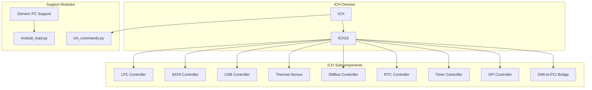
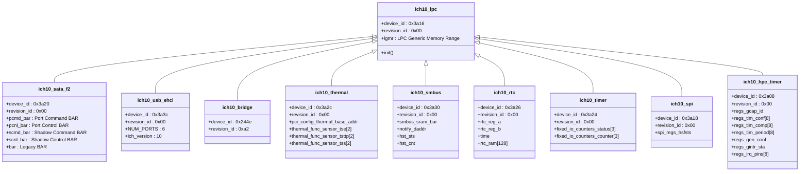
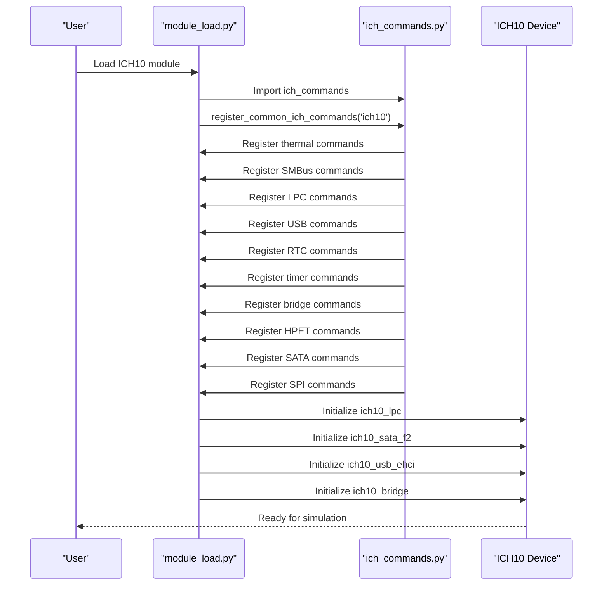
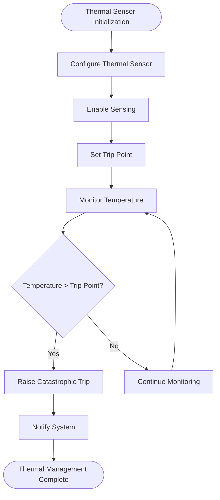
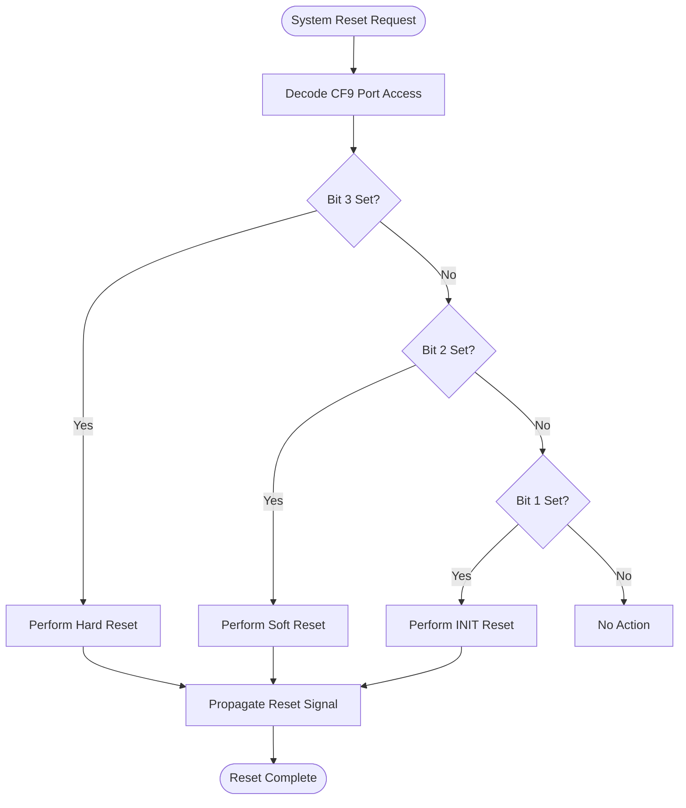
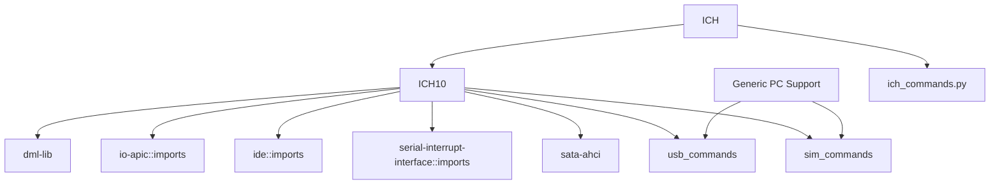

# Quick Start Platform x86 Devices

<cite>
**Referenced Files in This Document**   
- [module_load.py](file://simics-qsp-x86-7.38.0/src/devices/generic-pc-support/module_load.py)
- [ich_commands.py](file://simics-qsp-x86-7.38.0/src/devices/ICH/ich_commands.py)
- [module_load.py](file://simics-qsp-x86-7.38.0/src/devices/ICH10/module_load.py)
- [lpc.dml](file://simics-qsp-x86-7.38.0/src/devices/ICH10/lpc.dml)
- [bridge.dml](file://simics-qsp-x86-7.38.0/src/devices/ICH10/bridge.dml)
- [usb-ehci.dml](file://simics-qsp-x86-7.38.0/src/devices/ICH10/usb-ehci.dml)
- [sata-f2.dml](file://simics-qsp-x86-7.38.0/src/devices/ICH10/sata-f2.dml)
- [CMakeLists.txt](file://simics-qsp-x86-7.38.0/src/devices/ICH/CMakeLists.txt)
- [CMakeLists.txt](file://simics-qsp-x86-7.38.0/src/devices/ICH10/CMakeLists.txt)
</cite>

## Table of Contents
1. [Introduction](#introduction)
2. [Project Structure](#project-structure)
3. [Core Components](#core-components)
4. [Architecture Overview](#architecture-overview)
5. [Detailed Component Analysis](#detailed-component-analysis)
6. [Dependency Analysis](#dependency-analysis)
7. [Performance Considerations](#performance-considerations)
8. [Troubleshooting Guide](#troubleshooting-guide)
9. [Conclusion](#conclusion)

## Introduction
The Quick Start Platform (QSP) x86 Devices provide a ready-to-use simulation environment for x86-based systems, emulating Intel's legacy platform components through a comprehensive set of integrated chipset devices. This documentation focuses on the I/O Controller Hub (ICH) architecture and its role in system integration, power management, and backward compatibility. The ICH devices emulate critical legacy components including LPC, SATA, and USB controllers, enabling accurate simulation of traditional x86 platforms. The generic-pc-support module complements this by providing essential system services and configuration interfaces. Together, these components form a cohesive simulation platform that supports both historical compatibility and modern development requirements.

## Project Structure
The Quick Start Platform x86 Devices are organized in a hierarchical structure that reflects the modular nature of the ICH architecture. The core components are located in the `simics-qsp-x86-7.38.0/src/devices/` directory, with dedicated subdirectories for different chipset families and support modules.



**Diagram sources**
- [CMakeLists.txt](file://simics-qsp-x86-7.38.0/src/devices/ICH/CMakeLists.txt)
- [CMakeLists.txt](file://simics-qsp-x86-7.38.0/src/devices/ICH10/CMakeLists.txt)

**Section sources**
- [CMakeLists.txt](file://simics-qsp-x86-7.38.0/src/devices/ICH/CMakeLists.txt)
- [CMakeLists.txt](file://simics-qsp-x86-7.38.0/src/devices/ICH10/CMakeLists.txt)

## Core Components
The Quick Start Platform x86 Devices consist of two primary components: the ICH (I/O Controller Hub) device family and the generic-pc-support module. The ICH devices emulate Intel's legacy chipset components, providing a comprehensive set of integrated peripherals that enable backward compatibility with traditional x86 systems. The generic-pc-support module provides essential system services and configuration interfaces that complement the ICH functionality.

The ICH architecture is implemented as a collection of specialized controllers, each responsible for a specific aspect of system functionality. These include the LPC (Low Pin Count) controller for legacy I/O, SATA controller for storage, USB controller for peripheral connectivity, thermal sensor for temperature monitoring, SMBus controller for system management, RTC (Real-Time Clock) for timekeeping, timer controller for system timing, SPI (Serial Peripheral Interface) controller for firmware access, and a DMI-to-PCI bridge for system interconnect.

The generic-pc-support module provides command-line interfaces and status reporting for various system components, including minimal ACPI support, CF9 handler, PCI configuration space handler, HPET (High Precision Event Timer), RTC, and PCI upstream dispatcher. These components work together to provide a complete simulation environment that accurately replicates the behavior of physical x86 platforms.

**Section sources**
- [module_load.py](file://simics-qsp-x86-7.38.0/src/devices/generic-pc-support/module_load.py)
- [ich_commands.py](file://simics-qsp-x86-7.38.0/src/devices/ICH/ich_commands.py)

## Architecture Overview
The Quick Start Platform x86 Devices architecture is designed to emulate Intel's legacy platform components while providing a flexible and extensible simulation environment. The architecture is centered around the ICH (I/O Controller Hub), which integrates multiple peripheral controllers into a single chipset component.

```mermaid
graph TD
CPU[x86 CPU]
MCH[Memory Controller Hub]
subgraph ICH[ICH10 Device]
direction TB
LPC_Controller[LPC Controller]
SATA_Controller[SATA Controller]
USB_Controller[USB Controller]
Thermal_Sensor[Thermal Sensor]
SMBus_Controller[SMBus Controller]
RTC_Controller[RTC Controller]
Timer_Controller[Timer Controller]
SPI_Controller[SPI Controller]
Bridge_Controller[DMI-to-PCI Bridge]
LPC_Controller --> |Connects to| SuperIO[Super I/O]
SATA_Controller --> |Connects to| Storage[Storage Devices]
USB_Controller --> |Connects to| Peripherals[USB Devices]
Thermal_Sensor --> |Monitors| System[System Temperature]
SMBus_Controller --> |Communicates with| PMBus[Power Management Bus]
RTC_Controller --> |Provides time to| System[System Clock]
Timer_Controller --> |Generates interrupts| CPU
SPI_Controller --> |Accesses firmware| BIOS[BIOS/UEFI]
Bridge_Controller --> |Connects to| PCI_Express[PCI Express Devices]
end
CPU < --> |FSB| MCH
MCH < --> |DMI| ICH
```

**Diagram sources**
- [lpc.dml](file://simics-qsp-x86-7.38.0/src/devices/ICH10/lpc.dml)
- [sata-f2.dml](file://simics-qsp-x86-7.38.0/src/devices/ICH10/sata-f2.dml)
- [usb-ehci.dml](file://simics-qsp-x86-7.38.0/src/devices/ICH10/usb-ehci.dml)
- [bridge.dml](file://simics-qsp-x86-7.38.0/src/devices/ICH10/bridge.dml)

## Detailed Component Analysis

### ICH Architecture and Component Integration
The ICH (I/O Controller Hub) devices provide a comprehensive emulation of Intel's legacy platform components, integrating multiple peripheral controllers into a single chipset. This integration enables backward compatibility with traditional x86 systems while providing a unified interface for system configuration and management.

#### ICH Device Hierarchy
The ICH architecture is implemented as a hierarchical structure, with the ICH10 device serving as the primary implementation. The ICH10 device contains multiple subcomponents, each responsible for a specific aspect of system functionality. These subcomponents are implemented as separate DML (Device Modeling Language) files that are imported into the main device definition.



**Diagram sources**
- [lpc.dml](file://simics-qsp-x86-7.38.0/src/devices/ICH10/lpc.dml)
- [sata-f2.dml](file://simics-qsp-x86-7.38.0/src/devices/ICH10/sata-f2.dml)
- [usb-ehci.dml](file://simics-qsp-x86-7.38.0/src/devices/ICH10/usb-ehci.dml)
- [bridge.dml](file://simics-qsp-x86-7.38.0/src/devices/ICH10/bridge.dml)

#### ICH Initialization and Configuration
The ICH devices are initialized and configured through the module_load.py scripts, which register command-line interfaces and status reporting functions for each component. The initialization process follows a hierarchical pattern, with the ICH10 module_load.py script importing and registering commands from the shared ich_commands.py file.



**Diagram sources**
- [module_load.py](file://simics-qsp-x86-7.38.0/src/devices/ICH10/module_load.py)
- [ich_commands.py](file://simics-qsp-x86-7.38.0/src/devices/ICH/ich_commands.py)

### Power Management and System Integration
The ICH devices provide comprehensive power management capabilities through the integration of thermal sensors, timers, and system control interfaces. These components work together to emulate the power management features of physical x86 platforms.

#### Thermal Management
The thermal sensor component monitors system temperature and provides trip point detection for catastrophic thermal events. The sensor status is reported through the get_thermal_status function, which indicates whether each sensor is active and whether the temperature has exceeded the trip point.



**Diagram sources**
- [ich_commands.py](file://simics-qsp-x86-7.38.0/src/devices/ICH/ich_commands.py)

#### System Control and Reset
The CF9 handler provides system reset functionality through the standard I/O port 0xcf9. This interface allows for both hard and soft resets, emulating the behavior of physical systems. The reset signal is propagated to the appropriate system components through the reset_signal target.



**Diagram sources**
- [ich_commands.py](file://simics-qsp-x86-7.38.0/src/devices/ICH/ich_commands.py)

## Dependency Analysis
The Quick Start Platform x86 Devices have a well-defined dependency structure that ensures proper initialization and integration of all components. The dependencies are managed through the CMakeLists.txt files and the module_load.py scripts.



**Diagram sources**
- [CMakeLists.txt](file://simics-qsp-x86-7.38.0/src/devices/ICH10/CMakeLists.txt)
- [module_load.py](file://simics-qsp-x86-7.38.0/src/devices/generic-pc-support/module_load.py)

## Performance Considerations
When simulating legacy x86 platforms with multiple integrated peripherals, several performance optimization strategies can be applied:

1. **Component Selection**: Only enable the ICH components that are actually needed for the simulation. Disabling unused components reduces simulation overhead.

2. **Interrupt Coalescing**: Configure timers and other interrupt-generating devices to use appropriate interrupt coalescing settings to reduce interrupt overhead.

3. **DMA Configuration**: Optimize DMA setup for storage and network devices to minimize CPU involvement in data transfers.

4. **ACPI Configuration**: Use simplified ACPI tables when full ACPI functionality is not required, reducing the complexity of power management emulation.

5. **IRQ Routing**: Configure IRQ routing to minimize interrupt conflicts and ensure efficient interrupt handling.

6. **Memory Mapping**: Optimize memory mappings for LPC and other legacy devices to reduce address translation overhead.

7. **Timer Configuration**: Use HPET timers for high-precision timing requirements, but fall back to simpler timers when possible to reduce overhead.

8. **USB Configuration**: Limit the number of active USB ports and devices to only those needed for the simulation scenario.

## Troubleshooting Guide
When configuring and using the Quick Start Platform x86 Devices, several common issues may arise:

1. **IRQ Routing Conflicts**: Ensure that IRQ routing is properly configured to avoid conflicts between devices. Use the get_status commands to verify IRQ assignments.

2. **DMA Setup Issues**: Verify that DMA channels are properly configured for devices that require DMA access. Check that the DMA controller is properly initialized.

3. **ACPI Compatibility Problems**: If experiencing ACPI-related issues, verify that the ACPI tables are properly configured and that the minimal_acpi_support component is correctly initialized.

4. **Timing Issues**: If experiencing timing-related problems, verify that the RTC and timer components are properly configured and that the system clock is synchronized.

5. **Device Initialization Failures**: If devices fail to initialize, check that the cmos-init command has been issued before attempting to configure device settings.

6. **Memory Mapping Conflicts**: Verify that memory mappings for LPC and other legacy devices do not conflict with other system memory regions.

7. **USB Device Recognition**: If USB devices are not being recognized, verify that the USB controller is properly initialized and that the appropriate USB commands are available.

8. **SATA Configuration Issues**: For SATA-related problems, verify that the SATA controller is configured in the correct mode (IDE, AHCI, or RAID) and that the appropriate storage devices are connected.

**Section sources**
- [ich_commands.py](file://simics-qsp-x86-7.38.0/src/devices/ICH/ich_commands.py)
- [module_load.py](file://simics-qsp-x86-7.38.0/src/devices/generic-pc-support/module_load.py)

## Conclusion
The Quick Start Platform x86 Devices provide a comprehensive simulation environment for x86-based systems, with a focus on emulating Intel's legacy platform components through the ICH architecture. The integration of LPC, SATA, USB, and other controllers into a unified chipset enables backward compatibility with traditional x86 systems while providing a flexible and extensible simulation platform. The generic-pc-support module complements this by providing essential system services and configuration interfaces. Through careful configuration and optimization, these components can be used to create accurate and efficient simulations of legacy x86 platforms for development, testing, and analysis purposes.