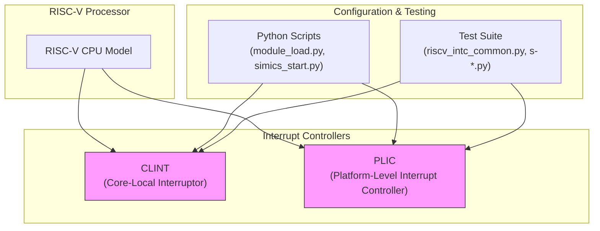
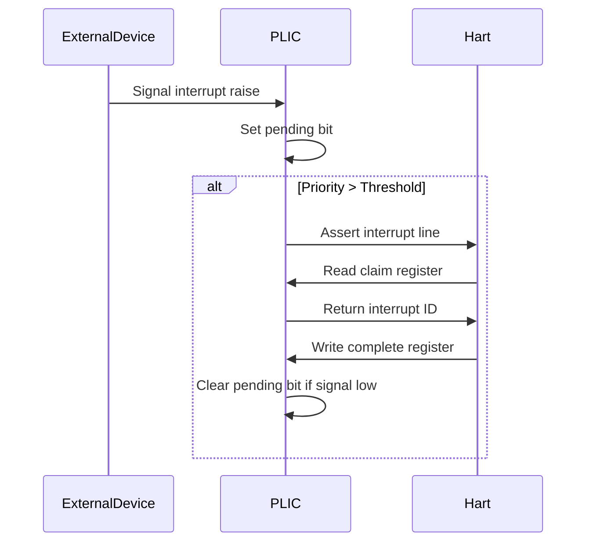
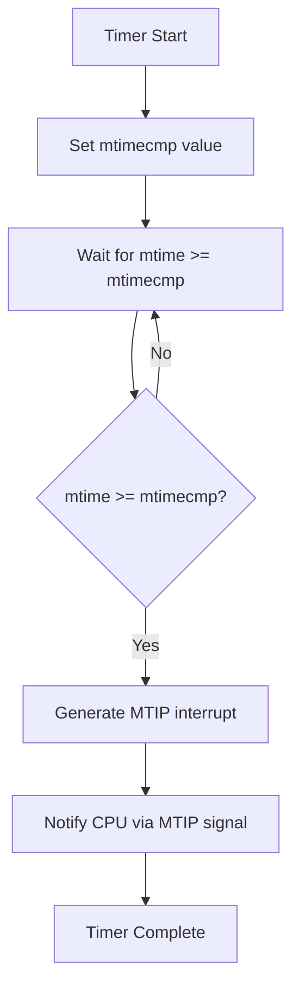

# RISC-V Simple Platform Devices

<cite>
**Referenced Files in This Document**   
- [riscv-interrupt-controllers.c](file://simics-risc-v-simple-7.12.0/src/devices/riscv-interrupt-controllers/riscv-interrupt-controllers.c)
- [module_load.py](file://simics-risc-v-simple-7.12.0/src/devices/riscv-interrupt-controllers/module_load.py)
- [simics_start.py](file://simics-risc-v-simple-7.12.0/src/devices/riscv-interrupt-controllers/simics_start.py)
- [CMakeLists.txt](file://simics-risc-v-simple-7.12.0/src/devices/riscv-interrupt-controllers/CMakeLists.txt)
- [Makefile](file://simics-risc-v-simple-7.12.0/src/devices/riscv-interrupt-controllers/Makefile)
- [riscv_intc_common.py](file://simics-risc-v-simple-7.12.0/src/devices/riscv-interrupt-controllers/test/riscv_intc_common.py)
- [s-clint-interrupt.py](file://simics-risc-v-simple-7.12.0/src/devices/riscv-interrupt-controllers/test/s-clint-interrupt.py)
- [s-plic-interrupt.py](file://simics-risc-v-simple-7.12.0/src/devices/riscv-interrupt-controllers/test/s-plic-interrupt.py)
- [s-clint-register-access.py](file://simics-risc-v-simple-7.12.0/src/devices/riscv-interrupt-controllers/test/s-clint-register-access.py)
- [s-plic-register-access.py](file://simics-risc-v-simple-7.12.0/src/devices/riscv-interrupt-controllers/test/s-plic-register-access.py)
</cite>

## Table of Contents
1. [Introduction](#introduction)
2. [Architecture Overview](#architecture-overview)
3. [CLINT Implementation](#clint-implementation)
4. [PLIC Implementation](#plic-implementation)
5. [Interrupt Routing and Priority Management](#interrupt-routing-and-priority-management)
6. [Timer Functionality](#timer-functionality)
7. [Integration with RISC-V Processor Model](#integration-with-risc-v-processor-model)
8. [Configuration Options](#configuration-options)
9. [Troubleshooting Guide](#troubleshooting-guide)
10. [Educational Value and Simplicity](#educational-value-and-simplicity)

## Introduction

RISC-V Simple Platform Devices provide a minimal yet functional simulation environment for RISC-V based systems. These devices are designed to support the RISC-V privilege architecture by implementing essential interrupt handling mechanisms that enable interrupt-driven programming models. The platform focuses on educational and experimental use cases, offering a clear and accessible implementation of core RISC-V components.

The interrupt controller implementation consists of two primary components: CLINT (Core-Local Interruptor) and PLIC (Platform-Level Interrupt Controller). Together, these components manage timer interrupts, software interrupts, and external interrupts according to the RISC-V specification. The design emphasizes simplicity and clarity, making it ideal for understanding RISC-V interrupt handling mechanisms without the complexity of full-scale production systems.

This documentation explores the architecture, implementation, and usage of these interrupt controllers, providing insights into their role in the RISC-V ecosystem and their value for development and experimentation.

## Architecture Overview

The RISC-V Simple Platform Devices architecture centers around the interrupt controller implementation, which provides essential services for RISC-V processor models. The system is implemented using a combination of C code for core functionality and Python scripts for configuration and testing.

**Diagram sources**
- [riscv-interrupt-controllers.c](file://simics-risc-v-simple-7.12.0/src/devices/riscv-interrupt-controllers/riscv-interrupt-controllers.c)
- [module_load.py](file://simics-risc-v-simple-7.12.0/src/devices/riscv-interrupt-controllers/module_load.py)
- [riscv_intc_common.py](file://simics-risc-v-simple-7.12.0/src/devices/riscv-interrupt-controllers/test/riscv_intc_common.py)

**Section sources**
- [riscv-interrupt-controllers.c](file://simics-risc-v-simple-7.12.0/src/devices/riscv-interrupt-controllers/riscv-interrupt-controllers.c)
- [module_load.py](file://simics-risc-v-simple-7.12.0/src/devices/riscv-interrupt-controllers/module_load.py)

## CLINT Implementation

The CLINT (Core-Local Interruptor) component provides machine-mode timer and software interrupts for each hart (hardware thread) in the system. Implemented in C within the riscv-interrupt-controllers module, the CLINT handles time-critical interrupts that are local to individual processor cores.

The CLINT implementation includes three key registers per hart: msip (machine software interrupt pending), mtimecmp (machine timer compare), and mtime (machine timer). These registers are memory-mapped and accessible to the processor through standard load/store operations. The msip register controls software interrupts, while the mtimecmp and mtime registers work together to generate timer interrupts when the current time exceeds the compare value.

The Python configuration in module_load.py defines the info and status commands for the CLINT, allowing users to query the current frequency and hart configuration. The implementation ensures that timer interrupts are generated with precise timing based on the configured frequency, supporting accurate timekeeping in the simulated environment.

**Section sources**
- [riscv-interrupt-controllers.c](file://simics-risc-v-simple-7.12.0/src/devices/riscv-interrupt-controllers/riscv-interrupt-controllers.c)
- [module_load.py](file://simics-risc-v-simple-7.12.0/src/devices/riscv-interrupt-controllers/module_load.py)
- [s-clint-interrupt.py](file://simics-risc-v-simple-7.12.0/src/devices/riscv-interrupt-controllers/test/s-clint-interrupt.py)

## PLIC Implementation

The PLIC (Platform-Level Interrupt Controller) manages external interrupts in the RISC-V system, providing priority-based interrupt handling for multiple interrupt sources. The PLIC implementation supports up to 1024 interrupt sources and multiple interrupt contexts, allowing for sophisticated interrupt routing and prioritization.

Implemented in C with Python configuration support, the PLIC exposes several memory-mapped register blocks: priority registers (one per interrupt source), pending registers (indicating which interrupts are pending), and context registers (one per hart for interrupt enable, threshold, and claim/complete operations). Each interrupt source can be assigned a priority, and each hart can set an interrupt threshold to filter out lower-priority interrupts.

The PLIC implementation in riscv-interrupt-controllers.c registers the "riscv_plic" class with appropriate aliases, while module_load.py defines the info and status commands that provide visibility into interrupt sources, targets, and current state. The design follows the RISC-V specification for interrupt handling, ensuring compatibility with standard RISC-V software.

**Section sources**
- [riscv-interrupt-controllers.c](file://simics-risc-v-simple-7.12.0/src/devices/riscv-interrupt-controllers/riscv-interrupt-controllers.c)
- [module_load.py](file://simics-risc-v-simple-7.12.0/src/devices/riscv-interrupt-controllers/module_load.py)
- [s-plic-interrupt.py](file://simics-risc-v-simple-7.12.0/src/devices/riscv-interrupt-controllers/test/s-plic-interrupt.py)

## Interrupt Routing and Priority Management

The RISC-V interrupt controllers implement a comprehensive interrupt routing and priority management system that follows the RISC-V privilege architecture specification. Interrupt routing is configured through the PLIC's enable registers, where each hart can enable specific interrupt sources for processing.

Priority management is implemented through a combination of interrupt priority assignment and hart-specific threshold settings. Each interrupt source can be assigned a priority value, with higher values indicating higher priority. Each hart maintains an interrupt threshold that filters out interrupts with priority below the threshold value. When an interrupt source becomes active and its priority exceeds the hart's threshold, the PLIC signals the interrupt to the hart.

The implementation includes sophisticated handling of interrupt claiming and completion. When a hart reads from its claim/complete register, it receives the ID of the highest-priority pending interrupt, which becomes active. Writing the interrupt ID back to the same register completes the interrupt, allowing it to be reasserted if still active. This mechanism prevents interrupt loss during processing and supports nested interrupt handling.

**Diagram sources**
- [riscv-interrupt-controllers.c](file://simics-risc-v-simple-7.12.0/src/devices/riscv-interrupt-controllers/riscv-interrupt-controllers.c)
- [s-plic-interrupt.py](file://simics-risc-v-simple-7.12.0/src/devices/riscv-interrupt-controllers/test/s-plic-interrupt.py)

**Section sources**
- [riscv-interrupt-controllers.c](file://simics-risc-v-simple-7.12.0/src/devices/riscv-interrupt-controllers/riscv-interrupt-controllers.c)
- [s-plic-interrupt.py](file://simics-risc-v-simple-7.12.0/src/devices/riscv-interrupt-controllers/test/s-plic-interrupt.py)
- [s-plic-register-access.py](file://simics-risc-v-simple-7.12.0/src/devices/riscv-interrupt-controllers/test/s-plic-register-access.py)

## Timer Functionality

The timer functionality in the RISC-V Simple Platform is implemented through the CLINT's mtime and mtimecmp registers, providing precise timekeeping and timer interrupt generation. The mtime register represents the current time in timer ticks, while mtimecmp contains the compare value that triggers timer interrupts.

When the value in mtime exceeds or equals the value in mtimecmp, the CLINT generates a timer interrupt for the corresponding hart. This mechanism enables operating systems and applications to implement time-based scheduling, timeouts, and periodic operations. The timer frequency is configurable, allowing users to adjust the timing characteristics of the simulated system.

The implementation includes support for measuring and configuring timer accuracy, with the ability to specify the number of cycles per timer tick. This allows for precise simulation of real-world timing behavior and supports performance analysis of time-sensitive code. The test suite includes comprehensive verification of timer functionality, ensuring accurate interrupt generation and proper handling of edge cases.

**Diagram sources**
- [riscv-interrupt-controllers.c](file://simics-risc-v-simple-7.12.0/src/devices/riscv-interrupt-controllers/riscv-interrupt-controllers.c)
- [s-clint-interrupt.py](file://simics-risc-v-simple-7.12.0/src/devices/riscv-interrupt-controllers/test/s-clint-interrupt.py)

**Section sources**
- [riscv-interrupt-controllers.c](file://simics-risc-v-simple-7.12.0/src/devices/riscv-interrupt-controllers/riscv-interrupt-controllers.c)
- [s-clint-interrupt.py](file://simics-risc-v-simple-7.12.0/src/devices/riscv-interrupt-controllers/test/s-clint-interrupt.py)
- [s-clint-register-access.py](file://simics-risc-v-simple-7.12.0/src/devices/riscv-interrupt-controllers/test/s-clint-register-access.py)

## Integration with RISC-V Processor Model

The integration between the interrupt controllers and the RISC-V processor model is implemented through well-defined interfaces that follow the RISC-V specification. The CLINT and PLIC connect to the processor harts through dedicated signal interfaces that assert interrupt lines when interrupts are pending and unmasked.

The C implementation in riscv-interrupt-controllers.c registers the necessary class aliases and initializes the device interfaces, while the Python configuration in module_load.py defines the command interface for monitoring and controlling the interrupt controllers. The integration supports multiple harts, with each hart having its own set of CLINT registers and PLIC context.

The processor model interacts with the interrupt controllers through memory-mapped I/O, reading and writing to the various control registers. The implementation ensures proper synchronization between the processor and interrupt controller, maintaining correct interrupt state even during complex scenarios involving multiple simultaneous interrupts and rapid state changes.

**Section sources**
- [riscv-interrupt-controllers.c](file://simics-risc-v-simple-7.12.0/src/devices/riscv-interrupt-controllers/riscv-interrupt-controllers.c)
- [module_load.py](file://simics-risc-v-simple-7.12.0/src/devices/riscv-interrupt-controllers/module_load.py)
- [riscv_intc_common.py](file://simics-risc-v-simple-7.12.0/src/devices/riscv-interrupt-controllers/test/riscv_intc_common.py)

## Configuration Options

The RISC-V interrupt controllers provide several configuration options that allow users to customize the behavior of the simulation environment. These options include interrupt thresholds, timer frequencies, and power management settings that can be adjusted to match specific use cases or experimental requirements.

Interrupt thresholds can be configured per hart through the PLIC's threshold registers, allowing fine-grained control over which interrupts are delivered. Timer frequencies are configurable through the CLINT's freq_mhz attribute, enabling users to simulate systems with different clock rates. The maximum number of interrupts and priority levels can also be configured, supporting both minimal educational setups and more complex experimental configurations.

Power management options include the ability to stall register accesses for a configurable number of cycles, which can be used to simulate the power characteristics of real hardware. The implementation also supports configurable interrupt masking and filtering, allowing users to create specialized interrupt handling scenarios for testing and experimentation.

**Section sources**
- [riscv-interrupt-controllers.c](file://simics-risc-v-simple-7.12.0/src/devices/riscv-interrupt-controllers/riscv-interrupt-controllers.c)
- [module_load.py](file://simics-risc-v-simple-7.12.0/src/devices/riscv-interrupt-controllers/module_load.py)
- [s-clint-register-access.py](file://simics-risc-v-simple-7.12.0/src/devices/riscv-interrupt-controllers/test/s-clint-register-access.py)
- [s-plic-register-access.py](file://simics-risc-v-simple-7.12.0/src/devices/riscv-interrupt-controllers/test/s-plic-register-access.py)

## Troubleshooting Guide

Common issues with the RISC-V interrupt controllers typically involve interrupt masking problems, timer accuracy discrepancies, and interrupt latency measurement challenges. For interrupt masking problems, verify that the appropriate enable bits are set in the PLIC's enable registers and that the interrupt threshold is properly configured to allow the desired interrupts through.

Timer accuracy issues can often be resolved by verifying the freq_mhz setting and ensuring that the simulation timebase is correctly configured. When measuring interrupt latency, account for the simulation overhead and use the built-in stalling configuration to model real-world timing characteristics more accurately.

For debugging interrupt issues, use the info and status commands defined in module_load.py to inspect the current state of the interrupt controllers. These commands provide visibility into pending interrupts, active interrupts, and interrupt source/target mappings. The comprehensive test suite can also be used to verify correct functionality and isolate configuration issues.

**Section sources**
- [module_load.py](file://simics-risc-v-simple-7.12.0/src/devices/riscv-interrupt-controllers/module_load.py)
- [s-clint-interrupt.py](file://simics-risc-v-simple-7.12.0/src/devices/riscv-interrupt-controllers/test/s-clint-interrupt.py)
- [s-plic-interrupt.py](file://simics-risc-v-simple-7.12.0/src/devices/riscv-interrupt-controllers/test/s-plic-interrupt.py)

## Educational Value and Simplicity

The RISC-V Simple Platform Devices offer significant educational value by providing a clear and accessible implementation of RISC-V interrupt handling mechanisms. The simplicity of the design makes it ideal for learning and experimentation, allowing students and developers to understand the fundamentals of interrupt processing without being overwhelmed by complexity.

The modular implementation, combining C for performance-critical code and Python for configuration and testing, demonstrates best practices in simulation development. The comprehensive test suite provides practical examples of interrupt controller usage and verification, serving as a valuable resource for learning proper testing methodologies.

The platform's focus on the RISC-V privilege architecture enables users to explore interrupt-driven programming models in a controlled environment. This makes it particularly valuable for teaching operating system concepts, device driver development, and real-time programming techniques on the RISC-V architecture.

**Section sources**
- [riscv-interrupt-controllers.c](file://simics-risc-v-simple-7.12.0/src/devices/riscv-interrupt-controllers/riscv-interrupt-controllers.c)
- [module_load.py](file://simics-risc-v-simple-7.12.0/src/devices/riscv-interrupt-controllers/module_load.py)
- [riscv_intc_common.py](file://simics-risc-v-simple-7.12.0/src/devices/riscv-interrupt-controllers/test/riscv_intc_common.py)