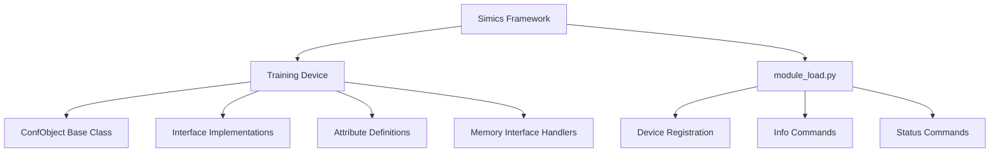
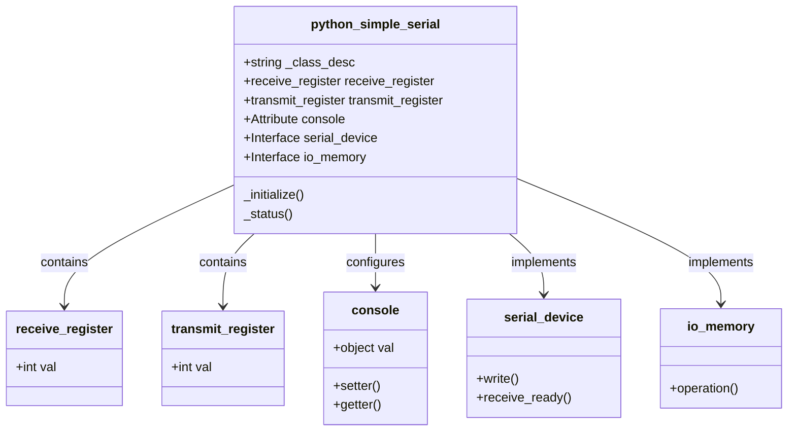
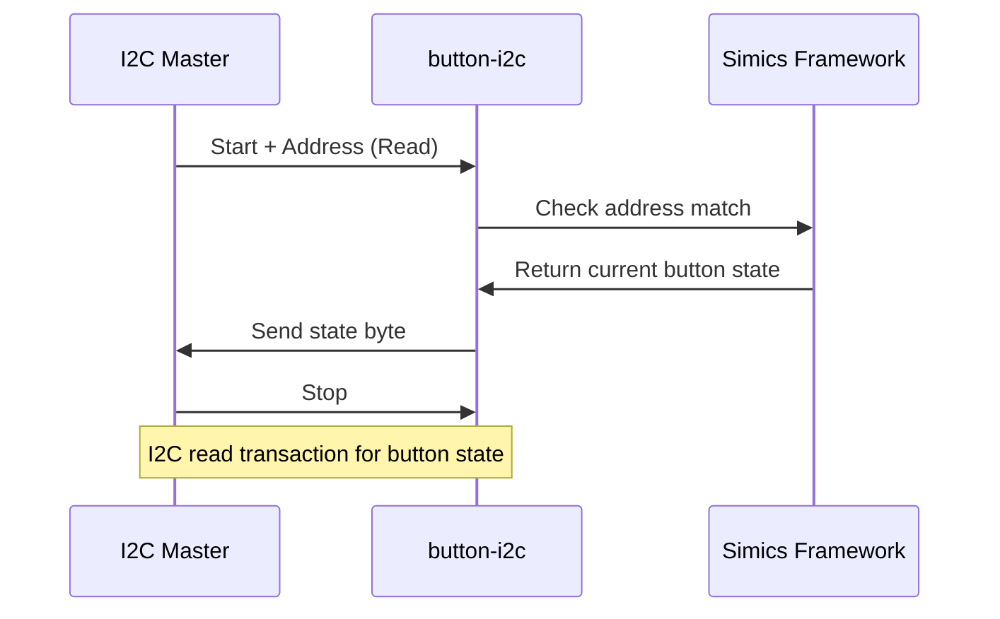
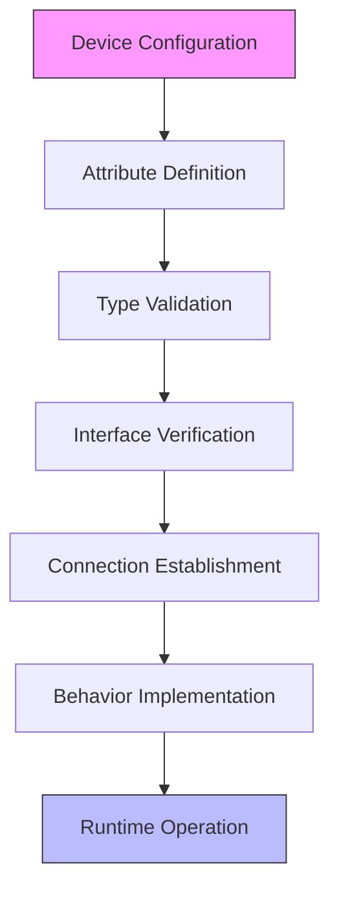

# Training Devices

<cite>
**Referenced Files in This Document**   
- [python_simple_serial.py](file://simics-training-7.0.0-pre.11/src/devices/python-simple-serial/python_simple_serial.py)
- [module_load.py](file://simics-training-7.0.0-pre.11/src/devices/python-simple-serial/module_load.py)
- [button-i2c/module_load.py](file://simics-training-7.0.0-pre.11/src/devices/button-i2c/module_load.py)
- [led-system-controller-bb/module_load.py](file://simics-training-7.0.0-pre.11/src/devices/led-system-controller-bb/module_load.py)
- [p_control.py](file://simics-training-7.0.0-pre.11/src/devices/p-control/p_control.py)
- [toggle-i2c/module_load.py](file://simics-training-7.0.0-pre.11/src/devices/toggle-i2c/module_load.py)
- [rgb-led-i2c/module_load.py](file://simics-training-7.0.0-pre.11/src/devices/rgb-led-i2c/module_load.py)
</cite>

## Table of Contents
1. [Introduction](#introduction)
2. [Training Device Architecture](#training-device-architecture)
3. [Core Training Devices](#core-training-devices)
4. [Python Simple Serial Device](#python-simple-serial-device)
5. [I2C-Based Training Devices](#i2c-based-training-devices)
6. [Device Configuration and Behavior](#device-configuration-and-behavior)
7. [Learning Through Modification](#learning-through-modification)
8. [Onboarding New Developers](#onboarding-new-developers)
9. [Conclusion](#conclusion)

## Introduction

Training devices in the Simics framework serve as pedagogical tools designed to teach fundamental concepts of device modeling through simple, understandable examples. These devices prioritize clarity and educational value over performance or completeness, making them ideal for onboarding new developers and teaching core simulation principles. The training devices cover essential hardware simulation concepts including I2C communication, GPIO control, serial interface modeling, and memory-mapped I/O operations. Each device is implemented with minimal code to clearly illustrate specific principles of device simulation, providing a foundation for understanding more complex device models.

## Training Device Architecture

The architecture of Simics training devices follows a consistent pattern focused on educational clarity. These devices are organized in the simics-training package and implemented using Python, DML (Device Modeling Language), or C, with Python-based examples being particularly valuable for learning due to their readability and accessibility. The core architectural components include device classes that inherit from ConfObject, interface implementations that define device behavior, attribute definitions that expose configuration parameters, and memory interface handlers that manage register access.

Training devices typically follow a modular structure with separate module_load.py files that register the device and define custom info and status commands. This separation allows learners to understand the distinction between device implementation and system integration. The devices use Simics' component model to connect with other system elements through well-defined interfaces, demonstrating proper encapsulation and interface-based design principles.

**Diagram sources**
- [python_simple_serial.py](file://simics-training-7.0.0-pre.11/src/devices/python-simple-serial/python_simple_serial.py#L25-L185)
- [module_load.py](file://simics-training-7.0.0-pre.11/src/devices/python-simple-serial/module_load.py#L13-L15)

**Section sources**
- [python_simple_serial.py](file://simics-training-7.0.0-pre.11/src/devices/python-simple-serial/python_simple_serial.py#L1-L185)
- [module_load.py](file://simics-training-7.0.0-pre.11/src/devices/python-simple-serial/module_load.py#L1-L15)

## Core Training Devices

The Simics training package includes several key devices that demonstrate fundamental hardware simulation concepts. The button-i2c device illustrates I2C communication protocols and interrupt generation, showing how simple input devices can be modeled on an I2C bus. The led-system-controller-bb device demonstrates more complex I2C interactions with multiple registers and state management, serving as a bridge between simple and complex device models. The python-simple-serial device provides a clear example of serial interface modeling with memory-mapped registers and interface-based communication.

Other important training devices include toggle-i2c, which demonstrates stateful I2C devices with persistent state across transactions, and rgb-led-i2c, which shows how to model devices with multiple output channels and custom command implementations. These devices collectively cover a broad spectrum of device modeling concepts, from simple register-based interfaces to more complex state machines and protocol implementations. Each device is designed with educational goals in mind, featuring clear code structure, comprehensive comments, and focused functionality that isolates specific learning objectives.

**Section sources**
- [button-i2c/module_load.py](file://simics-training-7.0.0-pre.11/src/devices/button-i2c/module_load.py#L1-L35)
- [led-system-controller-bb/module_load.py](file://simics-training-7.0.0-pre.11/src/devices/led-system-controller-bb/module_load.py#L1-L75)
- [toggle-i2c/module_load.py](file://simics-training-7.0.0-pre.11/src/devices/toggle-i2c/module_load.py#L1-L33)
- [rgb-led-i2c/module_load.py](file://simics-training-7.0.0-pre.11/src/devices/rgb-led-i2c/module_load.py#L1-L69)

## Python Simple Serial Device

The python-simple-serial device is a foundational example that demonstrates key concepts in device modeling through a minimal implementation. This device implements a trivial serial interface with two registers: a receive register that stores the last character received and a transmit register that immediately sends characters to a connected console. The device illustrates several important simulation concepts, including memory-mapped I/O, interface-based communication, and proper error handling for invalid memory accesses.

The implementation shows how to define device attributes using pyobj.Attribute, implement interfaces like serial_device for inter-device communication, and handle memory operations through the io_memory interface. The code demonstrates proper inquiry handling, where simulation queries are processed without triggering side effects, and shows how to use Simics logging functions for debugging and monitoring device behavior. This device serves as an excellent starting point for understanding the relationship between hardware registers and software-visible device behavior.

**Diagram sources**
- [python_simple_serial.py](file://simics-training-7.0.0-pre.11/src/devices/python-simple-serial/python_simple_serial.py#L25-L185)

**Section sources**
- [python_simple_serial.py](file://simics-training-7.0.0-pre.11/src/devices/python-simple-serial/python_simple_serial.py#L1-L185)

## I2C-Based Training Devices

I2C-based training devices provide practical examples of implementing communication protocols in hardware simulation. The button-i2c device demonstrates how a simple input device can be modeled on an I2C bus, with the device responding to read operations by returning its current state (pressed or not pressed). This device illustrates the basic pattern of I2C slave implementation, including address matching, transaction state management, and data register handling.

The led-system-controller-bb device expands on these concepts by implementing a more complex I2C device with multiple configuration registers and status indicators. This device shows how to manage device state across multiple I2C transactions, handle different register addresses within the same device, and integrate with other system components through additional interfaces. The rgb-led-i2c device further extends these concepts by demonstrating how to implement custom Simics commands that interact with the simulated hardware, allowing users to directly control the device from the simulation console.

**Diagram sources**
- [button-i2c/module_load.py](file://simics-training-7.0.0-pre.11/src/devices/button-i2c/module_load.py#L20-L34)
- [led-system-controller-bb/module_load.py](file://simics-training-7.0.0-pre.11/src/devices/led-system-controller-bb/module_load.py#L31-L67)

**Section sources**
- [button-i2c/module_load.py](file://simics-training-7.0.0-pre.11/src/devices/button-i2c/module_load.py#L1-L35)
- [led-system-controller-bb/module_load.py](file://simics-training-7.0.0-pre.11/src/devices/led-system-controller-bb/module_load.py#L1-L75)
- [rgb-led-i2c/module_load.py](file://simics-training-7.0.0-pre.11/src/devices/rgb-led-i2c/module_load.py#L41-L68)

## Device Configuration and Behavior

The relationship between Python configuration and device behavior is clearly demonstrated in the training devices through the use of attributes and interfaces. In the python-simple-serial device, the console attribute establishes a connection to a serial output interface, showing how device interconnections are configured in Simics. The attribute's setter method validates that the target object implements the required interface, enforcing proper system composition at configuration time.

The p_control device provides another example of configuration-driven behavior, where the controls attribute accepts a list of objects that must implement the p_control_button interface. This pattern demonstrates how Simics enforces interface contracts during system setup, preventing configuration errors before simulation begins. The device uses cached interface references to optimize runtime performance while maintaining the flexibility of interface-based design.

**Diagram sources**
- [python_simple_serial.py](file://simics-training-7.0.0-pre.11/src/devices/python-simple-serial/python_simple_serial.py#L62-L89)
- [p_control.py](file://simics-training-7.0.0-pre.11/src/devices/p-control/p_control.py#L121-L150)

**Section sources**
- [python_simple_serial.py](file://simics-training-7.0.0-pre.11/src/devices/python-simple-serial/python_simple_serial.py#L1-L185)
- [p_control.py](file://simics-training-7.0.0-pre.11/src/devices/p-control/p_control.py#L1-L234)

## Learning Through Modification

Training devices serve as excellent templates for experimentation and learning through modification. Developers can extend these devices to explore different behaviors and deepen their understanding of device modeling concepts. For example, the python-simple-serial device can be modified to implement proper FIFO buffering instead of single-character registers, introducing concepts of data structures and state management in device models.

The button-i2c device can be extended to generate interrupts when pressed, demonstrating how to integrate with Simics' interrupt system. The led-system-controller-bb device could be enhanced to support PWM (Pulse Width Modulation) control, introducing timing concepts and periodic events in simulation. These modifications allow learners to progressively build their skills, starting from simple register operations to more complex timing and event-driven behaviors.

Common learning challenges include understanding the distinction between inquiry and regular memory operations, managing device state across simulation checkpoints, and properly handling interface connections. The training devices address these challenges by providing clear examples of best practices, such as using _up references to access parent objects, implementing proper initialization and finalization methods, and using Simics logging functions for debugging.

**Section sources**
- [python_simple_serial.py](file://simics-training-7.0.0-pre.11/src/devices/python-simple-serial/python_simple_serial.py#L32-L39)
- [button-i2c/module_load.py](file://simics-training-7.0.0-pre.11/src/devices/button-i2c/module_load.py#L20-L34)
- [led-system-controller-bb/module_load.py](file://simics-training-7.0.0-pre.11/src/devices/led-system-controller-bb/module_load.py#L31-L67)

## Onboarding New Developers

Training devices play a crucial role in onboarding new developers to the Simics framework by providing accessible entry points to hardware simulation concepts. These devices lower the barrier to entry by using familiar programming languages like Python and focusing on clear, readable code rather than optimized performance. The step-by-step progression from simple devices like python-simple-serial to more complex examples like led-system-controller-bb allows developers to build their understanding incrementally.

The devices demonstrate important software engineering practices in the context of hardware simulation, including proper error handling, interface-based design, and configuration validation. By studying and modifying these training devices, new developers gain practical experience with the Simics API, component model, and simulation lifecycle. The presence of comprehensive comments and focused functionality helps learners isolate and understand specific concepts without being overwhelmed by implementation details.

**Section sources**
- [python_simple_serial.py](file://simics-training-7.0.0-pre.11/src/devices/python-simple-serial/python_simple_serial.py#L1-L185)
- [module_load.py](file://simics-training-7.0.0-pre.11/src/devices/python-simple-serial/module_load.py#L1-L15)
- [p_control.py](file://simics-training-7.0.0-pre.11/src/devices/p-control/p_control.py#L1-L234)

## Conclusion

The training devices in the Simics framework provide an invaluable resource for learning device modeling concepts through practical, hands-on examples. By focusing on clarity over performance or completeness, these devices effectively teach fundamental principles of hardware simulation, including I2C communication, GPIO control, serial interface modeling, and memory-mapped I/O operations. The python-simple-serial, button-i2c, and led-system-controller-bb devices serve as excellent starting points for understanding how to create and configure device models in Simics.

These training devices not only demonstrate technical concepts but also serve as templates for creating new device models, showing best practices in code organization, interface design, and error handling. Through experimentation and modification of these devices, developers can progressively build their skills and confidence in hardware simulation. The comprehensive nature of the training device collection makes them an essential tool for onboarding new developers and ensuring a deep understanding of the Simics framework and device modeling principles.