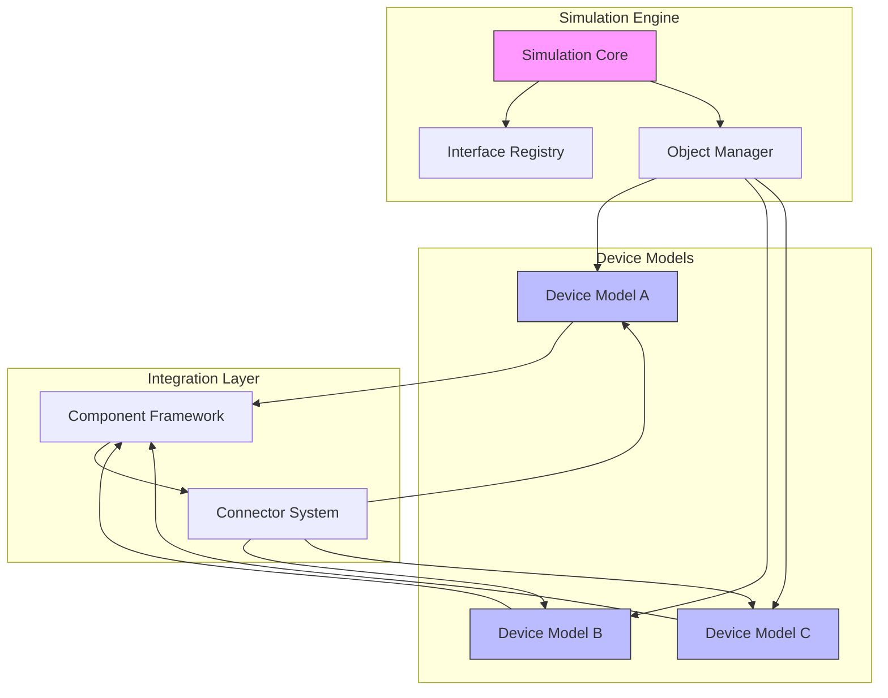
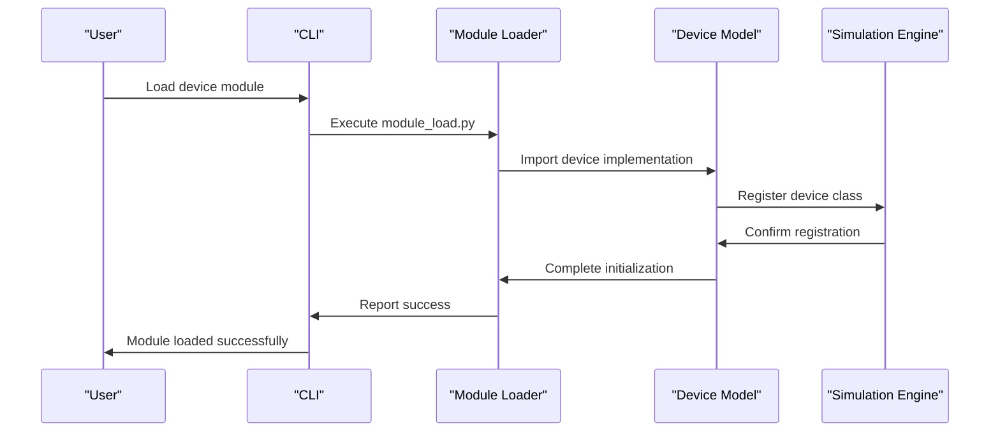
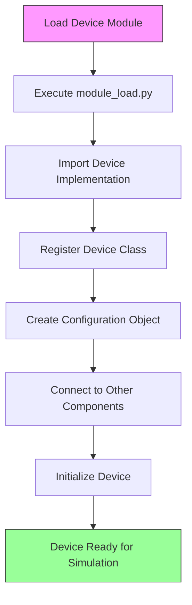

# Integration with Simics

<cite>
**Referenced Files in This Document**   
- [module_load.py](file://simics-7.57.0/src/devices/sample-device-python/module_load.py)
- [sample_device_python.py](file://simics-7.57.0/src/devices/sample-device-python/sample_device_python.py)
- [module_load.py](file://simics-7.57.0/src/devices/sample-device-dml/module_load.py)
- [module_load.py](file://simics-7.57.0/src/devices/sample-device-c/module_load.py)
- [empty_device_python.py](file://simics-7.57.0/src/devices/empty-device-python/empty_device_python.py)
- [empty_device_confclass.py](file://simics-7.57.0/src/devices/empty-device-confclass/empty_device_confclass.py)
- [sample_device_python_confclass.py](file://simics-7.57.0/src/devices/sample-device-python-confclass/sample_device_python_confclass.py)
- [pci_proxy.py](file://simics-7.57.0/src/devices/pci-proxy/pci_proxy.py)
- [eth-links/module_load.py](file://simics-7.57.0/src/devices/eth-links/module_load.py)
- [cdrom-image/simics_start.py](file://simics-7.57.0/src/devices/cdrom-image/simics_start.py)
- [pcie-downstream-port/simics_start.py](file://simics-7.57.0/src/devices/pcie-downstream-port/simics_start.py)
- [AT24Cxx/simics_start.py](file://simics-7.57.0/src/devices/AT24Cxx/simics_start.py)
</cite>

## Table of Contents
1. [Introduction](#introduction)
2. [Integration Architecture](#integration-architecture)
3. [Device Model Integration Patterns](#device-model-integration-patterns)
4. [Configuration and Runtime Environment](#configuration-and-runtime-environment)
5. [APIs and Integration Mechanisms](#apis-and-integration-mechanisms)
6. [Practical Examples of Device Integration](#practical-examples-of-device-integration)
7. [Common Integration Script Patterns](#common-integration-script-patterns)
8. [Component Interaction Diagrams](#component-interaction-diagrams)

## Introduction

Simics is a full-system simulation platform that enables the integration of device models to create comprehensive virtual prototypes of hardware systems. The integration process connects device models to the simulation engine through standardized interfaces and protocols, allowing for seamless interaction between simulated components. This document provides a comprehensive overview of the Simics integration architecture, focusing on how device models are connected to the simulation environment.

The integration framework supports multiple implementation approaches, including C, Python, and DML (Device Modeling Language), providing flexibility for developers to choose the most appropriate method for their use case. The architecture is designed to be extensible, allowing for the creation of custom device models that can interact with the simulation engine and other components in a consistent and predictable manner.

This documentation serves both beginners who are new to Simics integration and experienced developers who need detailed technical information about the integration APIs and mechanisms. It covers conceptual overviews of the integration process, as well as practical examples demonstrating how device models are loaded and initialized within the Simics environment.

**Section sources**
- [module_load.py](file://simics-7.57.0/src/devices/sample-device-python/module_load.py#L1-L15)
- [module_load.py](file://simics-7.57.0/src/devices/sample-device-dml/module_load.py#L1-L24)

## Integration Architecture

The Simics integration architecture is built around a modular design that enables device models to connect to the simulation engine through well-defined interfaces. At the core of this architecture is the concept of components and objects, where device models are implemented as configuration objects that expose specific interfaces to interact with the simulation environment.

The architecture follows a layered approach, with the simulation engine providing the foundational services and device models implementing specific functionality through standardized interfaces. This design allows for loose coupling between components, enabling independent development and testing of device models while ensuring compatibility with the overall system.

Key architectural elements include:
- Configuration objects that represent device instances in the simulation
- Interfaces that define the contract between device models and the simulation engine
- Connectors that enable communication between components
- The component framework that manages the lifecycle of device models

The integration architecture supports both static and dynamic loading of device models, allowing for flexible configuration of simulation scenarios. Device models can be loaded at startup or added dynamically during simulation, providing flexibility for different use cases.



**Diagram sources**
- [module_load.py](file://simics-7.57.0/src/devices/sample-device-python/module_load.py#L1-L15)
- [eth-links/module_load.py](file://simics-7.57.0/src/devices/eth-links/module_load.py#L1-L800)

## Device Model Integration Patterns

Simics supports multiple patterns for integrating device models, each with its own advantages and use cases. The primary integration patterns include Python-based models using pyobj, C-based models, and DML-based models. These patterns provide different levels of abstraction and performance characteristics, allowing developers to choose the most appropriate approach for their specific requirements.

The Python/pyobj pattern is the most modern and recommended approach for new device models. It provides a high-level, object-oriented interface that simplifies development and reduces boilerplate code. This pattern uses the pyobj framework to define configuration objects and their interfaces, making it easier to create and manage device models.

The C-based pattern provides the highest performance and is typically used for performance-critical device models. It offers direct access to the simulation engine's APIs and allows for fine-grained control over device behavior. This pattern is often used for complex device models that require low-level access to system resources.

The DML-based pattern provides a domain-specific language for describing device behavior, combining aspects of both hardware description languages and programming languages. It is particularly well-suited for modeling complex hardware devices with intricate register interfaces and state machines.

Each integration pattern follows a consistent structure, with a module_load.py file that serves as the entry point for loading the device model into the simulation environment. This file is responsible for registering the device class and its interfaces with the simulation engine.

**Section sources**
- [module_load.py](file://simics-7.57.0/src/devices/sample-device-python/module_load.py#L1-L15)
- [module_load.py](file://simics-7.57.0/src/devices/sample-device-c/module_load.py#L1-L48)
- [module_load.py](file://simics-7.57.0/src/devices/sample-device-dml/module_load.py#L1-L24)

## Configuration and Runtime Environment

The relationship between device configuration scripts and the Simics runtime environment is a critical aspect of the integration process. Device configuration scripts define the structure and behavior of device models, while the runtime environment provides the execution context in which these models operate.

Configuration scripts are typically written in Python and use the Simics API to define device classes, attributes, and interfaces. These scripts are executed during the initialization phase of the simulation, creating configuration objects that represent device instances. The configuration process involves setting up the device's attributes, connecting it to other components, and registering its interfaces with the simulation engine.

The runtime environment provides a rich set of services that device models can use to interact with the simulation. These services include memory access, interrupt handling, timer management, and inter-component communication. Device models implement specific interfaces to access these services, allowing them to participate in the simulation as first-class components.

One key aspect of the configuration and runtime environment is the separation between static configuration and dynamic behavior. Static configuration defines the structure of the device model, including its attributes and interfaces, while dynamic behavior is implemented through interface methods that respond to events and requests from the simulation engine.

The simics_start.py files in various device directories demonstrate how configuration updates and compatibility fixes are applied to device models. These files are executed during the simulation startup process and can modify existing device configurations to ensure compatibility with newer versions of the simulation engine.

**Section sources**
- [cdrom-image/simics_start.py](file://simics-7.57.0/src/devices/cdrom-image/simics_start.py#L1-L102)
- [pcie-downstream-port/simics_start.py](file://simics-7.57.0/src/devices/pcie-downstream-port/simics_start.py#L1-L36)
- [AT24Cxx/simics_start.py](file://simics-7.57.0/src/devices/AT24Cxx/simics_start.py#L1-L23)

## APIs and Integration Mechanisms

The Simics integration framework provides a comprehensive set of APIs and mechanisms that enable device models to connect to the simulation engine. These APIs are organized around the concept of interfaces, which define the contract between device models and the simulation environment.

The primary integration mechanism is the interface system, which allows device models to expose specific capabilities to the simulation engine and other components. Each interface defines a set of methods that implement specific functionality, such as memory access, interrupt handling, or device-specific operations. Device models implement these interfaces by providing concrete implementations of the interface methods.

Key integration APIs include:

- **Configuration API**: Used to define device classes, attributes, and relationships
- **Interface API**: Used to register and implement interfaces for device models
- **Object API**: Used to create and manage configuration objects
- **Connector API**: Used to establish connections between components
- **CLI API**: Used to define commands and provide user interaction

The pyobj framework provides a high-level abstraction for implementing device models in Python. It uses Python classes and decorators to define configuration objects and their interfaces, reducing the amount of boilerplate code required. The pyobj.ConfObject class serves as the base class for device models, providing common functionality and lifecycle management.

For more advanced use cases, the confclass system provides an alternative approach to defining device models. This system uses a declarative syntax to define device classes, attributes, and interfaces, making it easier to create complex device models with minimal code.

The integration APIs also support dynamic loading and unloading of device models, allowing for flexible configuration of simulation scenarios. This capability is particularly useful for testing and debugging, as it enables developers to modify the simulation configuration without restarting the entire simulation.

**Section sources**
- [empty_device_python.py](file://simics-7.57.0/src/devices/empty-device-python/empty_device_python.py#L1-L85)
- [empty_device_confclass.py](file://simics-7.57.0/src/devices/empty-device-confclass/empty_device_confclass.py#L1-L63)
- [sample_device_python_confclass.py](file://simics-7.57.0/src/devices/sample-device-python-confclass/sample_device_python_confclass.py#L1-L77)

## Practical Examples of Device Integration

To illustrate the integration process, let's examine several practical examples of device models being loaded and initialized within Simics. These examples demonstrate the different integration patterns and highlight the key steps involved in connecting device models to the simulation engine.

The first example is a simple Python-based device model implemented using the pyobj framework. The device is defined as a Python class that inherits from pyobj.ConfObject and implements the io_memory interface. The module_load.py file registers the device class with the simulation engine, making it available for use in simulations.



**Diagram sources**
- [module_load.py](file://simics-7.57.0/src/devices/sample-device-python/module_load.py#L1-L15)
- [sample_device_python.py](file://simics-7.57.0/src/devices/sample-device-python/sample_device_python.py#L1-L80)

The second example demonstrates a more complex device model that uses the confclass system. This approach provides a declarative way to define device classes, attributes, and interfaces, making it easier to create complex device models with minimal code. The confclass system automatically generates the necessary boilerplate code, reducing the potential for errors.

The third example shows a PCI proxy device implemented in Python. This device acts as an intermediary between a PCI bus and a PCI device, forwarding interface calls in both directions. The implementation demonstrates how to use the pyobj framework to create a device that implements multiple interfaces and manages connections between components.

These examples illustrate the flexibility of the Simics integration framework, showing how different approaches can be used to achieve the same goal. They also highlight the importance of following established patterns and best practices when implementing device models.

**Section sources**
- [sample_device_python.py](file://simics-7.57.0/src/devices/sample-device-python/sample_device_python.py#L1-L80)
- [pci_proxy.py](file://simics-7.57.0/src/devices/pci-proxy/pci_proxy.py#L1-L137)
- [sample_device_python_confclass.py](file://simics-7.57.0/src/devices/sample-device-python-confclass/sample_device_python_confclass.py#L1-L77)

## Common Integration Script Patterns

Analysis of the integration scripts across different device types reveals several common patterns that are consistently used throughout the Simics codebase. These patterns provide a standardized approach to device integration, making it easier to understand and maintain device models.

One of the most common patterns is the use of module_load.py files as the entry point for device modules. These files follow a consistent structure, typically importing the device implementation and registering the device class with the simulation engine. This pattern ensures that device modules can be loaded and initialized in a predictable manner.

Another common pattern is the separation of device implementation from interface registration. Device functionality is implemented in separate Python files, while the module_load.py file is responsible for registering the device class and its interfaces. This separation of concerns makes it easier to test and maintain device models.

The use of standardized interface names and method signatures is another important pattern. Common interfaces such as io_memory, pci_bus, and pci_device have well-defined method signatures that are consistently implemented across different device models. This consistency enables components to interact with each other in a predictable manner, regardless of their specific implementation.

Error handling is another area where common patterns emerge. Device models typically use the SIM_log_error, SIM_log_info, and SIM_log_spec_violation functions to report errors and warnings, providing consistent logging across different components. This pattern makes it easier to diagnose issues and understand the behavior of device models.

Finally, the use of configuration attributes to control device behavior is a common pattern. Device models expose attributes that can be set during configuration to customize their behavior. These attributes are typically documented with descriptive docstrings, making it easier for users to understand how to configure the device.

**Section sources**
- [module_load.py](file://simics-7.57.0/src/devices/sample-device-python/module_load.py#L1-L15)
- [module_load.py](file://simics-7.57.0/src/devices/sample-device-c/module_load.py#L1-L48)
- [module_load.py](file://simics-7.57.0/src/devices/eth-links/module_load.py#L1-L800)

## Component Interaction Diagrams

The following diagrams illustrate the key component interactions in the Simics integration architecture. These diagrams provide a visual representation of how device models connect to the simulation engine and interact with other components.

```mermaid
classDiagram
class ConfObject {
+object_data
+_initialize()
+_finalize()
+_status()
}
class Interface {
+operation()
}
class Attribute {
+get()
+set()
}
class DeviceModel {
+temperature
+io_memory
}
ConfObject <|-- DeviceModel
DeviceModel --> Attribute : has
DeviceModel --> Interface : implements
DeviceModel --> ConfObject : extends
note right of DeviceModel
Device model implemented using
pyobj framework with temperature
attribute and io_memory interface
end note
```

**Diagram sources**
- [sample_device_python.py](file://simics-7.57.0/src/devices/sample-device-python/sample_device_python.py#L1-L80)
- [empty_device_python.py](file://simics-7.57.0/src/devices/empty-device-python/empty_device_python.py#L1-L85)

The class diagram above shows the relationship between the core components of a device model implemented using the pyobj framework. The DeviceModel class extends ConfObject and implements the io_memory interface, while also defining a temperature attribute. This structure is typical of Python-based device models in Simics.



**Diagram sources**
- [module_load.py](file://simics-7.57.0/src/devices/sample-device-python/module_load.py#L1-L15)
- [sample_device_python.py](file://simics-7.57.0/src/devices/sample-device-python/sample_device_python.py#L1-L80)

The flowchart above illustrates the sequence of steps involved in loading and initializing a device model in Simics. This process begins with loading the device module and ends with the device being ready for simulation. Each step in the process is handled by specific components in the integration architecture, ensuring a consistent and reliable initialization process.