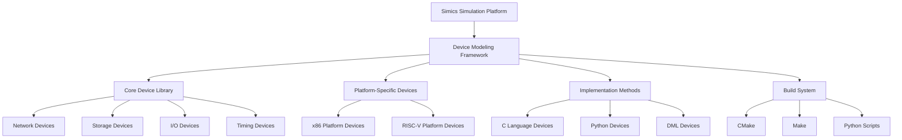
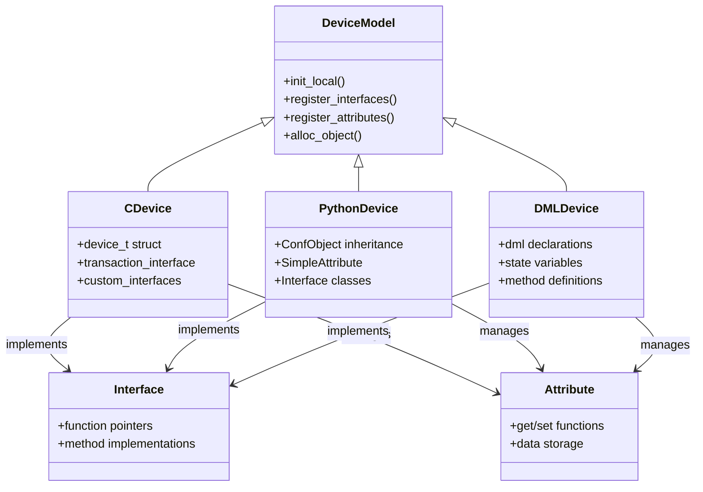
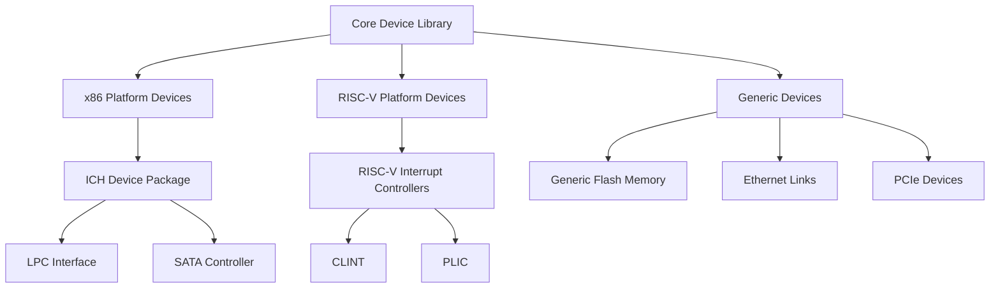
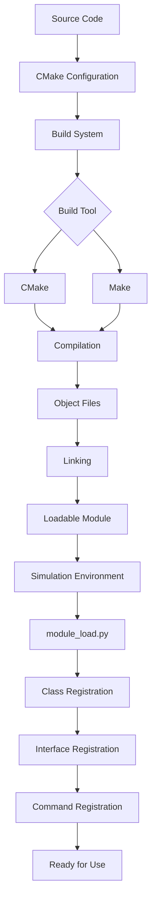

# Project Overview

<cite>
**Referenced Files in This Document**   
- [README.md](file://README.md)
- [sample-device-c/sample-device.c](file://simics-7.57.0/src/devices/sample-device-c/sample-device.c)
- [sample-device-c/module_load.py](file://simics-7.57.0/src/devices/sample-device-c/module_load.py)
- [sample-device-python/sample_device_python.py](file://simics-7.57.0/src/devices/sample-device-python/sample_device_python.py)
- [sample-device-python/module_load.py](file://simics-7.57.0/src/devices/sample-device-python/module_load.py)
- [generic-flash-memory/generic-flash-memory.c](file://simics-7.57.0/src/devices/generic-flash-memory/generic-flash-memory.c)
- [generic-flash-memory/CMakeLists.txt](file://simics-7.57.0/src/devices/generic-flash-memory/CMakeLists.txt)
- [eth-links/module_load.py](file://simics-7.57.0/src/devices/eth-links/module_load.py)
- [i210/module_load.py](file://simics-7.57.0/src/devices/i210/module_load.py)
- [riscv-interrupt-controllers/CMakeLists.txt](file://simics-risc-v-simple-7.12.0/src/devices/riscv-interrupt-controllers/CMakeLists.txt)
- [ICH/CMakeLists.txt](file://simics-qsp-x86-7.38.0/src/devices/ICH/CMakeLists.txt)
</cite>

## Table of Contents
1. [Introduction](#introduction)
2. [Simics Device Modeling Framework Architecture](#simics-device-modeling-framework-architecture)
3. [Core Components and Device Categories](#core-components-and-device-categories)
4. [Device Implementation Patterns](#device-implementation-patterns)
5. [Platform-Specific Device Implementations](#platform-specific-device-implementations)
6. [Build and Loading Process](#build-and-loading-process)
7. [Practical Examples of Device Integration](#practical-examples-of-device-integration)
8. [Conclusion](#conclusion)

## Introduction

The Simics device modeling framework provides a comprehensive library system for hardware simulation within the Simics full-system simulation platform. This framework enables the creation and integration of virtual hardware components that accurately emulate real-world devices across multiple processor architectures including x86 and RISC-V. The system supports various device categories such as network interfaces, storage controllers, I/O peripherals, and timing devices, allowing for the construction of complex virtual platforms that can simulate complete computer systems.

The framework is designed with modularity in mind, supporting multiple implementation approaches including C, Python, and DML (Device Modeling Language). This flexibility allows developers to choose the most appropriate language and methodology for their specific use case, from simple educational examples to complex production-level device models. The architecture facilitates both the creation of generic device models and platform-specific implementations, enabling reuse across different simulated systems while allowing for necessary customization.

This document provides a comprehensive overview of the Simics device modeling framework, covering its architecture, implementation patterns, build process, and practical integration examples. It is designed to serve both beginners seeking to understand device modeling concepts in simulation environments and experienced developers looking for technical details about the modular component design.

**Section sources**
- [README.md](file://README.md)

## Simics Device Modeling Framework Architecture

The Simics device modeling framework follows a modular, component-based architecture that enables the creation of complex virtual platforms through the composition of individual device models. At its core, the framework provides a standardized interface for device implementation, allowing different device types to interact consistently within the simulation environment. The architecture supports multiple processor architectures (x86, RISC-V) and various device categories (network, storage, I/O, timing) through a unified modeling approach.

The framework's architecture is organized around several key principles: component modularity, interface-based communication, and hierarchical composition. Devices are implemented as self-contained modules that expose well-defined interfaces for configuration, control, and data exchange. These interfaces enable devices to be connected together to form complete virtual platforms, with the simulation environment managing the interactions between components.

**Diagram sources**
- [README.md](file://README.md)

**Section sources**
- [README.md](file://README.md)

## Core Components and Device Categories

The Simics device modeling framework encompasses a wide range of device categories, each serving specific functions within the simulated system. These categories include network devices, storage controllers, I/O peripherals, and timing devices, all of which contribute to creating a comprehensive virtual platform.

Network devices such as the i210 Ethernet controller provide connectivity between simulated systems and external networks. These devices implement standard network protocols and interfaces, allowing simulated systems to communicate as if they were physical machines. The framework includes various network device models with different capabilities and performance characteristics, supporting both simple point-to-point connections and complex network topologies.

Storage devices form another critical category, with models ranging from simple flash memory to complex NVMe controllers. The generic-flash-memory device, for example, provides a flexible implementation that can emulate various flash memory configurations and behaviors. These storage models support different interface standards and can be configured with various parameters to match specific hardware requirements.

I/O devices handle communication between the processor and external peripherals, implementing standard interfaces such as UART, I2C, and PCIe. These devices enable the simulation of complex peripheral ecosystems, allowing developers to test software interactions with various hardware components. Timing devices, including real-time clocks and programmable interval timers, provide accurate timekeeping functions essential for system operation and synchronization.

The framework also includes specialized components such as link devices that facilitate communication between different parts of the simulated system. These components, like the ethernet-hub-link and ethernet-switch-link, enable the creation of complex network topologies within the simulation environment.

**Section sources**
- [i210/module_load.py](file://simics-7.57.0/src/devices/i210/module_load.py)
- [generic-flash-memory/generic-flash-memory.c](file://simics-7.57.0/src/devices/generic-flash-memory/generic-flash-memory.c)
- [eth-links/module_load.py](file://simics-7.57.0/src/devices/eth-links/module_load.py)

## Device Implementation Patterns

The Simics device modeling framework supports multiple implementation patterns, allowing developers to create device models using different programming languages and methodologies. The three primary approaches are C-based implementations, Python-based implementations, and DML (Device Modeling Language) implementations, each with its own strengths and use cases.

C-based device implementations, exemplified by the sample-device-c, provide high-performance models with direct access to the simulation environment's APIs. These implementations typically consist of a C source file containing the device logic and a module_load.py file that registers the device with the simulation environment. The C approach is suitable for complex devices requiring fine-grained control over timing and performance characteristics.

Python-based implementations, such as the sample-device-python, offer a more accessible development experience with faster iteration times. These models leverage Python's simplicity and extensive libraries while still providing access to the full simulation environment. The Python approach is particularly useful for prototyping, educational purposes, and devices with less stringent performance requirements.

DML-based implementations provide a specialized language designed specifically for hardware modeling, combining the performance of C with higher-level abstractions for common hardware patterns. DML allows developers to describe device behavior at a more conceptual level while automatically generating efficient C code.

All implementation patterns follow a common structure, with device initialization, interface registration, and attribute management forming the core components. The framework provides standardized APIs for memory-mapped I/O, interrupt handling, and configuration management, ensuring consistency across different device models regardless of their implementation language.

**Diagram sources**
- [sample-device-c/sample-device.c](file://simics-7.57.0/src/devices/sample-device-c/sample-device.c)
- [sample-device-python/sample_device_python.py](file://simics-7.57.0/src/devices/sample-device-python/sample_device_python.py)

**Section sources**
- [sample-device-c/sample-device.c](file://simics-7.57.0/src/devices/sample-device-c/sample-device.c)
- [sample-device-c/module_load.py](file://simics-7.57.0/src/devices/sample-device-c/module_load.py)
- [sample-device-python/sample_device_python.py](file://simics-7.57.0/src/devices/sample-device-python/sample_device_python.py)
- [sample-device-python/module_load.py](file://simics-7.57.0/src/devices/sample-device-python/module_load.py)

## Platform-Specific Device Implementations

The Simics device modeling framework supports platform-specific device implementations through a hierarchical organization of device packages. This approach allows for the creation of specialized device models tailored to specific processor architectures and system configurations while maintaining compatibility with the core framework.

For x86-based platforms, the framework includes the ICH (I/O Controller Hub) device package, which provides a comprehensive set of integrated peripherals commonly found in Intel-based systems. This package includes components such as the LPC (Low Pin Count) interface and SATA (Serial ATA) controllers, organized in a modular structure that enables selective inclusion based on the target platform requirements.

For RISC-V platforms, the framework includes specialized interrupt controllers that implement the RISC-V CLINT (Core-Local Interruptor) and PLIC (Platform-Level Interrupt Controller) specifications. These devices are implemented using a combination of DML and C code, leveraging the strengths of both approaches to provide accurate and efficient interrupt handling.

The platform-specific implementations follow a consistent pattern of organization, with each platform having its own directory structure containing the relevant device models. These implementations build upon the core device library, extending or customizing generic device models to meet the specific requirements of the target architecture. This approach enables code reuse while allowing for necessary specialization.

The relationship between core Simics devices and platform-specific implementations is one of extension and specialization. Core devices provide generic functionality that can be used across multiple platforms, while platform-specific implementations add architecture-specific features and optimizations. This modular approach allows developers to create virtual platforms that accurately represent specific hardware configurations while leveraging the extensive library of generic device models.

**Diagram sources**
- [ICH/CMakeLists.txt](file://simics-qsp-x86-7.38.0/src/devices/ICH/CMakeLists.txt)
- [riscv-interrupt-controllers/CMakeLists.txt](file://simics-risc-v-simple-7.12.0/src/devices/riscv-interrupt-controllers/CMakeLists.txt)

**Section sources**
- [ICH/CMakeLists.txt](file://simics-qsp-x86-7.38.0/src/devices/ICH/CMakeLists.txt)
- [riscv-interrupt-controllers/CMakeLists.txt](file://simics-risc-v-simple-7.12.0/src/devices/riscv-interrupt-controllers/CMakeLists.txt)

## Build and Loading Process

The Simics device modeling framework utilizes a comprehensive build and loading process that supports multiple build systems including CMake, Make, and Python scripts. This multi-tool approach provides flexibility in development workflows while ensuring consistent integration with the simulation environment.

The build process is orchestrated through CMake configuration files (CMakeLists.txt), which define the compilation and linking parameters for each device module. These files specify the source files, compiler flags, and dependencies required to build the device model. The simics_add_module macro is used to register device modules with the build system, specifying the classes, sources, and initialization functions that comprise each module.

For example, the generic-flash-memory device uses a CMakeLists.txt file that defines the module with its constituent source files (amd.c, generic-flash-memory.c, intel.c) and the module_load.py initialization script. This configuration ensures that all necessary components are compiled and linked correctly, producing a loadable module that can be integrated into the simulation environment.

The loading process is managed through Python scripts (module_load.py) that register device classes and their associated interfaces with the simulation environment. These scripts are executed when the module is loaded, performing tasks such as class registration, interface definition, and command registration. The module_load.py scripts use the Simics CLI API to expose device functionality to users, enabling configuration and control through the simulation environment's command interface.

The build system also supports hierarchical organization through the use of add_subdirectory commands, allowing complex device packages to be structured in a modular fashion. This approach enables the creation of device families with shared components while maintaining clear separation between different device types.

The integration of CMake, Make, and Python scripts provides a robust development workflow that supports both automated builds and interactive development. Developers can use CMake for comprehensive build management while leveraging Python scripts for dynamic configuration and testing within the simulation environment.

**Diagram sources**
- [generic-flash-memory/CMakeLists.txt](file://simics-7.57.0/src/devices/generic-flash-memory/CMakeLists.txt)
- [sample-device-c/module_load.py](file://simics-7.57.0/src/devices/sample-device-c/module_load.py)

**Section sources**
- [generic-flash-memory/CMakeLists.txt](file://simics-7.57.0/src/devices/generic-flash-memory/CMakeLists.txt)
- [sample-device-c/module_load.py](file://simics-7.57.0/src/devices/sample-device-c/module_load.py)

## Practical Examples of Device Integration

The Simics device modeling framework provides several practical examples that demonstrate how device models are integrated into simulation platforms. These examples range from simple educational devices to complex production-level implementations, illustrating the framework's capabilities and best practices.

One fundamental example is the sample-device-c, which demonstrates the basic structure of a C-based device implementation. This device includes a C source file that defines the device's data structure, initialization function, and interface implementations, along with a module_load.py script that registers the device with the simulation environment. The example shows how to define custom interfaces, register attributes, and implement memory-mapped I/O operations.

Another illustrative example is the sample-device-python, which demonstrates Python-based device implementation. This example shows how to create a device class that inherits from pyobj.ConfObject, define attributes using descriptor classes, and implement interfaces through nested class definitions. The Python approach simplifies development by leveraging Python's object-oriented features while maintaining compatibility with the simulation environment's C-based APIs.

The generic-flash-memory device provides a more complex example that demonstrates advanced device modeling techniques. This implementation includes multiple source files that handle different aspects of flash memory behavior, from basic read/write operations to complex command sequences and timing models. The device supports configurable parameters such as bus width, chip organization, and command sets, making it adaptable to various flash memory types.

Network device examples, such as those in the eth-links package, demonstrate how to create link components that facilitate communication between simulated systems. These examples show how to implement hub, switch, and cable abstractions with different forwarding behaviors, as well as how to integrate packet capture functionality for network analysis.

These practical examples illustrate the framework's support for different implementation approaches and complexity levels, providing developers with reference implementations that can be adapted to their specific needs. The examples also demonstrate the importance of proper initialization, interface registration, and error handling in creating robust device models.

**Section sources**
- [sample-device-c/sample-device.c](file://simics-7.57.0/src/devices/sample-device-c/sample-device.c)
- [sample-device-python/sample_device_python.py](file://simics-7.57.0/src/devices/sample-device-python/sample_device_python.py)
- [generic-flash-memory/generic-flash-memory.c](file://simics-7.57.0/src/devices/generic-flash-memory/generic-flash-memory.c)
- [eth-links/module_load.py](file://simics-7.57.0/src/devices/eth-links/module_load.py)

## Conclusion

The Simics device modeling framework provides a comprehensive and flexible system for hardware simulation, enabling the creation of virtual platforms that accurately emulate real-world computer systems. Through its support for multiple processor architectures, device categories, and implementation methods, the framework offers a powerful environment for both educational and production-level development.

The architecture's modular design, based on component composition and interface-based communication, allows for the creation of complex virtual platforms through the integration of individual device models. This approach facilitates code reuse, simplifies testing, and enables the construction of highly customized simulation environments.

The framework's support for multiple implementation languages (C, Python, DML) accommodates different development needs and expertise levels, from rapid prototyping to high-performance modeling. The build and loading process, leveraging CMake, Make, and Python scripts, provides a robust development workflow that integrates seamlessly with the simulation environment.

Practical examples within the framework demonstrate best practices for device implementation and integration, serving as valuable references for developers creating new device models. These examples illustrate the framework's capabilities while highlighting the importance of proper design, initialization, and error handling in creating reliable simulation components.

Overall, the Simics device modeling framework represents a sophisticated and well-structured approach to hardware simulation, providing the tools and infrastructure needed to create accurate, efficient, and maintainable virtual platforms for a wide range of applications.