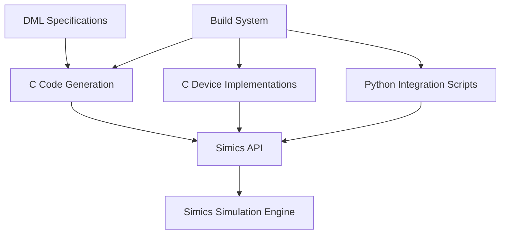
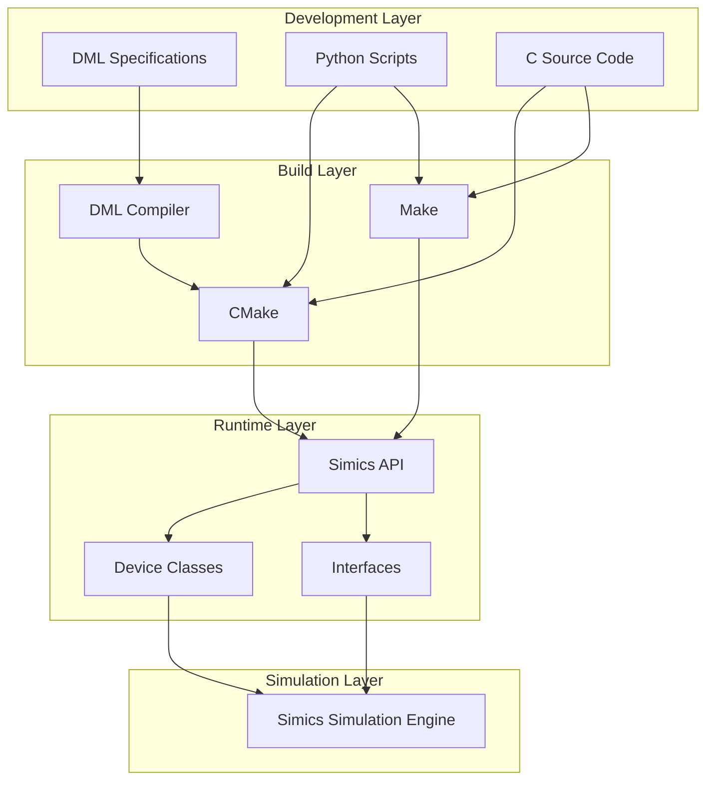

# Technology Stack & Dependencies

<cite>
**Referenced Files in This Document**   
- [DML.py](file://simics-7.57.0/linux64/lib/python-py3/DML.py)
- [sample-device.c](file://simics-7.57.0/src/devices/sample-device-c/sample-device.c)
- [sample_device_python.py](file://simics-7.57.0/src/devices/sample-device-python/sample_device_python.py)
- [empty_device_python.py](file://simics-7.57.0/src/devices/empty-device-python/empty_device_python.py)
- [pci_proxy.py](file://simics-7.57.0/src/devices/pci-proxy/pci_proxy.py)
- [CMakeLists.txt](file://simics-7.57.0/src/devices/sample-device-c/CMakeLists.txt)
- [Makefile](file://simics-7.57.0/src/devices/sample-device-c/Makefile)
- [module_load.py](file://simics-7.57.0/src/devices/sample-device-c/module_load.py)
- [attr-value.dml](file://simics-7.57.0/linux64/bin/dml/api/7/1.4/simics/base/attr-value.dml)
- [dml-builtins.dml](file://simics-7.57.0/linux64/bin/dml/1.4/dml-builtins.dml)
</cite>

## Table of Contents
1. [Introduction](#introduction)
2. [Core Technology Stack](#core-technology-stack)
3. [Architecture Overview](#architecture-overview)
4. [C Implementation Layer](#c-implementation-layer)
5. [Python Integration Layer](#python-integration-layer)
6. [DML (Device Modeling Language) Framework](#dml-device-modeling-language-framework)
7. [Build Toolchain and Dependencies](#build-toolchain-and-dependencies)
8. [Component Interaction Examples](#component-interaction-examples)
9. [Technology Stack Diagram](#technology-stack-diagram)
10. [Conclusion](#conclusion)

## Introduction
The Simics device modeling framework employs a multi-layered technology stack that combines performance-critical C implementations with flexible Python scripting and a specialized Device Modeling Language (DML). This architecture enables efficient simulation of hardware devices while maintaining high extensibility and ease of integration. The framework supports various device modeling approaches, from pure C implementations for maximum performance to Python-based models for rapid development and DML-generated code for standardized device modeling.

## Core Technology Stack
The Simics device modeling framework is built on a three-tier technology stack consisting of C for performance-critical device implementations, Python for scripting and integration, and DML (Device Modeling Language) as a domain-specific language for device modeling. This combination allows developers to choose the appropriate implementation approach based on performance requirements, development speed, and complexity considerations. The framework provides seamless interoperability between these layers, enabling C implementations to expose interfaces that can be accessed and manipulated through Python scripts, and allowing DML specifications to generate optimized C code while maintaining Python integration capabilities.

**Section sources**
- [DML.py](file://simics-7.57.0/linux64/lib/python-py3/DML.py#L1-L308)
- [sample-device.c](file://simics-7.57.0/src/devices/sample-device-c/sample-device.c#L1-L119)

## Architecture Overview
The Simics device modeling architecture follows a layered approach where C implementations provide the foundation for performance-critical device operations, Python scripts enable high-level control and integration, and DML serves as an abstraction layer for device modeling. The architecture is designed to maximize performance while maintaining flexibility and ease of use. Device classes created in C can be instantiated and manipulated through Python, and DML specifications are compiled into C code that integrates with the same framework. This hybrid approach allows developers to optimize performance-critical paths in C while using Python for configuration, testing, and higher-level logic.

**Diagram sources **
- [DML.py](file://simics-7.57.0/linux64/lib/python-py3/DML.py#L1-L308)
- [sample-device.c](file://simics-7.57.0/src/devices/sample-device-c/sample-device.c#L1-L119)
- [sample_device_python.py](file://simics-7.57.0/src/devices/sample-device-python/sample_device_python.py#L1-L80)

## C Implementation Layer
The C implementation layer forms the performance-critical foundation of the Simics device modeling framework. Device implementations in C provide direct access to the Simics API through header files such as simics/device-api.h and architecture-specific interfaces. The C layer is responsible for handling memory-mapped I/O operations, interrupt processing, and other low-level device behaviors with minimal overhead. Device classes are created using SIM_create_class and register interfaces such as transaction_interface_t for memory operations and custom interfaces for device-specific functionality. Attributes are registered with getter and setter functions to provide controlled access to device state. The C implementation follows a modular pattern where each device has an associated configuration object and device-specific data structure.

**Section sources**
- [sample-device.c](file://simics-7.57.0/src/devices/sample-device-c/sample-device.c#L1-L119)
- [CMakeLists.txt](file://simics-7.57.0/src/devices/sample-device-c/CMakeLists.txt#L1-L21)
- [Makefile](file://simics-7.57.0/src/devices/sample-device-c/Makefile#L1-L28)

## Python Integration Layer
The Python integration layer provides a flexible scripting interface for device configuration, control, and testing within the Simics framework. Python modules can implement device behavior directly using the pyobj framework or serve as integration scripts for C-implemented devices. The layer exposes the Simics API through Python bindings, allowing scripts to create and manipulate simulation objects, register commands, and respond to simulation events. Device classes implemented in Python inherit from pyobj.ConfObject and define attributes and interfaces using Python descriptors. The integration layer also provides CLI command registration through the cli module, enabling user interaction with devices through the Simics command interface. Python scripts can access and manipulate device attributes and call interface methods, providing a high-level interface to the underlying C implementations.

**Section sources**
- [sample_device_python.py](file://simics-7.57.0/src/devices/sample-device-python/sample_device_python.py#L1-L80)
- [empty_device_python.py](file://simics-7.57.0/src/devices/empty-device-python/empty_device_python.py#L1-L85)
- [pci_proxy.py](file://simics-7.57.0/src/devices/pci-proxy/pci_proxy.py#L1-L137)
- [module_load.py](file://simics-7.57.0/src/devices/sample-device-c/module_load.py#L1-L48)

## DML (Device Modeling Language) Framework
The Device Modeling Language (DML) framework provides a domain-specific language for describing hardware devices in a structured and standardized way. DML specifications are processed by tools in the bin/dml directory and compiled into C code that integrates with the Simics framework. The DML system includes built-in functionality in dml-builtins.dml and architecture-specific extensions for various processor architectures. The framework supports code generation for register access patterns, interrupt handling, and memory-mapped I/O operations, reducing the amount of boilerplate code required for device implementation. DML specifications can include embedded C code for performance-critical sections while maintaining the benefits of high-level device description. The DML compiler generates C code that follows the same patterns as hand-written C implementations, ensuring compatibility with the rest of the framework.

**Section sources**
- [dml-builtins.dml](file://simics-7.57.0/linux64/bin/dml/1.4/dml-builtins.dml#L1-L96)
- [attr-value.dml](file://simics-7.57.0/linux64/bin/dml/api/7/1.4/simics/base/attr-value.dml#L1-L96)
- [DML.py](file://simics-7.57.0/linux64/lib/python-py3/DML.py#L1-L308)

## Build Toolchain and Dependencies
The Simics device modeling framework supports multiple build systems, with CMake and Make both being used for module compilation. The build system is responsible for compiling C implementations, processing DML specifications, and packaging Python integration scripts into loadable modules. CMakeLists.txt files use the simics_add_module macro to define device modules, specifying the module name, device classes, source files, and build options. Make-based builds use MODULE_CLASSES, SRC_FILES, and PYTHON_FILES variables to define the module contents. Both build systems support the inclusion of external headers and libraries, as evidenced by the EXTRA_MODULE_VPATH directive in Makefiles. The build process generates shared libraries that can be loaded into the Simics simulation environment, with proper dependency tracking to ensure correct compilation order.

**Section sources**
- [CMakeLists.txt](file://simics-7.57.0/src/devices/sample-device-c/CMakeLists.txt#L1-L21)
- [Makefile](file://simics-7.57.0/src/devices/sample-device-c/Makefile#L1-L28)

## Component Interaction Examples
The Simics framework demonstrates several patterns for interaction between C implementations and Python integration scripts. In the sample-device-c example, the C implementation defines a device with a transaction interface for memory operations and a custom sample_interface for device-specific methods. The associated module_load.py script registers CLI commands that invoke the C implementation's interface methods. In Python-implemented devices, the pyobj framework allows direct definition of attributes and interfaces in Python, with the runtime handling the interaction with the Simics engine. The pci_proxy.py example shows how Python can implement a proxy device that forwards interface calls between components, demonstrating the framework's support for complex device interconnections. These examples illustrate how the framework enables seamless interaction between the performance-oriented C layer and the flexible Python scripting layer.

**Section sources**
- [sample-device.c](file://simics-7.57.0/src/devices/sample-device-c/sample-device.c#L1-L119)
- [module_load.py](file://simics-7.57.0/src/devices/sample-device-c/module_load.py#L1-L48)
- [sample_device_python.py](file://simics-7.57.0/src/devices/sample-device-python/sample_device_python.py#L1-L80)
- [pci_proxy.py](file://simics-7.57.0/src/devices/pci-proxy/pci_proxy.py#L1-L137)

## Technology Stack Diagram
The following diagram illustrates the layered architecture of the Simics device modeling framework, showing the relationship between the DML tools, C implementations, Python integration scripts, and the build system.

**Diagram sources **
- [CMakeLists.txt](file://simics-7.57.0/src/devices/sample-device-c/CMakeLists.txt#L1-L21)
- [Makefile](file://simics-7.57.0/src/devices/sample-device-c/Makefile#L1-L28)
- [dml-builtins.dml](file://simics-7.57.0/linux64/bin/dml/1.4/dml-builtins.dml#L1-L96)
- [sample-device.c](file://simics-7.57.0/src/devices/sample-device-c/sample-device.c#L1-L119)
- [sample_device_python.py](file://simics-7.57.0/src/devices/sample-device-python/sample_device_python.py#L1-L80)

## Conclusion
The Simics device modeling framework employs a sophisticated technology stack that effectively combines the performance benefits of C implementations with the flexibility of Python scripting and the abstraction capabilities of the Device Modeling Language. This multi-layered approach allows developers to optimize for performance where needed while maintaining productivity and ease of integration. The build system supports both CMake and Make, providing flexibility in development workflows. The framework's architecture enables seamless interaction between components implemented in different languages, allowing C performance-critical code to be controlled and extended through Python scripts. The DML framework further enhances productivity by providing a high-level language for device specification that compiles to efficient C code. This comprehensive technology stack makes Simics a powerful platform for hardware simulation and virtual system development.