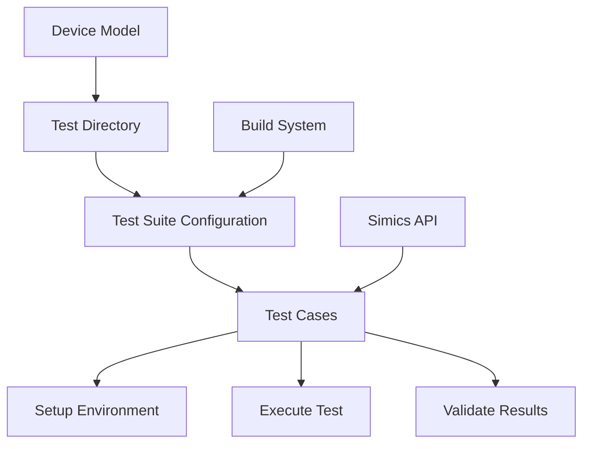
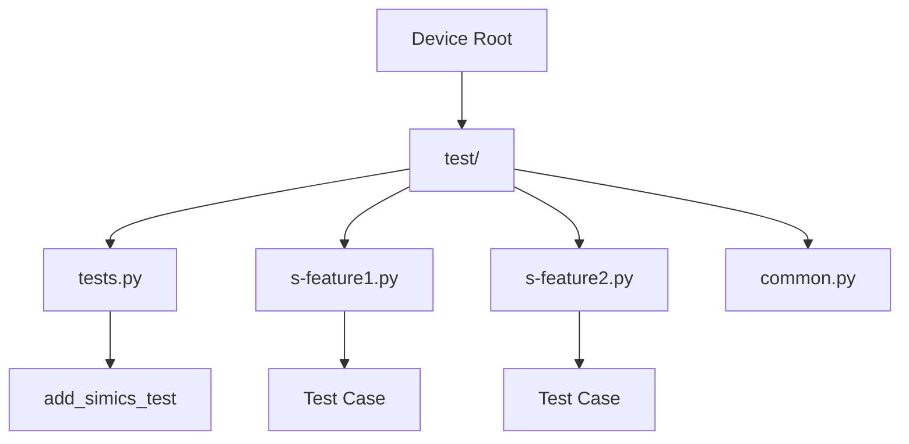
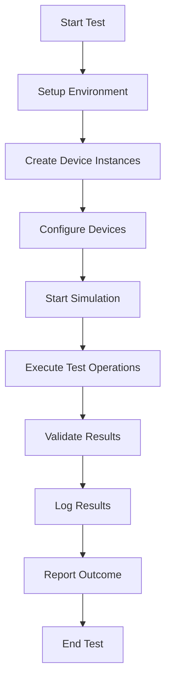

# Testing and Validation

<cite>
**Referenced Files in This Document**   
- [s-bug18067.py](file://simics-7.57.0/src/devices/AT24Cxx/test/s-bug18067.py)
- [common_test.py](file://simics-7.57.0/src/devices/NS16x50/test/common_test.py)
- [tests.py](file://simics-7.57.0/src/devices/can-link/test/tests.py)
- [CMakeLists.txt](file://simics-7.57.0/src/devices/empty-device-c/CMakeLists.txt)
- [module_load.py](file://simics-7.57.0/src/devices/AT24Cxx/module_load.py)
</cite>

## Table of Contents
1. [Introduction](#introduction)
2. [Testing Architecture](#testing-architecture)
3. [Test Organization and Patterns](#test-organization-and-patterns)
4. [Test Execution Workflow](#test-execution-workflow)
5. [Validation Techniques](#validation-techniques)
6. [Practical Examples](#practical-examples)
7. [Common Testing Patterns](#common-testing-patterns)
8. [Conclusion](#conclusion)

## Introduction
The Simics framework employs a comprehensive testing and validation methodology to ensure the correctness and reliability of hardware simulations. Device models are rigorously tested through dedicated test suites that validate functional accuracy, timing behavior, and compliance with hardware specifications. This documentation outlines the architecture, patterns, and practices used for testing device models in Simics, providing both conceptual overviews for beginners and technical details for experienced developers.

## Testing Architecture
The Simics testing framework is built around a modular architecture where each device has its own dedicated test directory containing comprehensive test cases. The architecture follows a hierarchical structure with test suites organized at the device level, enabling focused validation of individual components. Test execution is integrated into the build system through CMakeLists.txt files, which include test subdirectories and define test configurations.

The framework leverages Python-based test scripts that interact with Simics APIs to create test environments, configure devices, and verify behavior. Tests are designed to validate both normal operation and edge cases, ensuring robustness under various conditions. The architecture supports different test types including functional tests, integration tests, and regression tests, all organized within a consistent directory structure.

**Diagram sources**
- [CMakeLists.txt](file://simics-7.57.0/src/devices/empty-device-c/CMakeLists.txt)
- [module_load.py](file://simics-7.57.0/src/devices/AT24Cxx/module_load.py)

**Section sources**
- [CMakeLists.txt](file://simics-7.57.0/src/devices/empty-device-c/CMakeLists.txt)

## Test Organization and Patterns
Test organization in Simics follows a consistent pattern across device models. Each device directory contains a `test` subdirectory with Python test scripts that follow naming conventions such as `s-*.py` for specific test cases. The test directory includes a `tests.py` file that defines the test suite by registering individual test cases.

Common organizational patterns include:
- **Common utility modules**: Shared test utilities and helper functions (e.g., `common_test.py`)
- **Device-specific tests**: Individual test scripts for specific functionality or bug fixes
- **Suite configuration**: Centralized test suite definition that aggregates individual tests

Test scripts typically follow a structure that includes environment setup, test execution, and result validation. They use the Simics API to create device instances, configure parameters, and verify behavior through assertions and expectations.

**Diagram sources**
- [tests.py](file://simics-7.57.0/src/devices/can-link/test/tests.py)
- [common_test.py](file://simics-7.57.0/src/devices/NS16x50/test/common_test.py)

**Section sources**
- [tests.py](file://simics-7.57.0/src/devices/can-link/test/tests.py)
- [common_test.py](file://simics-7.57.0/src/devices/NS16x50/test/common_test.py)

## Test Execution Workflow
The test execution workflow in Simics follows a standardized process that ensures consistent and reliable testing across all device models. Tests are executed through the Simics simulation environment, which provides the necessary infrastructure for device interaction and behavior validation.

The workflow begins with environment setup, where test scripts create device instances and configure them for testing. This is followed by test execution, where specific operations are performed on the device, and finally result validation, where the outcomes are checked against expected behavior.

Key aspects of the workflow include:
- **Pre-configuration**: Device instances are created and configured before simulation starts
- **Runtime interaction**: Tests interact with devices during simulation execution
- **Result verification**: Expected outcomes are validated using assertions and expectations
- **Logging and reporting**: Test results are logged and reported for analysis

**Diagram sources**
- [s-bug18067.py](file://simics-7.57.0/src/devices/AT24Cxx/test/s-bug18067.py)
- [common_test.py](file://simics-7.57.0/src/devices/NS16x50/test/common_test.py)

**Section sources**
- [s-bug18067.py](file://simics-7.57.0/src/devices/AT24Cxx/test/s-bug18067.py)

## Validation Techniques
Simics employs various validation techniques to ensure the correctness of device models. These techniques include functional validation, timing validation, and specification compliance checking.

Functional validation verifies that devices behave correctly under normal operating conditions and edge cases. This includes checking register operations, interrupt handling, and data transfer functionality. Timing validation ensures that device operations occur with the correct timing characteristics, which is crucial for accurate simulation.

The framework provides specialized validation functions such as `stest.expect_equal` for value comparison and `stest.expect_log` for checking log messages. These functions help identify deviations from expected behavior and ensure that devices comply with hardware specifications.

Common validation approaches include:
- **Register-level testing**: Verifying register read/write operations and bitfield behavior
- **Interrupt testing**: Validating interrupt generation and handling
- **Data flow testing**: Checking data transmission and reception
- **Error condition testing**: Verifying behavior under invalid inputs or error conditions

**Section sources**
- [common_test.py](file://simics-7.57.0/src/devices/NS16x50/test/common_test.py)

## Practical Examples
Practical examples demonstrate how to write and execute tests for different device types in Simics. The following examples illustrate common testing scenarios:

For I2C devices like AT24Cxx, tests validate protocol compliance by simulating I2C operations such as START and STOP conditions. The test creates a fake I2C link and verifies that the device handles these operations correctly without generating unexpected error messages.

For serial devices like NS16x50, comprehensive test suites validate UART functionality including baud rate generation, interrupt handling, and FIFO operations. Tests verify that the device correctly handles data transmission and reception under various configuration settings.

For network devices like can-link, tests validate data frame transmission and checkpointing functionality. The test suite includes cases for both data frames and remote frames, ensuring reliable communication.

These examples demonstrate the use of Simics APIs to create test environments, configure devices, and verify behavior through assertions and expectations.

**Section sources**
- [s-bug18067.py](file://simics-7.57.0/src/devices/AT24Cxx/test/s-bug18067.py)
- [common_test.py](file://simics-7.57.0/src/devices/NS16x50/test/common_test.py)

## Common Testing Patterns
Several common patterns emerge across Simics device tests, reflecting best practices and standardized approaches to testing.

**Test setup pattern**: Most tests follow a consistent setup pattern where device instances are created using `pre_conf_object`, configured with appropriate parameters, and added to the simulation configuration using `SIM_add_configuration`.

**Register testing pattern**: Register operations are tested using helper classes like `Register_LE` and `Bitfield_LE` that provide convenient access to register fields and bit operations.

**Interrupt testing pattern**: Interrupt handling is validated using dedicated functions that check interrupt status and pending conditions, ensuring correct interrupt generation and clearing.

**Timing validation pattern**: Time-dependent operations are validated using `SIM_continue` to advance simulation time and verify that operations complete within expected timeframes.

**Error condition testing**: Tests include cases for invalid inputs and error conditions, verifying that devices handle these situations gracefully and generate appropriate log messages.

These patterns promote consistency across tests and make it easier to understand and maintain test code.

**Section sources**
- [common_test.py](file://simics-7.57.0/src/devices/NS16x50/test/common_test.py)
- [s-bug18067.py](file://simics-7.57.0/src/devices/AT24Cxx/test/s-bug18067.py)

## Conclusion
The Simics framework provides a comprehensive testing and validation infrastructure for ensuring the correctness and reliability of hardware simulations. Through a well-structured architecture, consistent test organization, and standardized validation techniques, the framework enables thorough testing of device models. The combination of practical examples and common patterns provides a solid foundation for developing and maintaining high-quality device simulations. This systematic approach to testing ensures that Simics models accurately represent real hardware behavior, making them valuable tools for development, debugging, and verification.